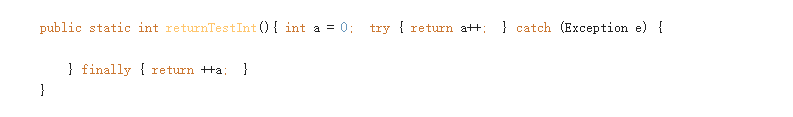

做 显示结果的题一定把中间结果画一下！！！！从main开始看；

越是简单的题目越要小心，有坑；//k nums.size  k++  0 7 1 1 7 2  2 7 3 3 7 4; 4 6 5;5 5 6

==梳理下OOM问题定位流程；==

多线程相关

- ==梳理下进程和线程的区别==
  - 子进程得到的是除了代码段是与父进程共享以外，其他所有的都是得到父进程的一个副本，子进程的所有资源都继承父进程，得到父进程资源的==副本==，子进程可获得父进程的所有堆和栈的数据，但二者并不共享地址空间
- 梳理下常见的类
  - Semaphore：类，控制某个资源可被同时访问的个数; ReentrantLock：类，具有与使用synchronized方法和语句所访问的隐式监视器锁相同的一些基本行为和语义，但功能更强大；ReentrantLock：类，具有与使用synchronized方法和语句所访问的隐式监视器锁相同的一些基本行为和语义，但功能更强大；  CountDownLatch： 类，可以用来在一个线程中等待多个线程完成任务的类 //  Future：接口，表示异步计算的结果；
- synchronized与volatile
  - 免程序在多线程竞争情况下读到不正确的值需要保证内存可见性，即当一个线程修改了volatile修饰的变量的值，volatile会保证新值立即同步到主内存，以及每次使用前立即从主内存读取。
  - synchronized可以修饰方法、代码块或对象，并不修饰变量。
  - static修饰的变量属于类，线程在使用这个属性的时候是从类中复制拷贝一份到线程工作内存中的，如果修改线程内存中的值之后再写回到原先的位置，就会有线程安全问题。用static修饰的变量可见性是无法确保的。
- synchronized  volatile Lock类  transient关键字
  -   synchrozied关键字称作同步，主要用来给方法、代码块加锁，被加锁的代码段，同一时间内多线程同时访问同一对象的加锁方法/代码块时，只能有一个线程执行能执行方法/代码块中的代码，其余线程必须等待当前线程执行完以后才执行该方法/代码块。 
  - volatile关键字1.保证了不同线程对该变量操作的内存可见性.(当一个线程修改了变量,其他使用次变量的线程可以立即知道这一修改)。2.禁止了指令重排序.  //保证可见性但不能保证线程安全
  - Lock接口提供了与synchronized关键字类似的同步功能，但需要在使用时手动获取锁和释放锁。   
  - transient关键字  简单地说，就是让某些被修饰的成员属性变量不被序列化。

JVM相关

- ==JVM内存区域也要好好梳理下==
- JVM 内存构成：堆 栈【里面有栈帧】  本地方法栈  方法区；  `共享内存：方法区、堆`；
  - 
- ==类加载流程再好好梳理下== 
- ==四种引用的回收时机梳理；==
  - 强引用不回收，软引用内存不足时回收，弱引用JVMGC时回收，虚引用随时会被回收。     
- 垃圾回收
  - JVM一旦启动，就会创建一个守护线程来监测是否需要有对象内存被释放。无法直接释放。  不可以指定时间，System.gc()，只是提醒JVM可以进行一次Full GC，但是什么时候真正执行，还是不知道的。 
- 运行时常量池
  -  运行时常量池是什么？
     运行时常量池是每一个类或接口的常量池的运行时表示形式.
  -  运行时常量池存放什么？
     存放编译期生成的各种字面量和符号引用；
  -   运行时常量池一直是方法区的一部分

特殊情况

-   new URL()时必须捕获检查异常，但这个异常是由于字符串格式和URL不符导致的，与网址是否存在无关。

-  count = count++ 原理是 temp = count； count = count+1 ； count = temp；  因此count始终是0 这仅限于java 与c是不一样的

- @SuppressWarnings(“deprecation”)的功能：屏蔽不赞同使用的类和方法的警告

- byte short char

  - b3=(b1+b2);  /*语句1*/    ==Java中的byte，short，char进行计算时都会提升为int类型。==所 以1,3,4得到一个int类型赋值给byte就不行。但是final修饰后byte不会转换成int计算，所以2得到的值还是byte    

- +=会自动强转（自动装箱功能），但是=必须要手动强转

- 模运算余数的符号跟被除数符号相同，本题中：

  -12=(-5)*2+(-2)，余数为-2，答案选D

-  C ++为什么最大64位双精度数有308位？

   -  浮点类型本质上是2个数字：分数（*尾数*）和指数。根据IEE765，双精度数具有11位的指数，而52位则为分数。
   -  https://www.nuomiphp.com/eplan/289121.html
   -  double a =3是可以的，但是Double a = 3会自动装箱然后报错

- 

-  位运算符： & |   ~[键盘1左边按键上方符号表示 按位取反，-n{这里的-是负号}= ~n+1]；

-  &也可以用于逻辑运算 表示  不短路逻辑与 ，&&短路

-  ^ 异或

- 以下哪个式子有可能在某个进制下成立（） 本质是个解方程

  - （3+x）*(4+x)=2x^2+4 

- 包权限

  - 

- java初始化

  - java初始化的加载顺序为：先静态成员变量  静态代码块，父子；非静态成员变量、非静态代码块、构造函数，父子；

    父类==静态成员变量== 父类==静态代码块== 子类静态成员变量 子类静态代码块  父类非静态成员变量，父类非静态代码块，父类构造函数，子类非静态成员变量，子类非静态代码块，子类构造函数

  - 静态代码块可以多个；

- 类的构造调用其它构造：this(param....)

- Math.  floor

  -  ceil 正无穷；floor 负无穷；//java还有0 -0

-   Java一个源程序只能有一个public类存在，且类名与文件名相同。

- ’2‘的ascii码值为49

- `梳理下重写和重载`

  -  重载：函数方法名必须相同，看参数列表即可，无关返回值。
  -  重写：参数列表 返回类型必须相同；访问修饰符不能更严【避免继承特性被破坏】、异常不能更广【避免多态时父类引用指向子类，但是异常无法捕获】；

- 命名规则；数字　字母　下划线　美元符号　组成；但不能数字开头，不可与关键字冲突；

- 注释不编译；

  -  一个.java文件，public权限类只能有一个；如果内部有多个类（包括内部类和局部类），会生成多个class文件；

- 局部变量可以先申明不用必须初始化，但使用到了一定要先初始化 

  -  JVM会自动帮我们完成类全局变量[static、成员变量]的初始化

- 类的构造调用其它构造，

-  一般关系数据模型和对象数据模型之间有以下对应关系：表对应类，记录对应对象，表的字段对应类的属性

- 类之间关联关系：是你 有你 用你

- ==8大封装类的常量池梳理下；==

  -    包装类的值都是final 不可变的，==对于++b 或者b++
       ，只是新创建了一个对象==，然后把引用传给了原对象句柄，在函数中操作，==只是形参的临时句柄改变了指向==，实参的句柄还是指向原来的对象。所以即使不是b
       = b++ 这种，b的值在add之后也是不会变的。
  
- static方法中是不能访问非静态变量 

- TCP/IP 没有使用面向对象的方式实现开发-->RPC(Remote Procedure Call） 未能做到面向对象调用的开发模式-->RMI(Remote Method Invocation)

- file只能操作文件整体，不能操作文件内容，文件内容需要IO流操作

- 数组复制效率

  -   复制的效率System.arraycopy>clone>Arrays.copyOf>for循环，System类源码中给出了arraycopy的方法，是native方法，也就是本地方法，肯定是最快的。而Arrays.copyOf(注意是Arrays类，不是Array)的实现，在源码中是调用System.copyOf的，多了一个步骤，
  -  native方法：
     -  java调用其它语言编写的的接口，一般是c、c++，目的是为了实现对操作系统的访问，具体的实现在DLL中
     -  https://blog.csdn.net/weixin_43653599/article/details/111592025

-  switch

   -  不支持 float，double和boolean

-  基础类型中属于整形：byte char int long

泛型

-  总结：泛型代码与JVM      ① 虚拟机中没有泛型，只有普通类和方法。
  ② 在编译阶段，所有泛型类的类型参数都会被Object或者它们的限定边界来替换。(类型擦除)     ③
  在继承泛型类型的时候，桥方法的合成是为了避免类型变量擦除所带来的多态灾难。   //反射可以获取实际类型
- Java泛型信息是否擦除有如下两种情况：
  1. 声明侧泛型信息保留 例如声明泛型接口，泛型类，泛型方法时的泛型信息
  2. 使用侧泛型信息擦除 例如方法的局部变量等。
  3. https://baijiahao.baidu.com/s?id=1717986608740805723&wfr=spider&for=pc
  4. https://blog.csdn.net/cpcpcp123/article/details/115141681
- 为什么说是伪泛型？反射获取List<String>对象，可以插入int数据

正则表达式

- ^表示匹配输入的开始，$表示匹配输入的结束 
- .为单个字符通配符，单独匹配需要转义 \ \ .    \/\/严格匹配两个//  
- \w 表示匹配字母数字或下划线   \d表示匹配一个数字   
- {m,n}表示最少匹配m次，最多匹配n次；  *表示匹配某元素0次或1次或多次；?表示重复0次或1次;  +表示匹配某元素1次或多次
- repalceAll第一个参数为正则表达式
-  匹配一个数字字符。等价于[0-9]
-    匹配一个非数字字符。等价于[ ^0-9]

java获取request范围内存在的对象

- request.getAttribute()

编码方式相关：

- 采用ISO8859-1编码方式时，一个中文字符与一个英文字符一样只占1个字节；采用GB2312或GBK编码方式时，一个中文字符占2个字节；而采用UTF-8编码方式时，一个中文字符会占3个字节。在Java中 在java中，char和byte都是基础数据类型，char类型，是16位，2个字节；java中采用GB2312或GBK编码方式时，一个中文字符占2个字节，而char是2个字节，所以是对的

常见的命令行指令

-   jar —— 将许多文件组合成一个jar文件 ；  javac —— 编译；  javadoc —— 它从程序源代码中抽取类，方法，成员等注释形成一个和源代码配套的API帮助文档；  javah —— 把java代码声明的JNI方法转化为C\C++头文件；jdb-----调试器；java---运行java程序？；javaprof 剖析工具；
-    java + 你的 Java 程序的名字但是不加后缀 所以这道题错在多了 .class这个后缀

HanshMap相关

- ==梳理下HashMap和HashTable的区别==
  
  - Hashtable在实现Map接口时保证了线程安全性，而HashMap则是非线程安全的。
  
- Hashtable不允许存入null，无论是以null作为key或value，都会引发异常
  
  -   继承的父类不同：HashTable继承Dictory类[Properties继承了HashTable]，HashMap继承AbstractMap.但都实现了Map接口； 
  
  -   1.继承的父类不同：HashTable继承Dictory类，HashMap继承AbstractMap.但都实现了Map接口； 
  
      2.线程安全性不同：HashTable是线程安全的,适用于多线程；HashMap是非线程安全，更适合于单线程； 
  
- ==总结下：hash冲突的几种解决方法？ LinkedHashSet  HashMap ThreadLocal  TreeMap使用的是哪种？==
- https://www.nowcoder.com/exam/test/74588465/submission?examPageSource=Intelligent&pid=53376938&testCallback=https%3A%2F%2Fwww.nowcoder.com%2Fexam%2Fintelligent%3FquestionJobId%3D10%26tagId%3D21003&testclass=%E8%BD%AF%E4%BB%B6%E5%BC%80%E5%8F%91

Object类相关

- 根类  Object类包含的方法： hashCode();equals(); toString();getClass(); notify(),notifyAll(); wait();clone();finalize();

集合相关

- ==ArrayList不是线程同步【即线程安全】的？哪些是线程同步的？==  
- 数组是有序的！！map才是无序的；

异常处理相关

-  java异常和错误的基类Throwable,包括Exception和Error 
-  Java语言中的异常处理包括声明异常、抛出异常、捕获异常和处理异常四个环节。 throw用于抛出异常。 throws关键字可以在方法上声明该方法要抛出的异常，然后在方法内部通过throw抛出异常对象。 try是用于检测被包住的语句块是否出现异常，如果有异常，则抛出异常，并执行catch语句。 cacth用于捕获从try中抛出的异常并作出处理。 finally语句块是不管有没有出现异常都要执行的内容。
-  try finally同时有return语句
   -    1、首先执行到try里的return，但是有finally语句还要执行，于是先执行return后面的语句，例如（x++），把要返回的值保存到局部变量。 
   -    2、执行finally语句的内容，其中有return语句，这时就会忽略try中的return，直接返回。 
   -  
- 异常类型
  - 特别小心：可以单独记忆运行时异常；空指针、下标越界、算数、非法声明、非法参数、==类型转换== 无此类元素；
  - 粉红色的是受检查的异常(checked exceptions),其必须被
    try{}catch语句块所捕获,或者在方法签名里通过throws子句声明.受检查的异常必须在编译时被捕捉处理,命名为 Checked
  - 绿色的异常是运行时异常(runtime exceptions),需要程序员自己分析代码决定是否捕获和处理
  - 而声明为Error的，则属于严重错误，如系统崩溃、虚拟机错误、动态链接失败等，这些错误无法恢复或者不可能捕捉，将导致应用程序中断，Error不需要捕捉。
  - 

final、finally、finalize相关

- 一个对象的finalize方法只会被调用一次

  - 判定一个对象objA是否可回收，至少要经历两次标记过程：

     

    如果对象objA到GC Roots没有引用链，则进行第一次标记。

    进行筛选，判断此对象是否有必要执行finalize（）方法

    

    如果对象objA没有重写finalize（）方法，或者finalize（）方法已经被虚拟机调用过，则虚拟机视为“没有必要执行”，objA被判定为不可触及的。 
    如果对象objA重写了finalize（）方法，且还未执行过，那么objA会被插入到F-Queue队列中，由一个虚拟机自动创建的、低优先级的Finalizer线程触发其finalize（）方法执行。 
    finalize（）方法是对象逃脱死亡的最后机会，稍后GC会对F-Queue队列中的对象进行第二次标记。如果objA在finalize（）方法中与引用链上的任何一个对象建立了联系，那么在第二次标记时，objA会被移出“即将回收”集合。之后，对象会再次出现没有引用存在的情况。在这个情况下，finalize方法不会被再次调用，对象会直接变成不可触及的状态，也就是说，一个对象的finalize方法只会被调用一次。 

  - 

    

string相关

- ==常量池存哪些变量 总结下？？？还有intern什么的？==
- java中将ISO8859-1字符串转成GB2312编码
  - new String(String.getBytes("ISO8859-1"），GB2312)是上面的字符数组按照GB2312编码成新的字符串

stringbuffer相关

- 注意！！！y=x改变了y的地址但是没有改变b的地址，以后这种画个图！！！
- 
- String StringBuilder StringBuffer
  - String是final修饰的，不可变 ; 运行速度StringBuilder>StringBuffer>String ;  StringBuffer是线程安全的; 

容器集合类

- 数组：是对象；数组是一个连续的存储结构，始化完成后内存中所占用的空间将会被固定; equals方法没有重写；
- 二维数组声明
  - 名字可以在中间，左边无数字，右边可以两个也可以只指定行
  - int [][] table = new int[2][2];
    int [][] table = new int[2][];
    int [] table [] = new int[2][2]; 
    int [] table [] = new int[2][];
- 注意接口和抽象类的区别，一个实现  一个继承，LinkedList实现List，AbstractSet实现Set，HashMap继承AbstractMap
- 线程安全的map：==Hashtable==的方法都是synchrnized修饰的线程安全；==ConcurrentHashMap==并发容器，JDK7采用分段锁，JDK8采用CAS算法，线程安全，建议使用；Connections工具类提供了一个方法==synchrnizedMap==可以把Map同步，本质就是给每一个方法加上synchrnized关键字进行同步
- 线程安全的集合：Vector【实现了List】、Stack、Hashtable
  - Vector与ArrayList相比多了同步机制；Stack继承了Vector，也保证了线程安全；HashTable是线程安全的类；
-  Arraylist默认数组大小是10，扩容后的大小是扩容前的1.5倍，最大值小于Integer 的最大值减8，如果新创建的集合有带初始值，默认就是传入的大小，也就不会扩容 

#### 多线程相关

- 用户线程与Daemo线程的关系
  - 用户线程: 用户线程可以简单的理解为用户定义的线程,当然包括main线程；
  - daemon线程: daemon线程是为我们创建的用户线程提供服务的线程,比如说jvm的GC等等,这样的线程有一个非常明显的特征: 当用户线程运行结束的时候,daemon线程将会自动退出.
    - 守护线程创建的过程中需要==先调用setDaemon方法进行设置,然后再启动线程==.否则会报出IllegalThreadStateException异常.
    - daemon线程的==终止条件是当前是否存在用户线程==,所以我们不能指派daemon线程来进行一些业务操作,而只能服务用户线程.
    - ==daemon线程创建的子线程任然是daemon线程== 
- Thread.sleep() 和 Object.wait(),都可以抛出 InterruptedException。这个异常是不能忽略的,因为它是一个检查异常(checked exception)
- ==进程的通讯方式梳理==
- 在Java中，常用的线程通信方式有两种，分别是利用Monitor实现线程通信、利用Condition实现线程通信。线程同步是线程通信的前提，所以究竟采用哪种方式实现通信，取决于线程同步的方式。
  -  synchronized关键字进行同步，依赖Monitor（同步监视器），锁对象可以是任意的类型，所以通信方法自然就被定义在Object类中了，wait()、notify()、notifyAll()
  -  Lock对象进行同步，则需要依赖Condition实现线程通信，Condition对象是由Lock对象创建出来的 await()、signal()、signalAll()
- Java多线程有几种实现方法？ 两种。 1、继承Thread类，Override它的run方法； 2、实现Runnable接口，实现run方法；3.实现 Callable接口 
- 线程生命周期
  - 
- ==synchronized加锁梳理下==
  -  所有的非静态同步方法用的都是同一把锁——实例对象本身(this，本例中有windows和windows1)，Synchronized修饰非静态方法，实际上是对调用该方法的对象加锁，俗称“对象锁”
  - 而所有的静态同步方法用的也是同一把锁——类对象本身（Windwos.class），Synchronized修饰静态方法，实际上是对该类对象加锁，俗称“类锁”。
- 这里需要注意Thread的t.start和t.run方法 用t.start方法才能真正启动线程，此时线程会处于就绪状态，而t.run方法只是普通方法
- 前三个都至少需要先读取，再操作，非原子操作。而D：x=1的话，直接赋值。   

继承、实现相关//接口相关

- 接口允许定义成员，但必须是**常量。**
- 接口和抽象类【可以有普通方法】区别：
  - 接口（interface）可以说成是抽象类的一种特例，接口中的所有方法都必须是抽象的。接口中的方法定义默认为public abstract类型，接口中的成员变量类型默认为public static final；
  - 抽象类可以有构造方法，接口中不能有构造方法。//因为抽象类中含有成员变量，需要存在构造方法为其赋值。不能和new关键字一起使用，但是子类可以通过super()关键字来引用抽象父类的构造方法。
  - 抽象类中的抽象方法的访问类型可以是public，protected和（默认类型   idea可以,虽然  eclipse下不报错，但应该也不行），但接口中的抽象方法只能是public类型的，并且默认即为public abstract类型
- 接口与实现类
  - 实现类可以获取接口中的属性；实现需要是public方法 【结合接口默认public abstract记忆】
-   子类的构造方法总是先调用父类的构造方法，如果子类的构造方法没有明显地指明使用父类的哪个构造方法，子类就调用父类无参构造。

外部类

- 外部类不能用static修饰；
- 外部类修饰符：public default，protected 和 private没有意义，因为不在类的内部 也 无法被别人继承；  局部类不能有访问修饰符（方法内不可能被别人访问）

内部类相关

- https://blog.csdn.net/qq_52292209/article/details/126533690
- ==内部类的访问规则  A:可以直接访问外部类的成员，包括私有  B:外部类要想访问内部类成员，必须创建对象==
- 成员内部类 (无static)：外部类名.内部类名 对象名 = new 外部类名().new 内部类名(); 
- 静态内部类：外部类名.内部类名 对象名 = new 外部类名.内部类名(); 
- 局部内部类：局部内部类放在方法、代码块、构造器等执行体中；局部内部类的类文件名为：外部类$N内部类.class 
  - ==局部内部类  A:局部内部类访问局部变量必须加final修饰？？？？需要自己再确认下==  B:为什么呢?  因为局部变量使用完毕就消失，而堆内存的数据并不会立即消失。  所以，堆内存还是用该变量，而改变量已经没有了。  为了让该值还存在，就加final修饰。
- 匿名内部类（重要）：本质上是一个没有名字的局部内部类，定义在方法中、代码块中、等。方便创建子类对象，最终目的是为了简化代码编写。
  -  new 类名或者接口名() {  重写方法;  } 
  - 

io流

-  简单地说，字符流是字节流根据字节流所要求的编码集解析获得的 

    可以理解为字符流=字节流+编码集 

    所以本题中和字符流（后缀非Stream结尾的）有关的类都拥有操作编码集(unicode)的能力。
    
-   使用ObjectOutputStream和ObjectInputStream可以将对象进行传输

http

- ==梳理下http  https相关的内容，如几次握手==
- doGet/doPost 则是在 javax.servlet.GenericServlet 中实现的
  - 

servlet相关

- httpServlet
  - 开发servlet继承HttpServlet时如何处理父类的service方法，一般我们都是不对service方法进行重载(没有特殊需求的话)，而只是重载doGet()之类的doXxx()方法，减少了开发工作量。但如果重载了service方法，doXXX()方法也是要重载的。即不论是否重载service方法，doXXX()方法都是需要重载的。D说至少需要重载doXXX(）方法是对的

- forward与redirect
  
  -   forward是服务器请求资源,服务器直接访问目标地址的URL,把那个URL的响应内容读取过来,然后把这些内容再发给浏览器.浏览器根本不知道服务器发送的内容从哪里来的,所以它的地址栏还是原来的地址. 
  
      redirect是服务端根据逻辑,发送一个状态码,告诉浏览器重新去请求那个地址.所以地址栏显示的是新的URL. 
  
  - redirect默认将产生302 Permanently moved的HTTP响应。
  
  
  
- servlet  ServletConfig  GenericServlet HttpServlet之间的关系
  
  - 
  
- Application  applet servlet区别

  -  1.Application：Java应用程序，是可以由Java解释器直接运行的程序。//jar选项是java.exe 的选项  
     2.Applet：即Java小应用程序，是可随网页下载到客户端由浏览器解释执行的Java程序。//Appletviewer是运行applet的， applet 不用main方法，继承applet类即可
     3.Servlet：Java服务器端小程序，由Web服务器(容器)中配置运行的Java程序。

    // j2sdk是JAVA的开发环境包它包含JDK(开发工具包，包含JRE)和JRE(运行时环境包)，简称JDK。J2SDK包含很多东西，比如Java language 、 Deployment等。 API只是其中很小的一部分。

- socket  serverSocket 和 TCP

  - 客户端通过new Socket()方法创建通信的Socket对象
    服务器端通过new ServerSocket()创建TCP连接对象  accept接纳客户端请求
  
  - ServerSocket(int port) 是服务端绑定port端口，调accept()监听等待客户端连接，它返回一个连接队列中的一个socket。Socket(InetAddress address ,  int port)是创建客户端连接主机的socket流，其中InetAddress是用来记录主机的类，port指定端口。
    
    - 
  
- serlvet与cgi

  - servlet处于服务器进程中，它通过多线程方式运行其service方法，一个实例可以服务于多个请求，并且其实例一般不会销毁，而CGI对每个请求都产生新的进程，服务完成后就销毁，所以效率上低于servlet。
  - servlet有如下优点：  可移植 稳健 易开发；

  

#### 反射

- Java反射主要涉及的类如Class, Method, Filed,等，他们都在java.lang包下
-  反射带来的效率问题主要是动态解析类，JVM没法对反射代码优化

spring相关

- spring事务相关
  - supports:支持。说明仅仅是支持事务，没有事务就非事务方式执行。mandatory:强制的。说明一定要有事务，没有事务就抛出异常。required:需要，有事务则直接运行，没有则新建一个；  required_new:必须新建事物。如果当前存在事物就挂起。not_supported:不支持事物，如果存在事物就挂起。never:绝不有事务。如果存在事物就抛出异常  NESTED：有事务则嵌套，没有则为REQUIRED;
    
  - 
  - 
  - 