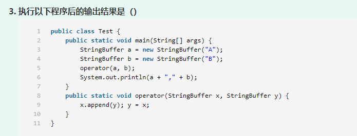
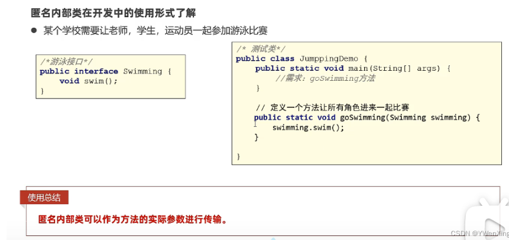
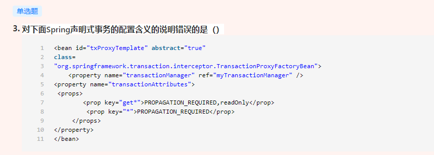
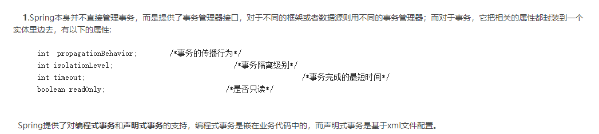
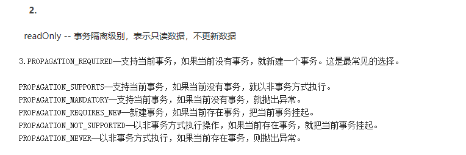

做 显示结果的题一定把中间结果画一下！！！！从main开始看；

==梳理下OOM问题定位流程；==

多线程相关

- synchronized与volatile
  - 免程序在多线程竞争情况下读到不正确的值需要保证内存可见性，即当一个线程修改了volatile修饰的变量的值，volatile会保证新值立即同步到主内存，以及每次使用前立即从主内存读取。
  - synchronized可以修饰方法、代码块或对象，并不修饰变量。
  - static修饰的变量属于类，线程在使用这个属性的时候是从类中复制拷贝一份到线程工作内存中的，如果修改线程内存中的值之后再写回到原先的位置，就会有线程安全问题。用static修饰的变量可见性是无法确保的。
- synchronized  volatile Lock类  transient关键字
  -   synchrozied关键字称作同步，主要用来给方法、代码块加锁，被加锁的代码段，同一时间内多线程同时访问同一对象的加锁方法/代码块时，只能有一个线程执行能执行方法/代码块中的代码，其余线程必须等待当前线程执行完以后才执行该方法/代码块。 
  - volatile关键字1.保证了不同线程对该变量操作的内存可见性.(当一个线程修改了变量,其他使用次变量的线程可以立即知道这一修改)。2.禁止了指令重排序.  //保证可见性但不能保证线程安全
  - Lock接口提供了与synchronized关键字类似的同步功能，但需要在使用时手动获取锁和释放锁。   
  - transient关键字  简单地说，就是让某些被修饰的成员属性变量不被序列化。

JVM相关

- JVM 内存构成：堆 栈【里面有栈帧】  本地方法栈  方法区；  共享内存：方法区、堆；
  - 
- ==类加载流程再好好梳理下== 
- ==四种引用的回收时机梳理；==
  - 强引用不回收，软引用内存不足时回收，弱引用JVMGC时回收，虚引用随时会被回收。     

特殊情况

-  count = count++ 原理是 temp = count； count = count+1 ； count = temp；  因此count始终是0 这仅限于java 与c是不一样的

- @SuppressWarnings(“deprecation”)的功能：屏蔽不赞同使用的类和方法的警告

- byte short char

  - b3=(b1+b2);  /*语句1*/     Java中的byte，short，char进行计算时都会提升为int类型。所以1,3,4得到一个int类型赋值给byte就不行。但是final修饰后byte不会转换成int计算，所以2得到的值还是byte    

- 模运算余数的符号跟被除数符号相同，本题中：

  -12=(-5)*2+(-2)，余数为-2，答案选D

-  C ++为什么最大64位双精度数有308位？

   -  浮点类型本质上是2个数字：分数（*尾数*）和指数。根据IEE765，双精度数具有11位的指数，而52位则为分数。
   -  https://www.nuomiphp.com/eplan/289121.html
   -  double a =3是可以的，但是Double a = 3会自动装箱然后报错

-  位运算符： & |   ~[键盘1左边按键上方符号表示 按位取反]；

- 以下哪个式子有可能在某个进制下成立（） 本质是个解方程

  - （3+x）*(4+x)=2x^2+4 

- 包权限

  - 

- java初始化

  - java初始化的加载顺序为：先静态成员变量  静态代码块，父子；非静态成员变量、非静态代码块、构造函数，父子；

    父类==静态成员变量== 父类==静态代码块== 子类静态成员变量 子类静态代码块  父类非静态成员变量，父类非静态代码块，父类构造函数，子类非静态成员变量，子类非静态代码块，子类构造函数

  - 静态代码块可以多个；

- ’2‘的ascii码值为49

- ==梳理下重写和重载==]

  -  函数方法名必须相同，看参数列表即可，无关返回值。

- 命名规则；数字　字母　下划线　美元符号　组成；但不能数字开头，不可与关键字冲突；

- 注释不编译；

正则表达式

- .为单个字符通配符，单独匹配需要转义 \ \ .
- repalceAll第一个参数为正则表达式

java获取request范围内存在的对象

- request.getAttribute()

常见的命令行指令

-   jar —— 将许多文件组合成一个jar文件 ；  javac —— 编译；  javadoc —— 它从程序源代码中抽取类，方法，成员等注释形成一个和源代码配套的API帮助文档；  javah —— 把java代码声明的JNI方法转化为C\C++头文件；jdb-----调试器；java---运行java程序？；javaprof 剖析工具；

HanshMap相关

- ==梳理下HashMap和HashTable的区别==
  -  Hashtable在实现Map接口时保证了线程安全性，而HashMap则是非线程安全的。
  -  Hashtable不允许存入null，无论是以null作为key或value，都会引发异常

- ==总结下：hash冲突的几种解决方法？ LinkedHashSet  HashMap ThreadLocal  TreeMap使用的是哪种？==
- https://www.nowcoder.com/exam/test/74588465/submission?examPageSource=Intelligent&pid=53376938&testCallback=https%3A%2F%2Fwww.nowcoder.com%2Fexam%2Fintelligent%3FquestionJobId%3D10%26tagId%3D21003&testclass=%E8%BD%AF%E4%BB%B6%E5%BC%80%E5%8F%91

Object类相关

- 根类  Object类包含的方法： hashCode();equals(); toString();getClass(); notify(),notifyAll(); wait();clone();finalize();

集合相关

- ==ArrayList不是线程同步【即线程安全】的？哪些是线程同步的？==  
- 数组是有序的！！map才是无序的；

异常处理相关

-  java异常和错误的基类Throwable,包括Exception和Error 
-  Java语言中的异常处理包括声明异常、抛出异常、捕获异常和处理异常四个环节。 throw用于抛出异常。 throws关键字可以在方法上声明该方法要抛出的异常，然后在方法内部通过throw抛出异常对象。 try是用于检测被包住的语句块是否出现异常，如果有异常，则抛出异常，并执行catch语句。 cacth用于捕获从try中抛出的异常并作出处理。 finally语句块是不管有没有出现异常都要执行的内容。
- 异常类型
  - 特别小心：可以单独记忆运行时异常；空指针、下标越界、算数、非法声明、非法参数、==类型转换== 无此类元素；
  - 粉红色的是受检查的异常(checked exceptions),其必须被
    try{}catch语句块所捕获,或者在方法签名里通过throws子句声明.受检查的异常必须在编译时被捕捉处理,命名为 Checked
  - 绿色的异常是运行时异常(runtime exceptions),需要程序员自己分析代码决定是否捕获和处理
  - 而声明为Error的，则属于严重错误，如系统崩溃、虚拟机错误、动态链接失败等，这些错误无法恢复或者不可能捕捉，将导致应用程序中断，Error不需要捕捉。
  - 

final、finally、finalize相关

- 一个对象的finalize方法只会被调用一次

  - 判定一个对象objA是否可回收，至少要经历两次标记过程：

     

    如果对象objA到GC Roots没有引用链，则进行第一次标记。

    进行筛选，判断此对象是否有必要执行finalize（）方法

    

    如果对象objA没有重写finalize（）方法，或者finalize（）方法已经被虚拟机调用过，则虚拟机视为“没有必要执行”，objA被判定为不可触及的。 
    如果对象objA重写了finalize（）方法，且还未执行过，那么objA会被插入到F-Queue队列中，由一个虚拟机自动创建的、低优先级的Finalizer线程触发其finalize（）方法执行。 
    finalize（）方法是对象逃脱死亡的最后机会，稍后GC会对F-Queue队列中的对象进行第二次标记。如果objA在finalize（）方法中与引用链上的任何一个对象建立了联系，那么在第二次标记时，objA会被移出“即将回收”集合。之后，对象会再次出现没有引用存在的情况。在这个情况下，finalize方法不会被再次调用，对象会直接变成不可触及的状态，也就是说，一个对象的finalize方法只会被调用一次。 

  - 

    

string相关

- ==常量池存哪些变量 总结下？？？==

stringbuffer相关

- 注意！！！y=x改变了y的地址但是没有改变b的地址，以后这种画个图！！！
- 

容器集合类

- 注意接口和抽象类的区别，一个实现  一个继承，LinkedList实现List，AbstractSet实现Set，HashMap继承AbstractMap
-  Arraylist默认数组大小是10，扩容后的大小是扩容前的1.5倍，最大值小于Integer 的最大值减8，如果新创建的集合有带初始值，默认就是传入的大小，也就不会扩容 

多线程相关

- Java多线程有几种实现方法？ 两种。 1、继承Thread类，Override它的run方法； 2、实现Runnable接口，实现run方法；
- 线程生命周期
  - 
- ==synchronized加锁梳理下==
  -  所有的非静态同步方法用的都是同一把锁——实例对象本身(this，本例中有windows和windows1)，Synchronized修饰非静态方法，实际上是对调用该方法的对象加锁，俗称“对象锁”
  - 而所有的静态同步方法用的也是同一把锁——类对象本身（Windwos.class），Synchronized修饰静态方法，实际上是对该类对象加锁，俗称“类锁”。

接口相关

- 接口允许定义成员，但必须是**常量。**
- 接口和抽象类区别：
  - 接口（interface）可以说成是抽象类的一种特例，接口中的所有方法都必须是抽象的。接口中的方法定义默认为public abstract类型，接口中的成员变量类型默认为public static final；
  - 抽象类可以有构造方法，接口中不能有构造方法。//因为抽象类中含有成员变量，需要存在构造方法为其赋值。不能和new关键字一起使用，但是子类可以通过super()关键字来引用抽象父类的构造方法。
  - 抽象类中的抽象方法的访问类型可以是public，protected和（默认类型   idea可以,虽然  eclipse下不报错，但应该也不行），但接口中的抽象方法只能是public类型的，并且默认即为public abstract类型
- 接口与实现类
  - 实现类可以获取接口中的属性；实现需要是public方法 【结合接口默认public abstract记忆】

外部类

- 外部类不能用static修饰；

内部类相关

- https://blog.csdn.net/qq_52292209/article/details/126533690
- ==内部类的访问规则  A:可以直接访问外部类的成员，包括私有  B:外部类要想访问内部类成员，必须创建对象==
- 成员内部类 (无static)：外部类名.内部类名 对象名 = new 外部类名().new 内部类名(); 
- 静态内部类：外部类名.内部类名 对象名 = new 外部类名.内部类名(); 
- 局部内部类：局部内部类放在方法、代码块、构造器等执行体中；局部内部类的类文件名为：外部类$N内部类.class 
  - ==局部内部类  A:局部内部类访问局部变量必须加final修饰？？？？需要自己再确认下==  B:为什么呢?  因为局部变量使用完毕就消失，而堆内存的数据并不会立即消失。  所以，堆内存还是用该变量，而改变量已经没有了。  为了让该值还存在，就加final修饰。
- 匿名内部类（重要）：本质上是一个没有名字的局部内部类，定义在方法中、代码块中、等。方便创建子类对象，最终目的是为了简化代码编写。
  -  new 类名或者接口名() {  重写方法;  } 
  - 

servlet相关

- servlet  ServletConfig  GenericServlet HttpServlet之间的关系
  
  - 
  
- Application  applet servlet区别

  -  1.Application：Java应用程序，是可以由Java解释器直接运行的程序。//jar选项是java.exe 的选项  
     2.Applet：即Java小应用程序，是可随网页下载到客户端由浏览器解释执行的Java程序。//Appletviewer是运行applet的， applet 不用main方法，继承applet类即可
     3.Servlet：Java服务器端小程序，由Web服务器(容器)中配置运行的Java程序。

    // j2sdk是JAVA的开发环境包它包含JDK(开发工具包，包含JRE)和JRE(运行时环境包)，简称JDK。J2SDK包含很多东西，比如Java language 、 Deployment等。 API只是其中很小的一部分。

    

spring相关

- spring事务相关
  - 
  - 
  - 