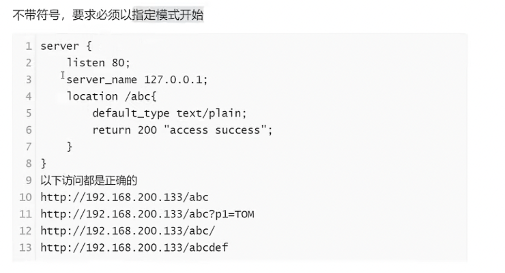
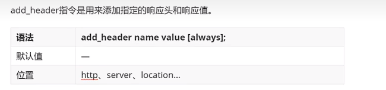
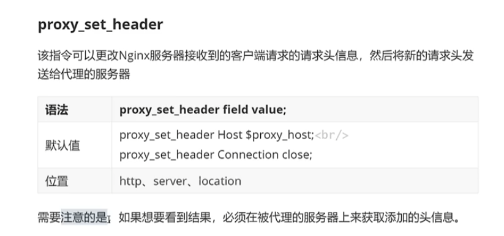
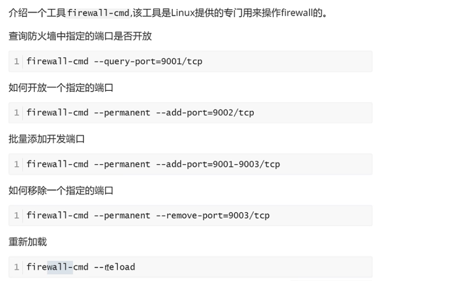

//有信的和温州的能占其一吧，有信的优先（看来周日当真要多去哦，不过话说回来，过于积极了我也头疼）；讲道理，我和她的缘分早该尽了，一直偶尔还会问候一下纯粹是因为没有遇到合适的，再者于我来说也不曾因为她而有任何的损失；如果有遇到合适的因为她而错过了，说实话，于自己就是犯傻，于这段关系来说也是不好的。  

哪个合适、追哪个的事情再说，眼前这个肯定是要了解一下的，差不多是今年新标准中top级别的了。我不是什么完美主义者，和她也没有什么特别的羁绊，如果真的是符合我的标准的，我肯定要试试。

//新年的目标：带回来的书看完；https研究下，nginx温习下；docker;oatuh2;

https、ssl证书的原理？？openssl用法？

- 在家里有一个好处，没有车水马龙的喧嚣，有着真正的、绝对的宁静，对于普通人来说令人窒息。对于一个真正能承受孤独的人，却是一种享受。希望自己35-40的时候，作选择时可以更少考虑物质层面的东西，更贴近自己的灵魂追求一些。毕竟，先要活着，然后才能追寻自己的灵魂。   两者的区别不在于肉体的劳累与舒适，而在于做事情的初衷与目标。每个人活着都是希望能解决问题的，我这一辈子希望解决什么问题？ 要站在巨人的肩膀上，而后能看到自己这辈子可能能解决的问题；追求此生的成就的话，则直接试着去解决这个时代最大的问题与矛盾。
- 慢慢去习惯脱离网络和影视吧，最初可能会稍有不适。   但是我相信坚持下去于己一定是大有裨益的。   垃圾食品吃多了容易营养不良，我在学校的时候何曾吃过垃圾食品，充其量就是看看综艺罢了。
- 正是研究生的经历，尤其是最后一年，让我深刻意识到，如果不是先立命，我的职业生涯甚至人生是绝对走不远的。
- 在我这里，人生的底色就是悲伤却伴随着宁静与平安的。

- 人的第一大罪是骄傲（唯有信仰能教会人绝对的谦卑）；第二大罪是攀比（这是一种精神上的懒惰，不曾去认真思考自己真正追求的是什么？）

正向代理的nignx可以直接安装在客户端？反向代理的nginx需要单独一台服务器  ？其实也可以用一个端口替代吧？

`正向代理和反向代理中，代理做的事情相同吗？`

正向代理中，客户端经过配置，所有的请求[目的ip是服务器]会转到Nginx； Nginx会获取请求的ip 端口 uri，然后自己转发请求到服务端；

反向代理，客户端直接访问代理[目的ip是代理]，代理从服务器获取资源

==//epoll？？？==

http  https仔细学习下！！！！很实用啊；

#### 面试角度的问题梳理

- 常用命令  ./nginx -t     ./nginx -s reload   //reload之后work进程的pid会变；重启之后master进程的pid会变；
- nginx速度快、并发高的原因是什么？epoll的底层原理是什么？为什么sendfile配置打开能提升从磁盘读取文件并返回的性能？
  - 使用了epoll，I/O多路复用。

- 简单介绍你对nginx的了解？nginx相比其它web服务器有什么优缺点？
  - nginx是具有高性能  HTTP 和 反向代理 功能的WEB服务器，也是一个 POP3/SMTP/IMAP代理服务器；
  - nginx主要具有：速度快，并发高[多进程和I/O多路复用]，高可靠，轻量级别 等优点 //[配置简单，扩展性好；热部署；成本低 BSD许可]
    - tomcat对态文件和高并发处理能力弱【200-300并发量】；
    - Apache：重量级、不支持高并发
    - Lighttpd：轻量级、高性能，欧美青睐
- ==什么是正向代理，什么是反向代理？==
  - 架设位置不同[客户端  服务端]；
  - 隐藏对象不同【正向隐藏了客户端---即客户端访问的目的地址是服务器[即客户端需要知道服务器的ip，因为代理在客户端]，访问服务端的是代理 ;  反向隐藏了服务端---即客户端访问的目的地址是代理服务器[即服务端需要知道客户端的ip，因为代理在服务端]；
  - 目的不同【正向 解决访问限制问题； 反向 负载均衡和安全防护】
- nginx的核心文件？核心路径？
  - nginx二进制可执行文件、nginx.conf配置文件、error.log、access.log
  - /nginx/sbin 二进制启动文件； /nginx/logs [内含nginx主进程id];  /nginx/html [访问成功、失败的页面]
- nginx启动、重启和停止nginx服务？
  - 信号控制（向master发送信号）：ps -ef | grep nginx获取master的PID； kill -signal PID
  - 命令行控制：/sbin/nginx -h查看支持参数；-c指定nginx配置文件路径；//还有-tc等；
    - 日常使用，直接可以用重启命令  ./nginx  -s quit ;  ./nginx -c  .....;   ./nginx -s reload
- nginx架构（高可靠的原理、平滑升级的原理）
  - 一个master进程和多个worker进程；master接收外界信息，发送给worker，监控worker状态，worker异常退出后，master会重新启用鑫的worker，由worker处理用户请求。
  - 先发送USR2信号，启动新的master和worker；如何发送QUIT给旧的master处理完请求关闭；
- nginx配置文件组成？
  - 默认三大块：全局块、events块、http块
    - http块可以配置多个server块，每个server块可以配置多个location块；
  - 全局块指令
    - user  user1：配置运行work进程的用户及用户组；例如：按照前面的配置只能访问/home/user1目录的权限 //有点迷糊，例子只配置了用户吧？没有用户组？
    - master process ; worker process (建议和cpu核心数保持一致)
    - 其它：daemon、pid、error_log、include
- 实际操作流程：正向代理 反向代理
  - 正向代理：客户端配置代理服务器；代理服务器监听指定端口；服务器仅打印日志即可；
  - 反向代理：代理配置监听的端口、服务器域名/ip，转发地址；服务器配置相应的内容；
    - 语法说明：proxy_pass设置代理服务器地址，可以是主机名称、ip附加端口号形式（还要指定传输协议）； proxy_set_header 更改服务器收到的请求头中某个属性的信息； proxy_redirect:适用场景：重定向时依旧能隐藏服务器的ip

- nginx是符合提升web服务器的安全的？
  - 安全隔离：通过代理分开了客户端到应用程序服务端的连接，实现了安全隔离。可以在代理之前设置防火墙，仅留一个入口供代理服务器访问（也就是行里的DMZ区，内网只留了一个DMZ区的入口）。
  - nginx支持https，http是明文传输数据，存在安全问题，https是加密传输，相当于http+ssl

### Nginx简介

#### 背景介绍

//协议：标准、规范；

//服务端禁掉某一类客户端的访问；客户端请求（指定了服务端?????）-->代理-->服务端； 服务端响应-->代理-->客户端；

//请求发给代理（请求未指定服务端????），代理分发给不同服务端；

#### 常见服务器对比

//web服务开发商市场份额占有率；

//tomcat并发量大概在200-300; 

#### Nginx的优点

//epoll？？？

#### Nginx的功能特性及常用功能

#### Nginx的官方简介

### Nginx系统环境准备

//用到时再参考视频即可；

### nginx.conf文件结构及其中的指令

//user work_process  daemon pid error_log等指令直接见思维导图

#### Events

- accept_mutex：对多个nginx进程接收连接进行序列化，即当一个请求到达时只唤醒一个work进程；设置为on只唤醒一个
  - 解决惊群问题，即一个请求到达时是唤醒多个work进程(性能低)还是一个
  - 
- Multi_accept：worker进程是否同时接收多个网络了解
  - 
- Worker connections：设置单个worker进程的最大连接数(指的是所有连接数且不大于操作系统支持打开的最大文件句柄数量)
  - 
- use:nginx服务器选择那种事件驱动处理网络消息，可选select/poll/epoll/kqueue
  - 

#### http块

- include   default_type
  - 支持的资源的类型   //mime.types保存了不同的资源和文件后缀的对应关系; application/octet-stream是二进制流的意思；
  - 
  - 
- Access_log + log_format 
  - Access_log用到的format需要用log_format提前声明
  - 
  - 
- Keepalive_timeout    keepalive_request
  -  
  - 

#### server块和location块

- root
  - 资源所在的目录
- index
  - 默认访问/时候对应的首页；资源要放在root指定的目录下；

#### nginx基础配置示例需求分析

- 
- 
- server1.conf
  - 
- server2.conf
  - 

#### Nginx配置成系统服务，Nginx命令配置到系统环境

- centOS配置系统服务
  - 
  - 

- 系统环境
  - 

### Nginx静态资源部署及可能用到的指令

- Nginx静态资源的配置指令
  - listen    //nginx.org/en/docs 有语法等信息
    - 
  - Default server //访问的地址没配置server时会跳转到default server；没有配置default server的时候，默认第一个配置的server为default_server
    - 
  - server_name //域名解析及host配置的内容略，参考自己的笔记
    - 
    - 精确匹配
      - 
    - 通配符匹配
      - *使用注意，不能在中间；不能前面有字幕
      - 
    - 使用正则表达式配置//～后面不能加空格；结合（）可以在后面获取正则表达式匹配的内容；
      - 
      - 
      - 
    - 匹配优先级
      - 精确匹配 > 通配符在开始时匹配>通配符在结束时匹配>正则表达式匹配 > 默认的default_server，没有指定默认找第一个server
      - 
  - location //不带符号（以指定模式开始，后面可以跟任意字符） =(严格匹配)  ~（正则区分大小写） ~*(正则不区分大小写)  ^~（以指定模式开始，且一旦模式匹配会忽略后面匹配的正则）
    - 
    - 
    - 
    - 
    - 
- 设置请求资源的目录
  - root / alias :都可以指定资源路径；root的处理结果是 root路径+location路径；alias的处理结果是alias路径替换location路径（所以location后面的路径末尾带/的话，alias末尾也要加/）
    - 
    - 
  - index : 设置location等的默认主页
    - 
  - error_page： 设置错误页面，可以跟域名、重定向地址、自定义展示错误信息、自定义返回的状态码；
    - 
    - 
    - 
- 静态资源优化配置指令
  - sendfile
    - http底层是tcp, tcp底层是socket;  sendfile是操作系统底层的一个函数；一般操作系统不允许应用程序直接读磁盘，认为不安全；
    - 
    - 未使用sendfile时访问静态资源流程很长，nginx应用程序发送read指令；磁盘拷贝文件到内核缓冲区；内核缓冲区拷贝文件到应用程序缓冲区；nginx应用程序发送write指令；应用程序缓冲区拷贝文件到socket缓冲区；socket缓冲区拷贝文件到网卡；最后由网卡发送到浏览器；
    - 
    - sendfile可以指定最终要交给的socket；可以直接走磁盘-->内核缓冲区-->socket缓冲区-->浏览器；少了两次拷贝和  内核态/用户态的切换；
    - 
  - tcp_nopush   tcp_nodelay
  - 
  - 
  - 如果有数据就发，实时性好，其中可能大多数是寻址用的数据，有效数据的占比很低，即所谓的效率低；
  - 
- 静态资源压缩
  - 
  - //浏览器缓存开启时，走缓存的话大小可能会显示很小；
  - gzip开启gzip功能； gzip_types指定要压缩的文件类型；gzip_comp_level指定压缩程度；gzip_vary 是否通过添加返回头中字段的形式告诉前端资源经过了压缩；gzip_buffers设置压缩缓冲区的数量和每个缓冲区的大小，和操作系统相关，一般采用默认即可；gzip_disable 针对不同种类客户端发起的请求，选择性地关闭Gzip功能；gzip_http_version 开启Gzip功能所需的最低版本http协议，一般默认；gzip_min_length 开启压缩最小的文件大小 bytes/kb/M（一般1k以上），和请求头的content-type比较；gzip_proxied 反向代理的过程中，是否对服务器返回的资源进行压缩
    - 
    - 
    - 
    - 
    - 
    - 
    - 
    - 
    - 
  - gzip使用示例
    - 
  - gzip_static
    - 解决Gzip和senfile共存的问题，使用sendfile之后，静态资源获取就不会经过应用程序（见前文，直接走磁盘-->内核缓冲区-->socket缓冲区-->浏览器）；但是压缩这个操作是要应用程序进行的。为了保证senfile和Gzip共存，一般是提前手动把静态资源压缩好（.gz文件），保存在磁盘，当gzip生效时就可以直接去找.gz文件
    - 
    - on则gzip_http_version配置生效，always则永远生效
- 番外：nginx重新编译 增加新的模块
  - 注：第六步还需要补充第一步查询得到的参数；第8步需要在安装目录下执行；
  - 
  - 

### web缓存

- 缓存概念

  - 
  - 

- 缓存种类

  - 

- 浏览器缓存

  - 

  - 

  - 

  - 强缓存：缓存未过期直接取浏览器缓存；弱缓存，缓存过期，还需要发请求到服务端确认Tag  Last-Modified没有变化，服务端返回一个304然后才能取浏览器缓存

    - F5或者刷新都会使得强缓存失效；验证强缓存需要新开一个tab   //验证缓存时，disable cahce注意配置；

  - expires指令

    - //time默认时服务端时间而且时格林尼治时间；max-age  expire都标志超时时间，但是expire在客户端  服务端时针不一致的时候会有问题，两者同时存在时max-age优先生效；
    - 
    - 

  - add header指令

    - 
    - 
    - 
    - 

    

### 跨域问题及解决方案

- 同源：协议  ip  端口都相同即为同源
- 跨域问题：两台服务器A、B，如果从A服务器的业务发送异步请求到B获取数据，且A和B不满足同源策略，则会出现跨域问题
- 解决方案：添加相关的头，add_header
  - 
- 案例
  - 
  - 
  - 
  - 
  - 

### 防盗链及实现

- 什么是资源盗链？
  - 就是静态资源不在自己服务器上，通过技术手段，把别人的资源放到自己的页面上展示给用户。如在自己的页面上引入京东/百度的图片。

-   实现原理
  - http的头信息referer，告诉浏览器该网页从哪个页面链接跳转过来，后台服务器判断referer是否为自己信任的网站地址，是则继续访问，不是则返回403（服务器拒绝访问）
  - 指令：vilid_referers
    - 
    - 
    - 扩展：可以结合后面的rewrite指令提升用户体验，403时给提示信息
      - 
- 案例
  - html 引入nginx服务器资源
    - 
  - 
- 不足：referer的限制比较粗粒度（一类文件或者是一个目录），比如随意加一个Referer，上面的方式无法限制。需要使用三方模块： ngx_http_accesskey_module。

### Rewrite功能配置

- 一般用于URL重写，依赖PCRE库，Nginx使用的是ngx_http_rewrite_module模块来解析和处理Rewrite功能的相关配置
  - 
- set指令
  - 
  - rewrite常用全局变量
  - 
  - 
  - 使用示例
    - 
    - 
- if 指令
  - if 和 (之间一定要有一个空格；字符串不需要加引号，并且等号和不等号前后都要加空格；
  - 
  - 
  - 
  - 示例
    - 
    - 
- break
  - nginx默认配置  root:当前目录下的html; index:当前目录下的index；一个作用域就是指一个{}的范围内；终止当前匹配就是不继续走当前location的后面return逻辑（不只是当前作用域了）
  - 
  - 
- return
  - 
  - 
- rewrite指令
  - rewrite后面的正则表达式中包含（），后面编写重写目的地址的时候可以用 \$1、 \$2等引用
  - 
  - 
  - flag: 设置rewrite对URI的处理行为，分 last(用新URI在当前server中匹配) 、 break（用新URI在当前location中匹配）、  redirect（用新URI在当前server中匹配+301重定向)、  permanent（用新URI在当前server中匹配+302重定向）
    - 
    - 
    - 
    - 
- rewrite_log
  - 
- rewrite的案例
  - 域名跳转：例如让www.360buy.com也重定向到www.jd.com
    - rewrite ^后面不跟任何就代表对server_name后面的内容没有任何限制，(.*)是为了重定向的时候把后面的uri一起带过来
    - 
  - 域名镜像：和镜像网站类似，完全相同的网站放置到几台服务器上，实现 高可用、分布不同地区以提高响应速度、流量负载、不同镜像不同域名防止域名限制。上述的www.itheima.com  www.itheima.cn 都跳转www.itcast.cn，则www.ticast.cn就是主域名，另外两个就是镜像域名。也可以只对一个子目录资源做镜像，可以在location配置write功能。
    - 
  - 独立域名：为每一个功能模块设置独立的域名
    - 
  - 目录自动添加  ”/“
    - 访问url不加斜杆，Nginx服务器内部会自动做一个301的重定向；如果重定向开关（serve_name_in_redirect）打开，目的地址（如果是nginx服务器）会被替换为server_name。nginx 0.8.48以前开关都是on，需要处理
    - 
    - 
    - \$request_filename   \$host  \$server等都是全局变量； 下面的\[^/] 表示    去匹配最后一个字符且最后一个字符不能为空
    - 
  - 合并目录
    - 搜索引擎优化（SEO）是一种利用搜索引擎的搜索规则提高目的网站在搜索引擎内排名的方式（简单举例就是 提升你在百度搜索结果的排名），其中一项就是URL目录层级不超过三级（过低 [即大量文件放一个目录] 的话有会有文件资源管理混乱+访问文件速度下降）。
    - 访问的时候通过名字添加 - 的方式降低目录层级，真正保存的时候一个 - 就是一个目录层级；
    - 
    - 
- vim小技巧
  - set nu;显示行号       31,36d；删除31-36行；
  - Control  v+选中多行+i+ #/d +esc，
  - gzip jquery.js  //压缩文件
  - chrome清楚浏览器缓存：ctrl +shift +del;   
- 其它小技巧
  - tree展示文件目录
  - cmd发送post请求： curl -X POST http://192.168.200.133:8081/testif
  - chmod 777的含义：http://www.mobiletrain.org/about/BBS/256716.html
  - 查看用户分组信息：cat /etc/group  http://www.mobiletrain.org/about/BBS/150835.html
  - break是301永久重定向；return是302临时重定向（重写地址是临时过渡的，和搜索引擎优化 su? 相关）  ;重定向跳转地址会变；

#### Nginx代理概述及环境准备

 正向代理在客户端配置（隐藏客户端），反向代理在服务端配置。

133

146

//uri:端口后面的所有内容

客户端经过配置，所有的请求会转到Nginx

#### Nginx反向代理的配置语法

 

//133代理上配置，服务器为146

//没有/的话，会自动把location添加到后面；

 

//不设置请求头的值的话，服务端只能活得代理的ip和端口；

146配置：

133配置

//133

//如下，133代理时地址不存在的时候重定向 到146主页，这时ip会跳转为146而不是133；仍然希望隐藏服务端的ip，返回代理服务器的地址；

//146

 

//133 对于146服务器上找不到资源的，先跳转到133的默认端口，然后在133的默认端口配置代理146；返回的信息就是133了，而index.html是146服务器上的，服务器的ip被隐藏

#### Nginx反向代理实战

服务器1 2 3的内容相同，则需要使用负载均衡；

//机器准备，机器有限，用146的不同端口模拟不同的服务器；

#### Nginx的安全控制

  

流量劫持的示例：中间人劫持你的请求，发送给下面的三方服务器；

#### Nginx添加ssl的支持（支持https请求）

nginx默认不支持https访问 

./nginx -V查看版本信息；

第三步的位置  ~/nignx/core/nginx-版本；//具体看你自己的nginx安装包位置；

第四步： 配置在原来配置的基础上添加http_ssl_module

http默认端口80，https默认端口443

//缓存较为常用；用于提升效率；

一般会设为on

#### 生成证书

证书控制台，证书申请，输入基本信息、域名（提前购买好），   验证 审批 签发后可用；

//第一种生产环境使用较多，学习期间相对麻烦；

#### 开启SSL实例

//nginx解压缩包下的conf/nginx.conf有对应的配置；

ctrl  v ,选中，delete;

//不安全是因为证书没经过三方验证； 用阿里云的方式生成key  pom文件，则没有这个问题；

www.baidu.com ，不需要加https前缀，默认的访问方式是https，用rewrite命令：

#### 反向代理系统调优

### Niginx负载均衡

//反向代理重点在服务端的内容不一样的情况，负载均衡重点在服务端的内容一样的情况；

#### 负载均衡的原理及处理流程

#### 负载均衡常用的处理方式

ping命令可以查看域名对应的ip地址；一个域名可以绑定多个ip；

 

DNS有本地缓存； ipconfig/flushdns

硬件：贵；不易扩展；但是效率高

  

#### Nginx七层负载均衡

 

除了浏览器也可以用curl命令测试端口；

  

//问题：服务器性能可能不同；

//问题：web需要登录的场景，通过session保存登录信息，不同服务器之间的session不共享，则需要登录多次；故需要把单台服务器的请求固定到单台web服务器上；

//ip_hash考虑的是登录 信息缓存不命中的问题；但是可能造成负载不均衡，可以把session信息都保存到redis中；

url_hash针对的是文件缓存命中的问题； 

 

vim:  /表示搜索；

  //注意：有两个nginx文件夹，一个是nginx的源码，make的时候在源码；另一个是安装目录，存放可执行文件；？？？？

#### Nginx四层负载均衡

  

//允许所有服务器访问reids

启动reids:

再启动一个redis：

同样改配置，启动；

关闭redis:

连接redis，安装redis客户端，在cmd

四层和七层的负载均衡，在nginx的底层有什么不同吗？？？？？

https://blog.csdn.net/tongzidane/article/details/125443140

//四层和七层如果监听同一个端口，生效的应该是四层；

