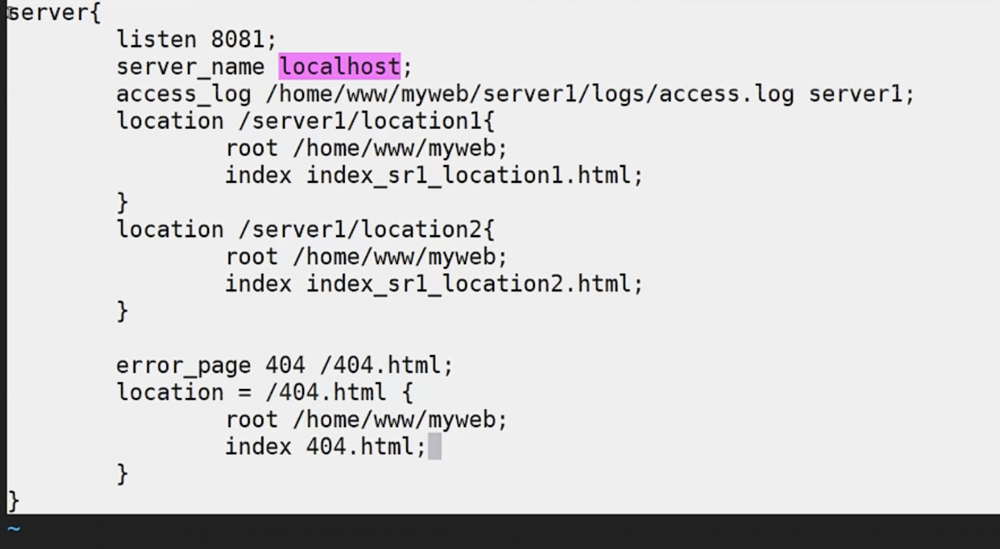
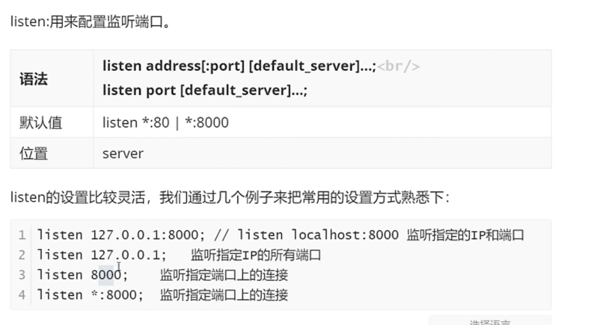
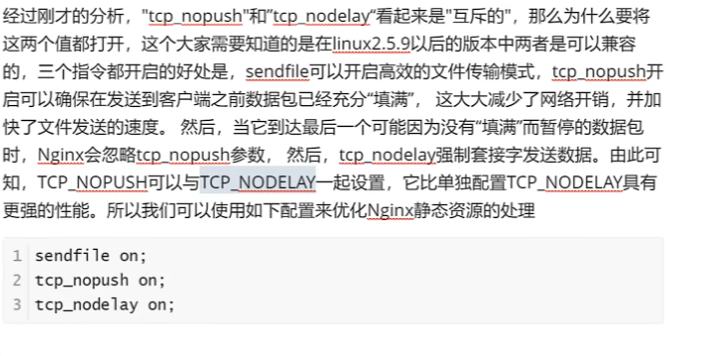
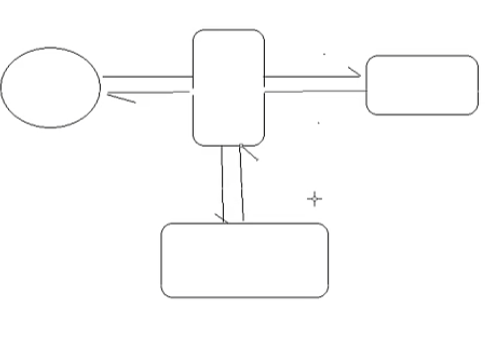

//有信的和温州的能占其一吧，有信的优先（看来周日当真要多去哦，不过话说回来，过于积极了我也头疼）；讲道理，我和她的缘分早该尽了，一直偶尔还会问候一下纯粹是因为没有遇到合适的，再者于我来说也不曾因为她而有任何的损失；如果有遇到合适的因为她而错过了，说实话，于自己就是犯傻，于这段关系来说也是不好的。  

哪个合适、追哪个的事情再说，眼前这个肯定是要了解一下的，差不多是今年新标准中top级别的了。我不是什么完美主义者，和她也没有什么特别的羁绊，如果真的是符合我的标准的，我肯定要试试。

//新年的目标：带回来的书看完；https研究下，nginx温习下；docker;oatuh2;

https、ssl证书的原理？？openssl用法？

- 在家里有一个好处，没有车水马龙的喧嚣，有着真正的、绝对的宁静，对于普通人来说令人窒息。对于一个真正能承受孤独的人，却是一种享受。希望自己35-40的时候，作选择时可以更少考虑物质层面的东西，更贴近自己的灵魂追求一些。毕竟，先要活着，然后才能追寻自己的灵魂。   两者的区别不在于肉体的劳累与舒适，而在于做事情的初衷与目标。每个人活着都是希望能解决问题的，我这一辈子希望解决什么问题？ 要站在巨人的肩膀上，而后能看到自己这辈子可能能解决的问题；追求此生的成就的话，则直接试着去解决这个时代最大的问题与矛盾。
- 慢慢去习惯脱离网络和影视吧，最初可能会稍有不适。   但是我相信坚持下去于己一定是大有裨益的。   垃圾食品吃多了容易营养不良，我在学校的时候何曾吃过垃圾食品，充其量就是看看综艺罢了。
- 正是研究生的经历，尤其是最后一年，让我深刻意识到，如果不是先立命，我的职业生涯甚至人生是绝对走不远的。
- 在我这里，人生的底色就是悲伤却伴随着宁静与平安的。

- 人的第一大罪是骄傲（唯有信仰能教会人绝对的谦卑）；第二大罪是攀比（这是一种精神上的懒惰，不曾去认真思考自己真正追求的是什么？）

正向代理的nignx可以直接安装在客户端？反向代理的nginx需要单独一台服务器  ？其实也可以用一个端口替代吧？

`正向代理和反向代理中，代理做的事情相同吗？`

正向代理中，客户端经过配置，所有的请求[目的ip是服务器]会转到Nginx； Nginx会获取请求的ip 端口 uri，然后自己转发请求到服务端；

反向代理，客户端直接访问代理[目的ip是代理]，代理从服务器获取资源

==//epoll？？？==

http  https仔细学习下！！！！很实用啊；

#### 面试角度的问题梳理

- 常用命令  ./nginx -t     ./nginx -s reload   //reload之后work进程的pid会变；重启之后master进程的pid会变；
- nginx速度快、并发高的原因是什么？epoll的底层原理是什么？为什么sendfile配置打开能提升从磁盘读取文件并返回的性能？
  - 使用了epoll，I/O多路复用。

- 简单介绍你对nginx的了解？nginx相比其它web服务器有什么优缺点？
  - nginx是具有高性能  HTTP 和 反向代理 功能的WEB服务器，也是一个 POP3/SMTP/IMAP代理服务器；
  - nginx主要具有：速度快，并发高[多进程和I/O多路复用]，高可靠，轻量级别 等优点 //[配置简单，扩展性好；热部署；成本低 BSD许可]
    - tomcat对态文件和高并发处理能力弱【200-300并发量】；
    - Apache：重量级、不支持高并发
    - Lighttpd：轻量级、高性能，欧美青睐
- ==什么是正向代理，什么是反向代理？==
  - 架设位置不同[客户端  服务端]；
  - 隐藏对象不同【正向隐藏了客户端---即客户端访问的目的地址是服务器[即客户端需要知道服务器的ip，因为代理在客户端]，访问服务端的是代理 ;  反向隐藏了服务端---即客户端访问的目的地址是代理服务器[即服务端需要知道客户端的ip，因为代理在服务端]；
  - 目的不同【正向 解决访问限制问题； 反向 负载均衡和安全防护】
- nginx的核心文件？核心路径？
  - nginx二进制可执行文件、nginx.conf配置文件、error.log、access.log
  - /nginx/sbin 二进制启动文件； /nginx/logs [内含nginx主进程id];  /nginx/html [访问成功、失败的页面]
- nginx启动、重启和停止nginx服务？
  - 信号控制（向master发送信号）：ps -ef | grep nginx获取master的PID； kill -signal PID
  - 命令行控制：/sbin/nginx -h查看支持参数；-c指定nginx配置文件路径；//还有-tc等；
    - 日常使用，直接可以用重启命令  ./nginx  -s quit ;  ./nginx -c  .....;   ./nginx -s reload
- nginx架构（高可靠的原理、平滑升级的原理）
  - 一个master进程和多个worker进程；master接收外界信息，发送给worker，监控worker状态，worker异常退出后，master会重新启用鑫的worker，由worker处理用户请求。
  - 先发送USR2信号，启动新的master和worker；如何发送QUIT给旧的master处理完请求关闭；
- nginx配置文件组成？
  - 默认三大块：全局块、events块、http块
    - http块可以配置多个server块，每个server块可以配置多个location块；
  - 全局块指令
    - user  user1：配置运行work进程的用户及用户组；例如：按照前面的配置只能访问/home/user1目录的权限 //有点迷糊，例子只配置了用户吧？没有用户组？
    - master process ; worker process (建议和cpu核心数保持一致)
    - 其它：daemon、pid、error_log、include
- 实际操作流程：正向代理 反向代理
  - 正向代理：客户端配置代理服务器；代理服务器监听指定端口；服务器仅打印日志即可；
  - 反向代理：代理配置监听的端口、服务器域名/ip，转发地址；服务器配置相应的内容；
    - 语法说明：proxy_pass设置代理服务器地址，可以是主机名称、ip附加端口号形式（还要指定传输协议）； proxy_set_header 更改服务器收到的请求头中某个属性的信息； proxy_redirect:适用场景：重定向时依旧能隐藏服务器的ip

- nginx是符合提升web服务器的安全的？
  - 安全隔离：通过代理分开了客户端到应用程序服务端的连接，实现了安全隔离。可以在代理之前设置防火墙，仅留一个入口供代理服务器访问（也就是行里的DMZ区，内网只留了一个DMZ区的入口）。
  - nginx支持https，http是明文传输数据，存在安全问题，https是加密传输，相当于http+ssl

### Nginx简介

#### 背景介绍

//协议：标准、规范；

//服务端禁掉某一类客户端的访问；客户端请求（指定了服务端?????）-->代理-->服务端； 服务端响应-->代理-->客户端；

//请求发给代理（请求未指定服务端????），代理分发给不同服务端；

#### 常见服务器对比

//web服务开发商市场份额占有率；

//tomcat并发量大概在200-300; 

#### Nginx的优点

//epoll？？？

#### Nginx的功能特性及常用功能

#### Nginx的官方简介

#### Nginx系统环境准备

### Nginx全局指令

#### Events

- accept_mutex：解决惊群问题
  - 设置为off 会激活所有的worker进程
  - 
- Multi_accept：worker进程是否同时接收多个网络了解
  - 
- Worker connections
  - 
- use
  - 

#### http块

- include   default_type
  - 支持的资源的类型   //mime.types保存了不同的资源和文件后缀的对应关系; application/octet-stream是二进制流的意思；
  - 
  - 
- Access_log + log_format 
  - Access_log用到的format需要用log_format提前声明
  - 
  - 
- Keepalive_timeout    keepalive_request
  -  
  - 

#### server块和location块

- root
  - 资源所在的目录
- index
  - 默认访问/时候对应的首页；资源要放在root指定的目录下；

#### nginx基础配置示例需求分析

- 
- 
- server1.conf
  - 
- server2.conf
  - 

#### Nginx配置成系统服务，Nginx命令配置到系统环境

- centOS配置系统服务
  - 
  - 

- 系统环境
  - 

### Nginx静态资源部署及可能用到的指令

- Nginx静态资源的配置指令
  - listen    //nginx.org/en/docs 有语法等信息
    - 
  - Default server //访问的地址没配置server时会跳转到default server；没有配置default server的时候，默认第一个配置的server为default_server
    - 
  - server_name //域名解析及host配置的内容略，参考自己的笔记
    - 
    - 精确匹配
      - 
    - 通配符匹配
      - *使用注意，不能在中间；不能前面有字幕
      - 
    - 使用正则表达式配置//～后面不能加空格；结合（）可以在后面获取正则表达式匹配的内容；
      - 
      - 
      - 
    - 匹配优先级
      - 精确匹配 > 通配符在开始时匹配>通配符在结束时匹配>正则表达式匹配 > 默认的default_server，没有指定默认找第一个server
      - 
  - location //不带符号（以指定模式开始，后面可以跟任意字符） =(严格匹配)  ~（正则区分大小写） ~*(正则不区分大小写)  ^~（以指定模式开始，且一旦模式匹配会忽略后面匹配的正则）
    - 
    - 
    - 
    - 
    - 
- 设置请求资源的目录
  - root / alias :都可以指定资源路径；root的处理结果是 root路径+location路径；alias的处理结果是alias路径替换location路径（所以location后面的路径末尾带/的话，alias末尾也要加/）
    - 
    - 
  - index : 设置location等的默认主页
    - 
  - error_page： 设置错误页面，可以跟域名、重定向地址、自定义展示错误信息、自定义返回的状态码；
    - 
    - 
    - 
- 静态资源优化配置指令
  - sendfile
    - http底层是tcp, tcp底层是socket;  sendfile是操作系统底层的一个函数；一般操作系统不允许应用程序直接读磁盘，认为不安全；
    - 
    - 未使用sendfile时访问静态资源流程很长，nginx应用程序发送read指令；磁盘拷贝文件到内核缓冲区；内核缓冲区拷贝文件到应用程序缓冲区；nginx应用程序发送write指令；应用程序缓冲区拷贝文件到socket缓冲区；socket缓冲区拷贝文件到网卡；最后由网卡发送到浏览器；
    - 
    - sendfile可以指定最终要交给的socket；可以直接走磁盘-->内核缓冲区-->socket缓冲区-->浏览器；少了两次拷贝和  内核态/用户态的切换；
    - 
  - tcp_nopush   tcp_nodelay
  - 
  - 
  - 如果有数据就发，实时性好，其中可能大多数是寻址用的数据，有效数据的占比很低，即所谓的效率低；
  - 
- vim小技巧
  - set nu;显示行号       31,36d；删除31-36行；
  - Control  v+选中多行+i+ #/d +esc，

#### Nginx代理概述及环境准备

 正向代理在客户端配置（隐藏客户端），反向代理在服务端配置。

133

146

//uri:端口后面的所有内容

客户端经过配置，所有的请求会转到Nginx

#### Nginx反向代理的配置语法

 

//133代理上配置，服务器为146

//没有/的话，会自动把location添加到后面；

 

//不设置请求头的值的话，服务端只能活得代理的ip和端口；

146配置：

133配置

//133

//如下，133代理时地址不存在的时候重定向 到146主页，这时ip会跳转为146而不是133；仍然希望隐藏服务端的ip，返回代理服务器的地址；

//146

 

//133 对于146服务器上找不到资源的，先跳转到133的默认端口，然后在133的默认端口配置代理146；返回的信息就是133了，而index.html是146服务器上的，服务器的ip被隐藏

#### Nginx反向代理实战

服务器1 2 3的内容相同，则需要使用负载均衡；

//机器准备，机器有限，用146的不同端口模拟不同的服务器；

#### Nginx的安全控制

  

流量劫持的示例：中间人劫持你的请求，发送给下面的三方服务器；

#### Nginx添加ssl的支持（支持https请求）

nginx默认不支持https访问 

./nginx -V查看版本信息；

第三步的位置  ~/nignx/core/nginx-版本；//具体看你自己的nginx安装包位置；

第四步： 配置在原来配置的基础上添加http_ssl_module

http默认端口80，https默认端口443

//缓存较为常用；用于提升效率；

一般会设为on

#### 生成证书

证书控制台，证书申请，输入基本信息、域名（提前购买好），   验证 审批 签发后可用；

//第一种生产环境使用较多，学习期间相对麻烦；

#### 开启SSL实例

//nginx解压缩包下的conf/nginx.conf有对应的配置；

ctrl  v ,选中，delete;

//不安全是因为证书没经过三方验证； 用阿里云的方式生成key  pom文件，则没有这个问题；

www.baidu.com ，不需要加https前缀，默认的访问方式是https，用rewrite命令：

#### 反向代理系统调优

### Niginx负载均衡

//反向代理重点在服务端的内容不一样的情况，负载均衡重点在服务端的内容一样的情况；

#### 负载均衡的原理及处理流程

#### 负载均衡常用的处理方式

ping命令可以查看域名对应的ip地址；一个域名可以绑定多个ip；

 

DNS有本地缓存； ipconfig/flushdns

硬件：贵；不易扩展；但是效率高

  

#### Nginx七层负载均衡

 

除了浏览器也可以用curl命令测试端口；

  

//问题：服务器性能可能不同；

//问题：web需要登录的场景，通过session保存登录信息，不同服务器之间的session不共享，则需要登录多次；故需要把单台服务器的请求固定到单台web服务器上；

//ip_hash考虑的是登录 信息缓存不命中的问题；但是可能造成负载不均衡，可以把session信息都保存到redis中；

url_hash针对的是文件缓存命中的问题； 

 

vim:  /表示搜索；

  //注意：有两个nginx文件夹，一个是nginx的源码，make的时候在源码；另一个是安装目录，存放可执行文件；？？？？

#### Nginx四层负载均衡

  

//允许所有服务器访问reids

启动reids:

再启动一个redis：

同样改配置，启动；

关闭redis:

连接redis，安装redis客户端，在cmd

四层和七层的负载均衡，在nginx的底层有什么不同吗？？？？？

https://blog.csdn.net/tongzidane/article/details/125443140

//四层和七层如果监听同一个端口，生效的应该是四层；

