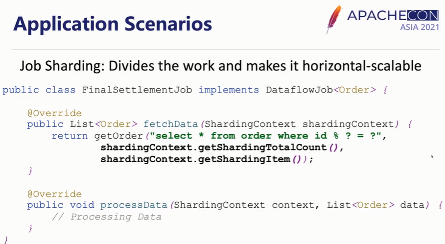

参考资料：https://www.bilibili.com/video/BV1BQ4y127Fp/?spm_id_from=333.337.search-card.all.click&vd_source=8bd5ab544d4cb8d9821752b68ce53b11

### ElasticJob

分布式  作业调度  水平扩展  高可用

弹性调度：分片，支持水平扩展

资源分配：作业执行时才分配资源

作业治理：故障转移、自动诊断修复

作业开放生态

UI界面：进程和作业的管控 连接数据源查询作业的历史执行状态和记录；

15年当当开源；

#### 架构

- 分为lite和cloud，lite为java sdk，调度器和执行器都在业务进程内，多个进程通过注册中心协调；
- cloud多了资源管理、作业分发、不同作业有进程级别的隔离；需要执行的时候才启动作业的进程；
- 开放生态[开发者可自行扩展]：作业执行器、错误处理器、分片策略、作业执行跟踪模块
- 

#### lite架构图

- ​	

- 注册中心写入  作业配置、当前节点的信息；作业触发通过course [java领域开源的调度工具]实现
  - course: 各个节点通过注册中心选取leader节点，leader完成分片操作；作业的配置变动、节点数量变化才会重新选举或重新分片的操作，各个进程按照得到的分片执行作业逻辑；trace跟踪模块会把执行状态和记录写入数据库，也可以打印到日志中[使用elk等]；
  - listner：借助了zookeeper的watch机制；重新分片  failover 故障转移等功能通过listener实现；
  - 管控端：连接注册中心获取作业和进程的信息；连接数据源  查询作业的历史状态或记录；

#### 关键能力

-  作业分片
  - 例：3个分片，2个进程；leader检测到作业状态为待分片，会依据分片策略进行分片；
  - 

- 弹性伸缩
  - leader检测到有新节点/进程注册上线，会将状态设置为需要分片，下次作业触发钱会重新分片；如果节点注册的时候恰好作业正在运行，新节点不影响作业运行；
  - 
- 故障转移
  - 例：两个进程，两个分片；三个进程，两个分片；
  - 进程0执行完分片0，在注册中心发现到分片1需要补偿执行；
  - 空闲进程2监听到带有分片1的进程1下线，故补偿执行分片1；
  - 理想情况：情况2的情况下支持断点续传，分片1被补偿执行时不需要重头执行；
  - 
  - 
  - 
- Misfire
  - 作业错过执行时间后，立刻补偿执行；
  - [如一个作业执行时间超时，错过下一次触发，因为不支持同一个作业叠加运行]，开启Misfire会在上一轮作业执行完毕后立刻开始执行；但是最多补偿执行1次；
- elasticJob UI
  - 作业管理：查看作业状态  修改作业配置 触发  启用禁用下线作业   禁用作业分片；
  - 作业进程：查看作业进程  停用下线进程
  - ：连接数据源，查询历史执行状态和记录；

#### 代码示例

- 水平扩展，例  对于dataFlow任务，取模的方式每个人处理一部分数据；
  - 

### 3.0版本的改进

- 2.1.5版本   作业类型 SimpleJobExecutor  DataflowJobExecutor ScriptJobExecutor 无法扩展，3.0.0抽象出顶层作业类型  Classed类型需要 自己编写业务逻辑，Typed类型需要提供配置和参数 ，使用java的spi机制注入;
- 3.0版本的触发不限于cron表达式，jobbootstrap接口，OneOffJobBootstrap 一次性启动器；节点像注册中心写入trigger标志，等listener接收；
  - 
- 3.0版本，抽离了很多模块，方便扩展
  - 
- 新增Spring Boot Starter支持；
  - 

#### ShardingSphere Scaling :

- 弹性迁移的能力
- 例如：二分库  扩展到  三分库
  - 
- 流程：
  - 第一阶段  准备：数据源检查  存量数据统计  准备迁移任务  拆分；第二阶段 存量数据迁移[迁移过程 不停机]：第三阶段 ：迁移过程的增量数据进行迁移；第四阶段 规则切换：业务数据流量从旧业务集群迁移到新业务集群；
  - 
- 数据迁移的数据量很大，为了提高效率需要水平扩展的能力，elasticJob 水平扩展  高可用能力，通过切片拆分迁移任务；elasticJob是scaling的核心调度引擎；
- 

### zookeeper也得学！！！！是如何保证只执行一次的？java调度工具 coursre?