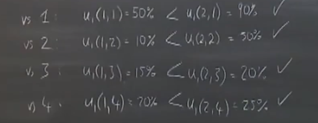

杜塔  策略与博弈

乔尔 沃森    策略

战略与思想

#### Lesson1

- 博弈论基本操作
  - 信息汇总到表格； 两张表格的信息尽量汇总到一张表格；
    
    - |      | a     | b     |
      | ---- | ----- | ----- |
      | a    | B- B- | A C   |
      | b    | C A   | B+ B+ |
  
- 基本要素：收益；用数字量化收益；  //博弈论能助你达成目标但是不能助你树立目，你的目标决定了你的收益
  
  - |      | a     | b     |
    | ---- | ----- | ----- |
    | a    | 0, 0  | 3, -1 |
    | b    | -1, 3 | 1, 1  |
  
- 无论对方如何选，选a的结果严格优于b，那么a相对于b是个严格优势策略

- 小结（如果只关心自己的成绩，成绩的游戏本质就是==囚徒困境==，类似寝室卫生打扫、企业的价格战、大家抢鱼群资源）
  - 收益（你的目标）很重要，影响你的决策
  - 可能方案：协约、制定规章制度，目的是改变了收益、冬季；  把单次博弈考虑成重复博弈；通过教育改变收益

- 几种情况梳理

  - 自私的人称之为饭桶恶魔；  考虑别人的人称之为愤怒天使；
  - 我方 饭桶恶魔 ， 对方也是 饭桶恶魔，收益矩阵如上
  - 我方  愤怒天使，对方  愤怒天使
    - 收益矩阵  如下变化，则变为==协和谬误==
      - 0 0 ， -1 -3
      - -3 -1，1  1
  - 我方饭桶恶魔， 对方 愤怒天使 
  - 我方  愤怒天使， 对方 饭桶恶魔，也是协和谬误
    - 0 0 ， -1  3
    - -3  -1，1   1
    - 注意到我们没有优势策略，但是考虑到对手有优势策略a，对手选a的可能性很大，，所以我们应该选a

- 结论:

  - 不要选择严格劣势策略
  -  大家都选择优势策略可能导致总结果变差
  - 你永远得不到想要的，如何有可能，想要得到某样东西，最好先了解他
  - ==策略分析的核心---是换位思考，分析对方的收益和对方的策略==
  - 结论5：耶鲁大学的学生大多比较自私
    - 现实中 囚徒困境的现实实验70% a，30% b，耶鲁大学大概是238：36

#### 第二课 

- 游戏2：随机写一个数字1-100，最接近平均数2/3的人获胜； 26

  - 这个游戏的关键是群体的特点，每个人能算到几层 //

- 博弈的要素 

  - 人： 表述方法（如i j）  
  -  策略：  si表示i选择了策略s    Si表示参与者i的所有策略集合   s表示一次博弈，策略组合（策略向量或者策略列表）表示每个参与人有一个对应的策略  
  - 收益：Ui(s'1....s'n)  表示参与人i的收益，s1..sn都会影响它，简写为Ui(s)

- 本节课的内容假设：

  - 每个人都知道其它人的策略集合
  - 新的符号：其他人的收益S-i表示除i外的其它的策略组合（考虑i和对手不同选择下的收益很重要，Ui（si,  S-i ）

- 优势策略：参与者i的策略s'i严格劣于参与者i的策略si

  - 如果 选择si的收益Ui(si, S-i)   >  Ui( s'i, S-i)  //对于所有的S-i成立

- 弱优势策略：参与者i的策略s'i弱劣于参与者i的策略si

  - 如果 选择si的收益Ui(si, S-i)   >  Ui( s'i, S-i)  //对于所有的S-i成立
  - 如果 选择si的收益Ui(si, S-i)   >  Ui( s'i, S-i)  //对于至少一个S-i成立

- 例子

  - | 1\ 2 | L    | C    | R    |
    | ---- | ---- | ---- | ---- |
    | T    | 5,-1 | 11,3 | 0,0  |
    | B    | 6,4  | 0,2  | 0,2  |

  - 人： T B

  -  S1= {T，B}    S2={L,C,R}

  - 收益： U1(T, C) = 1 1     U2(T, C) =3

  - 策略分析：参与者1无优势策略，参与者2无优势策略，但是策略R相对策略C是弱劣势策略；

- 结论

  - 不要选择弱劣势策略
  - ==策略分析的核心---是换位思考，分析对方的收益和对方的策略，对方可能不会选择严格劣势策略或弱劣势策略==

- \ >67的数相对67是弱劣势策略，所以不该填   //自己是理性的参与人可以到这一层

  - 一次换位思考，假设大家都不会选弱劣势策略：45 < si <= 67    67 * 2/3  = 44.6 以上的数在原博弈中不是劣势策略，但是在剔除67以上的数之后，这些策略也成了弱劣势策略   //知道你的对手是理性参与人可以到这一层
  - 二次换位思考，假设大家都做到一次换位思考：  30 < si <= 45也都成为了弱势策略   //知道你的对手知道 对手的对手是理性参与人
  - ...不断重复，最后会得到1 //==所以最后考虑的是分布在不同选择段的人数，不同的群体分布定然不同==  //共同知识：我知道一件事，你知道，  我知道你知道我知道你知道......

- 补充：a b各戴一顶粉色帽子，可以互相看到对方的，但是看不到自己的。  问：两个人戴的至少有一顶粉色帽子算是公共知识吗？   不算，因为a看到b的帽子，知道至少有一顶粉色帽子；但是a不知道b知道至少有一顶粉色帽子，因为a不知道自己帽子的颜色且知道b看不到自己的帽子的颜色

- 再玩一次游戏，平均数肯定会更低。 //大家通过数据都知道对手老练的程度；也知道大家都知道我学得老练；我知道大家知道我知道大家知道....

#### 第三课

- 游戏2，先剔除劣势策略，再审视这个博弈，观察哪些策略变为了劣势策略，再剔除劣势策略...  ==迭代剔除劣势策略==
- 游戏3 //政治学模型（Anthony Downs）：中间选民定理，候选人集中趋向中间立场，拉拢立场相近的选民；  经济学（Hotelling）：商业普遍集中，试图争取附近的客源；
  - 2个参与者 
  - 每个参与者需要选择一个政治立场，1-10
  - 每个政治立场有10%的选票，选票辉投给离自己近的参与者，平局则平分选票。收益是最大化选票数量
- 1相对2是劣势策略，同理10相对9是个劣势策略；
  - 
- 2相对3并不是劣势策略
  - 
- 但是如果我们剔除了劣势策略1和10，策略2相对3成了劣势策略

- 28min