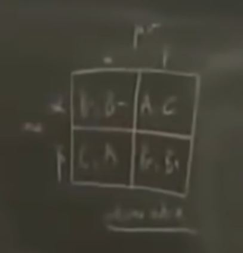
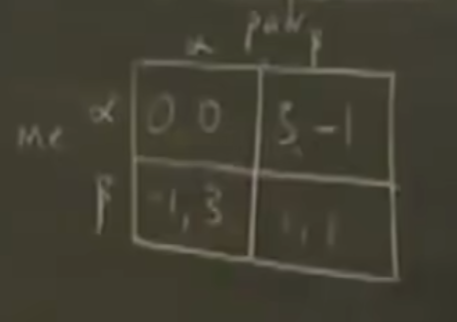

杜塔  策略与博弈

乔尔 沃森    策略

战略与思想

#### Lesson1

- 博弈论基本操作
  - 信息汇总到表格； 两张表格的信息尽量汇总到一张表格；
    - 
- 博弈论能助你达成目标但是不能助你树立目标
- 基本要素：收益；用数字量化收益；
  - 
- 如果只关心自己的成绩：无论对方如何选，选a的结果严格优于b，那么a相对于b是个严格优势策略
- 小结（成绩的游戏本质就是==囚徒困境==，类似寝室卫生打扫、企业的价格战、大家抢鱼群资源）
  - 1 不要选择严格劣势策略
  - 2 大家都选择优势策略可能导致总结果变差
  - 收益（你的目标）很重要，影响你的决策
  - 方案：协约、制定规章制度，目的是改变了收益、冬季；  把单次博弈考虑成重复博弈；通过教育改变收益
- 收益矩阵  如下变化，则变为==协和谬误==
  - 0 0 ， -1 -3
  - -3 -1，1  1
- 自私的人称之为饭桶恶魔；  考虑别人的人称之为愤怒天使；
- 收益矩阵 如下变化，

#### 第二课 

- 15

- 博弈的要素 

  - 人： 表述方法（如i j）  
  -  策略：  si表示i选择了策略s    Si表示参与者i的所有策略集合   s表示一次博弈，策略组合（策略向量或者策略列表）表示每个参与人有一个对应的策略  
  - 收益：Ui(s'1....s'n)  表示参与人i的收益，s1..sn都会影响它，简写为Ui(s)

- 本节课的内容假设：

  - 每个人都知道其它人的策略集合
  - 新的符号：其他人的收益S-i表示除i外的其它的策略组合（考虑i和对手不同选择下的收益很重要，Ui（si,  S-i ）

- 优势策略：参与者i的策略s'i严格劣于参与者i的策略si

  - 如果 选择si的收益Ui(si, S-i)   >  Ui( s'i, S-i)  //对于所有的S-i成立

- 弱优势策略：参与者i的策略s'i弱劣于参与者i的策略si

  - 如果 选择si的收益Ui(si, S-i)   >  Ui( s'i, S-i)  //对于所有的S-i成立
  - 如果 选择si的收益Ui(si, S-i)   >  Ui( s'i, S-i)  //对于至少一个S-i成立

- 例子

  - | 1\ 2 | L    | C    | R    |
    | ---- | ---- | ---- | ---- |
    | T    | 5,-1 | 11,3 | 0,0  |
    | B    | 6,4  | 0,2  | 0,2  |

  - 人： T B

  -  S1= {T，B}    S2={L,C,R}

  - 收益： U1(T, C) = 1 1     U2(T, C) =3

  - 策略分析：参与者1无优势策略，参与者2无优势策略，但是策略R一定不会是最有

- 结论

  - 不要选择弱劣势策略

- 34

