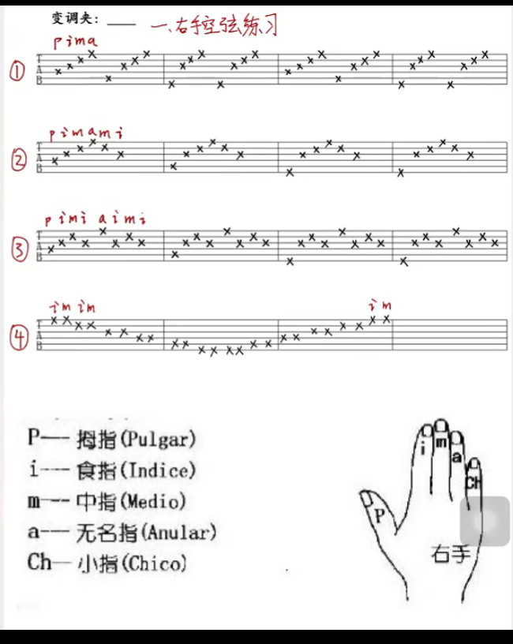
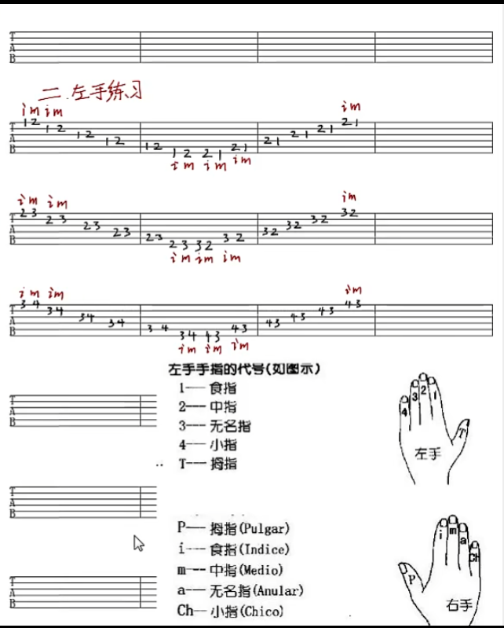
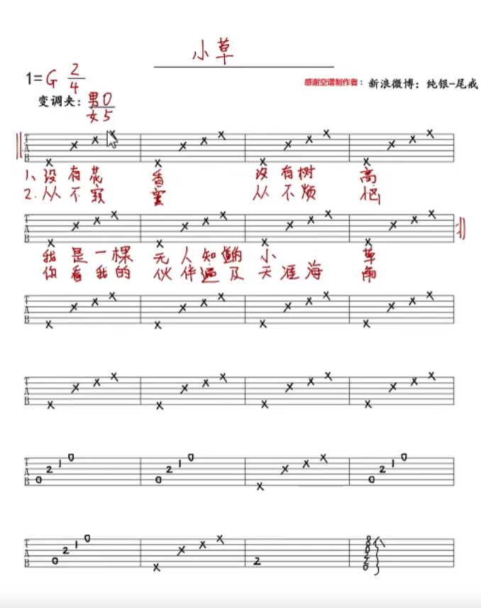
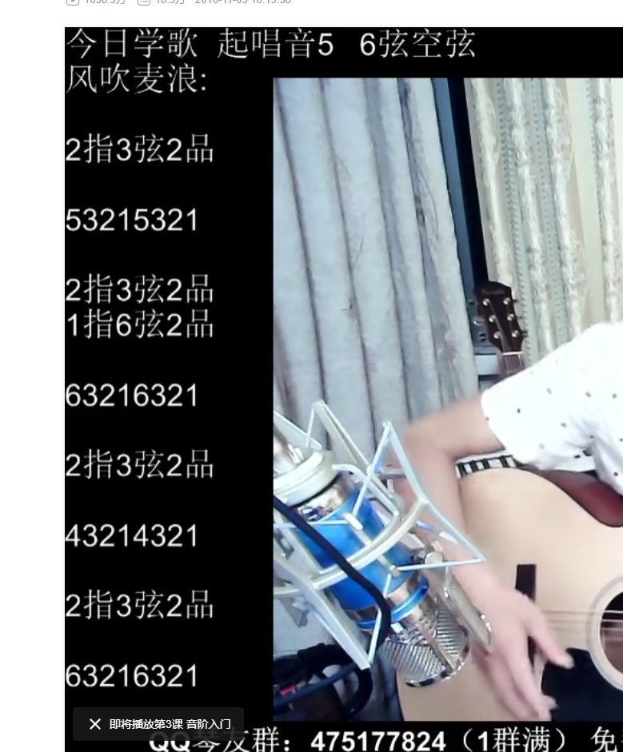

### 持琴姿势

### 平坐

- 琴有三点： 尾前部（胸）  尾下方中间（大腿）  尾后方最高点（右肘）
- 琴头 平或高于琴 箱体；
- 拨弦：力平行箱体 方向斜右下方一点；  勾弦：平行箱体   方向右上一点 //==大拇指的力量要大一些；右手可以考虑用左右找弦位置==
- 
- 注意
  - 手腕沉下来、指关节发力  手腕不动、大拇指拨弦时 其它手指自然弯曲自然放上去 拨完收回来；
    - ==大拇指可以常在五弦待命； 拨弦的时候大拇指要绷直  近掌第二关节有弹性一些；拇指怕拨到下面的弦可以力往外一点； 大拇指拨不同的弦时手掌不要移动，只移动大拇指==
    - ==拨弦的时候其它手指以近掌的第二关节要绷直 才会干净==
  - 尽量不看琴 一开始要看倾斜一点点；练到不看琴  音不会错即可；
  - 动作干净  节奏稳定  ==节拍器【73】==；

### 二郎腿

#### 空弦练习

- 右手
- 左手[左手一、二、三 组 可以 配合右手四组，前面的音尽量保持] //动作干净、连贯、指尖触弦；
  - 按弦：大拇指要给一个力（大拇指根部[博主习惯]   或 大拇指第一节），用指尖按，==位置要尽量接近品丝==，力量  能按住弦 然后尽量小； 往上爬  变1指位置的时候，2指不动； 往下爬稍微有点不一样，2弹完要主动松开，下移的时候一也可以考虑松开//第一组练习，大拇指可以露出一截  竖直向上，在一品； ==按弦时关节要立起来；两个手指不容易分开的话可以稍微倾斜一点==
  - ==按弦和拨弦的配合也要在研究下==
  - 2 3组变手指即可，其它不变；//==关注下大拇指位置的变化；==
  - 

#### 入门小草

- 

#### 风吹麦浪改编版

- 
- 

