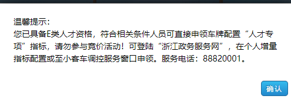

后续工作

- 本周末跑一趟 九堡，周边的 配套、生活气息再好好评估下；
- 如何选楼栋  如何选楼层？
  - 西边是否有出口两种情况下，自己给楼栋排个序【有西出口的情况下，近西出口好】，取前50%（加上楼层1/2，四次摇号的期望差不多就是1，人生大事稳重要紧）
    - 无西门：2 3 4 1 6 5 8        9 7 10  12 13 11 14
    - 有西门：12 13 9  8 10 11 14          3 5 6 2 7 1 4 
    - 15-20碾压全部
- 除了冻资证明、住房查询（有有效期限制）  其它的资料本周末汇总下；/==/其实也就一个具结书啦  需要按个手印（物业有）==；
- /////基本就是九堡了；保利那个  象征性地看看吧；   可以在那附件的商场吃个晚饭；
- 写字楼后面什么规划？是否绑定车位？有没有交付的合作盘【21年合作估计还很少】？
- 第一次是否参加也要好好考虑下，楼栋不一定绝对满意，但是想熟悉要号的全流程
- 整理下看样板房有哪些要点【小区的品质 装修的品质看哪几点？或者影响居住体验的哪几点？】？自己会比较看重房子的哪些点？//

资料***//所有的资料图片形式就可以了吧？有没有需要纸质的？      住房查询就够了吗？不动产查询证明哪里整？   冻资证明怎么获取？合作银行？    单身具结书是自己打印然后填写吗？

- //身份证 
- //***户口本  联系老爸老妈；
  - 
- ***婚姻证明   单身具结书？？？
  - 打印或手写 + 按手印即可；
- //住房查询 //住房查询就够了吗？     不动产查询证明哪里整？不动产不用
  - 户籍 所在地住房信息查询+不动产查询证明？？？
  - 住房查询：支付宝可以查现成的;
- 征信报告
  - 实际操作过了，明天核对下；
- //社保证明
  - 支付宝可以查现成的；
- ***冻资证明
  - ？？？合作银行？
- //高层次人才证明
  - 
  - 见pdf

