nodejs安装，idea中配置ndoejs

https://blog.csdn.net/m0_56602092/article/details/123109925

idea中启动vue项目

https://blog.csdn.net/m0_62808124/article/details/125776300

Java程序员用学前端么？java开发所需的前端技术全教程（HTML/CSS/js/vue2/vue3/react）

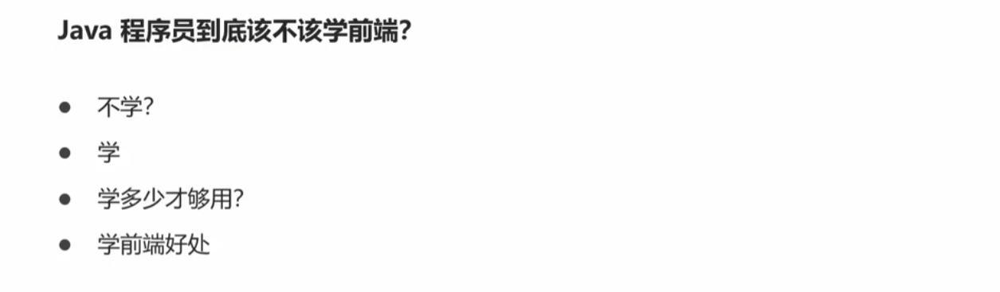

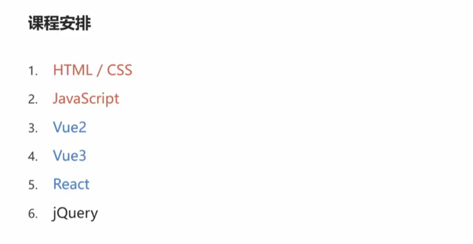

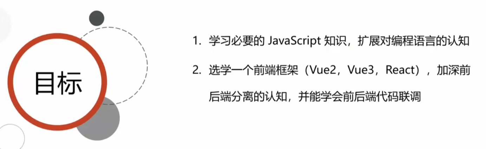

超文本：即包含超链接，可以关联多个网页；

标记：<></..>，不同的标签包含不同的内容

css: 描述网页的表现与展示效果，需要在html页面中引入；

#### html入门

//vscode中安装插件可以用idea的快捷键； html: !+tab； img+tab;    标签属性查找 推荐网站：mdn web docs; 

html元素：标签、内容、属性[
]、嵌套、空元素；

html页面：DOCTYPE--标准模式（渲染、展示）；  lang:语言；   页面组成；

常见元素：<h1>--文本 
--段落  <ul>---无序列表 ：<li>  <ol>--有序列表：<li>     <ul>-<li>-<ul>-</ul>-</li>-</ul>  <a>-锚，Anchor，超链接；本地页面调整-互联网页面跳转-页面内锚点<a href="#p1">；   //
 

多媒体：Image:   ，src支持-----文件地址,data URL, object URL;   <video>; <audio>

表单的基本用法： <from action>  <input   type=“text”  name--指定提交的变量名  > <input   type="submit"    value---按钮名字 >  <input   type=“password”  name--指定提交的变量名  >  <input   type=“hidden”  name--指定提交的变量名  value="1">:隐藏框不会显示，但是提交表单的时候也会提交到后端   <input   type=“date”  name--指定提交的变量名  >:对应的java接收建议Java.time.LocalDate，同时指定日期格式@DateTimeFormat(pattern = "yyyy-MM-dd")；   男 <input   type=“radio”  name--指定提交的变量名   value  checked>---单选；   <input   type=“checkbox”  name--指定提交的变量名   value >---多选，后端用List<String>接收； <input type = "file" name--指定提交的变量名>---文件上传，form的method属性必须为post，enctype = "multipart/form-data"，后端用multpartFile接收；

图片读入并用base64编码：

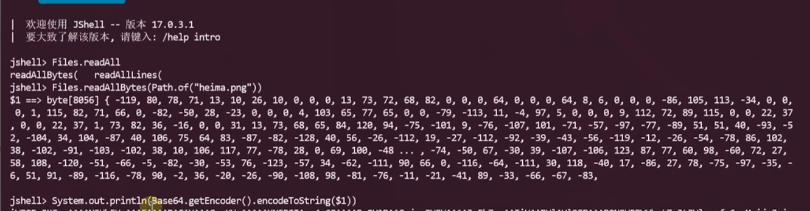

#### HTTP

get请求和post请求的区别在于 请求数据的存放位置不同；

host：指明要访问的虚拟主机名（不用于主机IP---链接哪台主机，连接上之后访问哪个虚拟主机）；tomcat默认的虚机主机名为localhost；

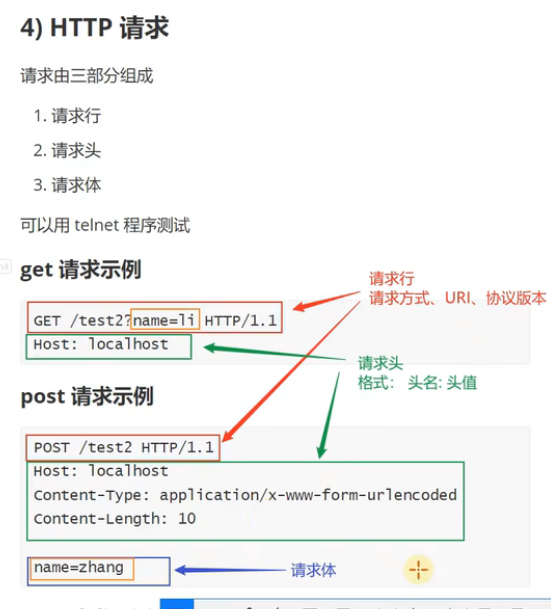

telnet可以发送原始http请求；  

Content-Type:

- post请求[application/x-www-form-urlencoded默认数据格式，汉字-&等特殊字符要先编码，再发送；JS可以编码----encodedURIComponent("张")]多个参数之间用&分隔；

`//url编码的本质就是先转换为utf-8编码(一个汉字3个字节)，转为16进制再在每个数字前面+%;`

- application/json格式，`后端接收参数前要+@RequestBody;  方法上的@ResponseBody是把javaBean转换为JSON对象的格式；`    `返回的JSON串格式（是chunked分块响应），长度（发送的字节数）-JSON串-0(字节数为0表示响应结束)`  JSON串中的汉字不需要编码 (用js计算长度可以用单引号，但是一个汉字3个字节 要额外计算[js中算一个])；
- jdk16以上可以用record类写javaBean;

- multipart/form-data: 需要自定义分隔符boundarty; 用js计算长度，有换行，不能用单引号、双引号，要用反引号，且要多加每一行的\r ；//==http中的长度计算和js中有点不一样，有空的话可以梳理下？？？有影响的是汉字三个字节，所以汉字要多加2； http的换行是\r\n所以换行要多加+1==

求字符串长度可以浏览器F12，控制台用javaScript计算；

#### session原理

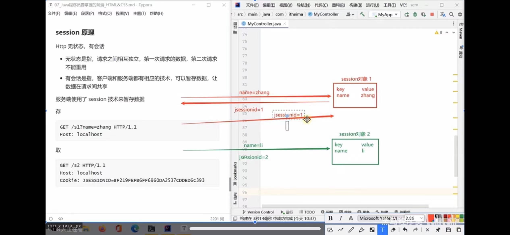

session技术是为了实现不同http请求之间的数据共享，将共享数据保存到session，生成一个sessionid并将session保存到服务端，后续请求带一个sessionid即可。常用于身份校验。

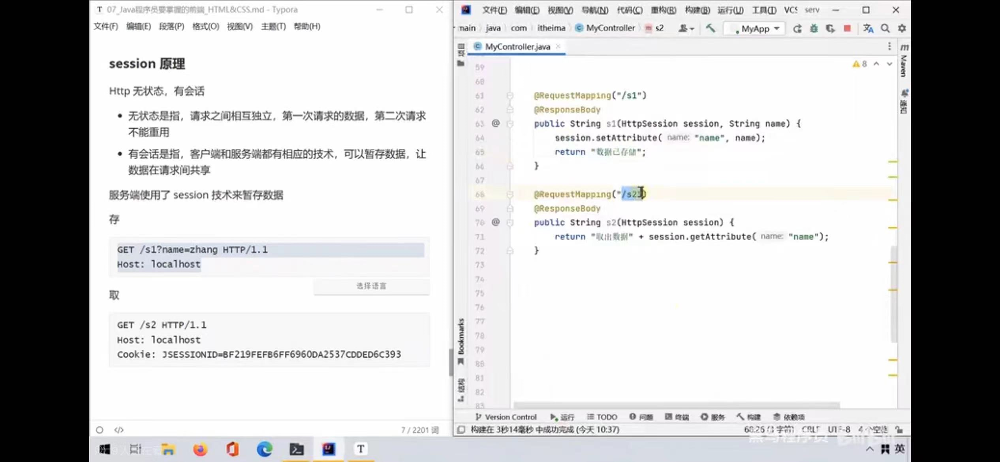

请求的sessionid常保存在cookie字段；conteoller请求参数多一个httpsession即可，请求不带sessionid则后端会自动生成一个session对象

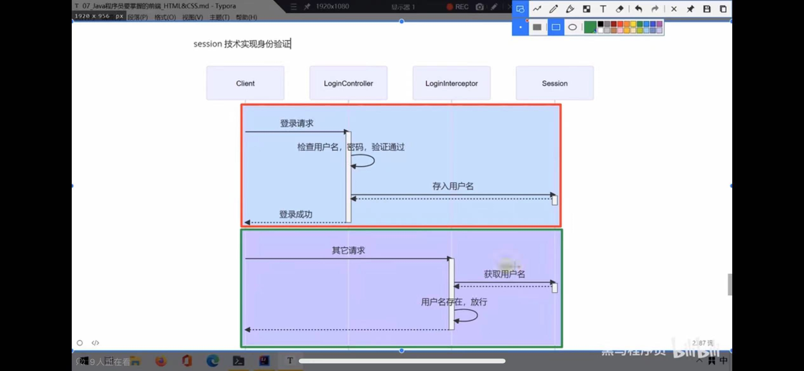

第一次登陆，用户名作为登陆成功的标志存入session，第二次登陆拦截器里校验session中是否有用户名；

#### JWT原理   Token的原理--类似花钱买的电影票

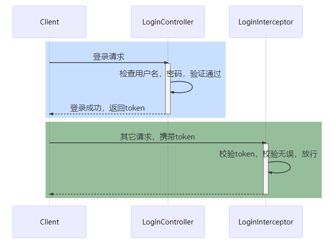

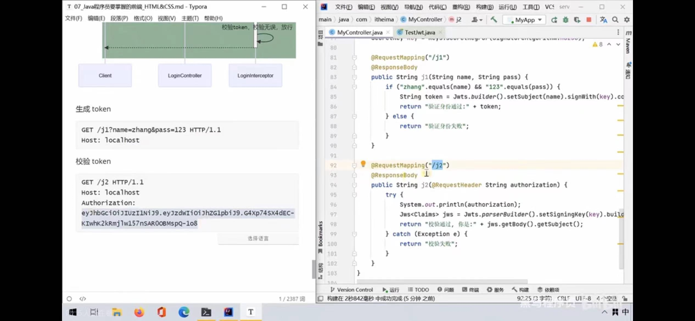

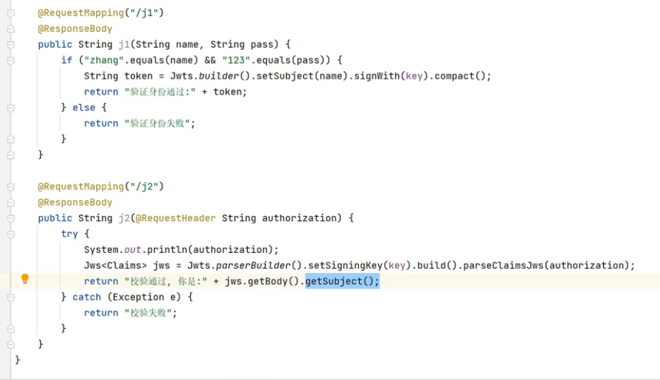

jwt适用于`分布式`身份校验和session的区别在于用token替代sessionid，区别在哪里？优缺点是什么？[session缺点：session存储在服务端，用户多影响性能；请求伪造攻击；若保存在内存中，分布式环境只在一台机器上有效；] [jwt不需要在服务端保存信息；跨语言；缺点：登录状态续签--每次请求刷新token或者快过期的时候刷新；用户不能主动注销[客户端删除的话要在所有客户端一个个删除]，可以在注销时将token加入黑名单；]

请求的token常保存在authorization中；controller要加@requestheader；

#### 

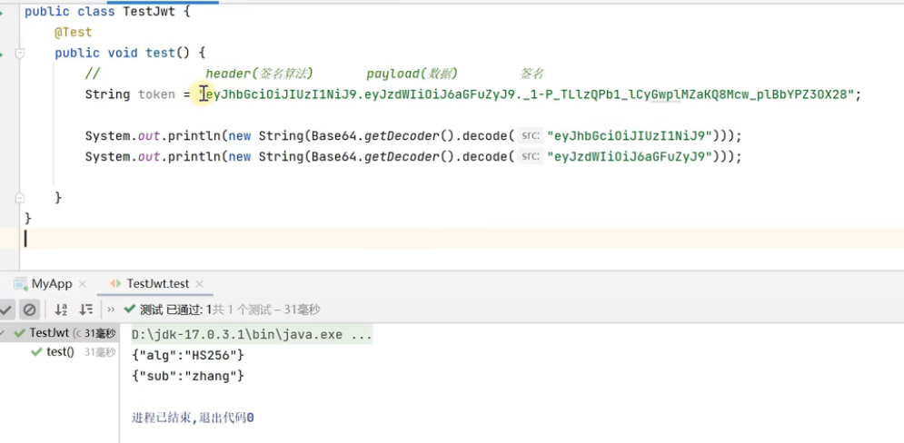

token或者称cookie，由三部分组成；但是要注意，payload部分不能存放敏感信息，是可以解密的[base64]；

签名：保证token不被篡改；签名依据  签名算法+数据 +密钥 生成签名，保证签名算法和数据未被篡改[如有人把普通用户伪造为管理员，将无法通过校验]；

#### CSS

**选择器**：定位到页面元素； 

type(元素选择器)--依据标签的名字匹配 p{key:value}；

class选择器  .c1{} //class取值为c1的标签； 

id选择器----依据元素的id属性记性匹配 #p3  //id为p3的标签；   

 优先级（范围小的优先）：id>class>元素

**属性和值**：指定样式； 参考之前的文档---references---CSS----Reference---Properties； 

display: none 隐藏；block 显示，常用于弹出框；

先用选择器定位到元素，然后用属性和值指定样式；

可以用<style>标签在html内部定义样式，即内部样式；

**div:容器标签**，可以写其它的html标签；一个div标签对应页面的一个区域, 通常分为header  aside main footer；

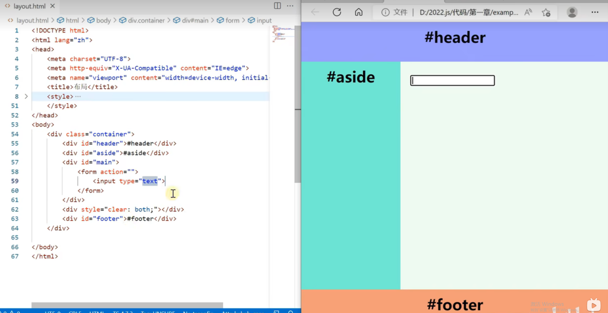

UI就是设计页面布局吧？？

**template 模板标签**：代码并不会直接在html页面上展示；结合JS代码使用，把代码动态加入到其它div容器中；用于快速生成多个功能类似的组件；

#### Javascript

//修改页面内容，可以让页面展示服务端获取的最新内容；  但是页面刷新会重置到初始状态；

浏览器控制台：document对象：整个html文档；

一般写在<script>内；一般放在<body>的最后；也可以写在js文件，然后在html中引入； <script src = "路径">

声明变量：能用Let就别用var;

基本类型：undefined--null-------函数和表达式执行时没有返回结果；对象元素不存在；变量无初始值；

​		模板字符串必须用反引号` ;   小trick，用-完成字符串转数字，“10”-0；

数据类型-Function--定义与参数：第一个参数用默认值，第二个参数实参：pagination(undefined, 20);

数据类型-Function--匿名函数，箭头函数；

//下面的作用域和闭包针对var定义变量的情况；

数据类型-Function---JS中函数是对象，可以赋值，可以使用console.dir查看对象属性；高阶函数：以函数为参数或返回值；作为参数的函数被称为回调函数；

数据类型-函数对象的属性scope为作用域，属性不包含函数内的那一层[当然函数内的变量肯定可以访问]；

Function---闭包；函数对象作用域在 函数定义 时候就确定了，闭包即函数能够访问自己作用域中的变量，即使是作为返回值返回；

//类似java中landau表达式和它 的参数捕获；

常用：console.log(XXX);

数据类型-var与let区别：普通[非函数]的{}是否能界定作用域的范围，let能[建议用let，更接近java]，var不能；

数据类型-array: map  filter，返回结果变了，但是原数组的内容不变；//难怪伪代码是新建一个新的数组，不是直接改旧的数组；

数据类型-object:  属性、方法用逗号,分隔；java script没有私有概念，只有有个约定，==_name 不会调get、set方法，直接访问==为什么要这样？？？；JS的get set调用有点不同，定义的时候接近方法，使用的时候当属性用（不过js中的方法本来也就是属性），外部调用直接 this.get/set  然后做获取、赋值操作

数据类型-object-this：

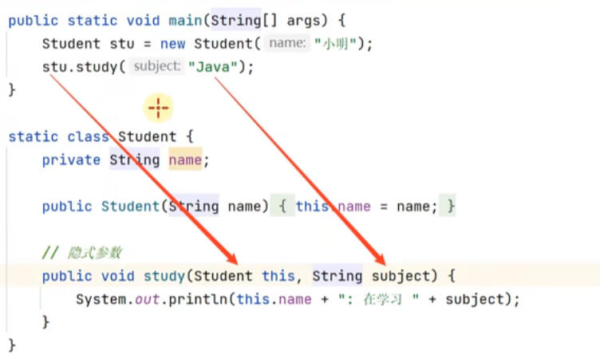

//java中的this，本质上是一个隐式参数，代表的是调用方法的对象

​	JS this三种情况：落单、对象内、call动态改变；    例外：箭头函数内出现的this，以外层this理解；（例子见课件的匿名函数-落单函数、箭头函数）

数据类型-object-原型继承：

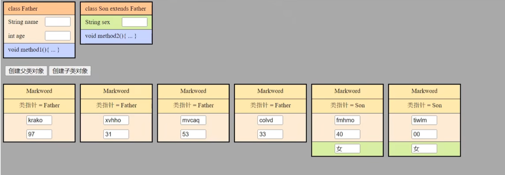

//java中的继承，在类之间；java中地址占4个字节？

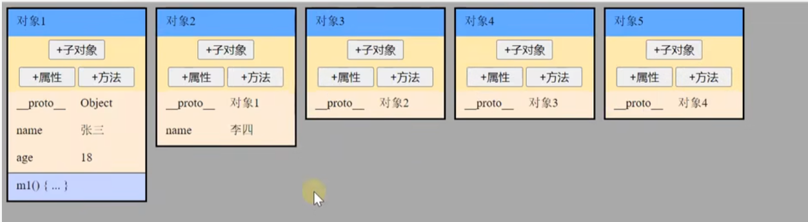

js中的继承，在对象之间，会形成原型链；

数据类型-object-基于函数的原型继承：函数中出现this，代表的是要创建的对象；函数的prototype 属性就是父对象；子对象的 `__proto__` 就是函数的 `prototype` 属性；

数据类型-object-json与js对象：js对象，属性名带不带双引号均可，json对象必须要带；

运算符和表达式-展开运算符：展开运算符复制属于浅拷贝，即只拷贝一层，如果对象内的属性是对象，拷贝的时候也直接拷贝地址；   ...展开运算符和解构赋值运算符区别：展开运算符不能多变量赋值；在函数传参的时候，展开是调用时对实际参数做处理，解构是在函数定义是对形参做处理； 解构还可以在for of循环中使用；

控制语句-for in : for in中，n是一个变量，不能用.语法，.语法的含义是找son中名字为n的属性；

api-环境准备：nvm github上可以下载exe;  npm 包管理器；版本切换本质就是 让nodejs快捷方式指向不同版本的nodejs；

api-搭建前端服务器：express，前端服务器，类似后端的tomcat； --save-dev，只在开发阶段生效； 前端代码推荐在vscode中编写；   要使用import语法需要在 package中添加 "type": "module"；  vscode----ctrl+shift+` 打开终端；修改前端页面，不需要重启服务；

api-查找页面元素：document.querySelector()---依据选择器查找页面元素；

api-利用模板：document.importNode()  复制元素，通常第二个参数传true，表示如果元素内有子元素，也复制子元素；

api-同步 异步接收结果：java中异步接收结果，注意之后的打印在  123之前，而且123的打印是由 线程池的另一个线程打印的！！！！//异步接收结果的代码，不影响后续代码的执行；  而同步接收结果，要等待；

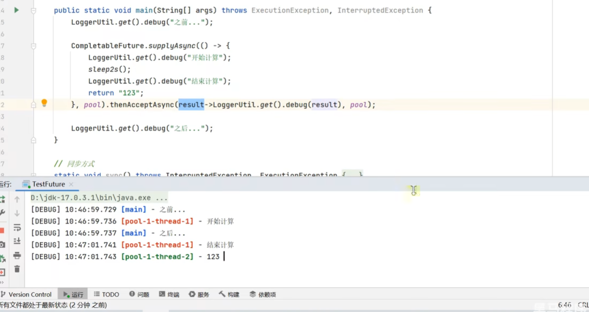

api-fetch-同步接收结果：promise 类似java中的compeletableFuture；

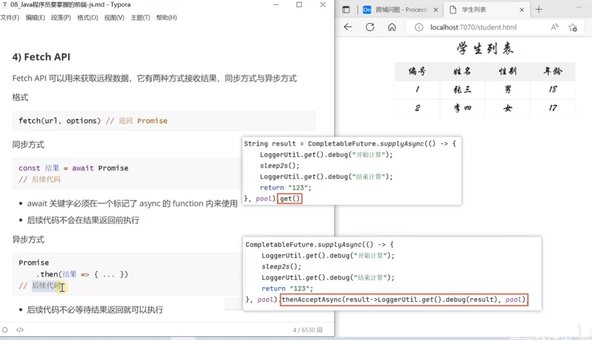

.json()获取的结果是promise对象，需要再次用await获取内容；

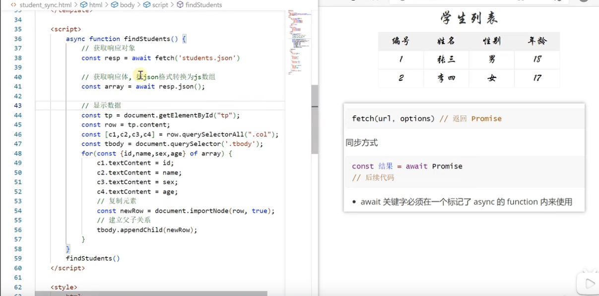

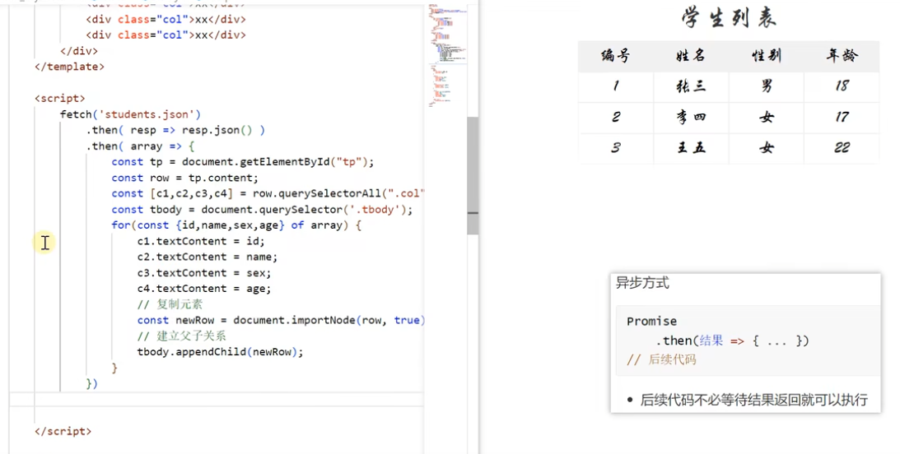

promise对象才有then方法；

异步的异常捕捉：

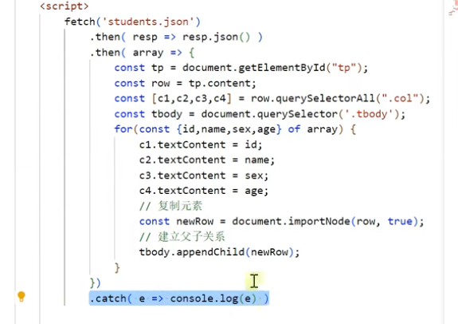

同步的异常捕捉，try catch即可；

api-fetch-跨域-请求头响应 解决：

跨域，未通过浏览器同源检查，即网页来源和网页内的fetch 、xhr请求是否同源；跨域请求会带一个Origin头，值为页面来源；

controller上添加@CrossOrign注解即可[响应头会多一个Access-Control-Allow-Origin]；

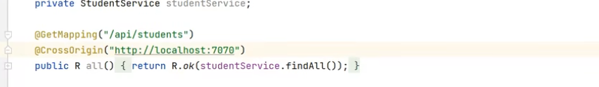

//注意：java后端返回对象的data属性才是json对象；

api-fetch-跨域-代理解决：

如何区分7070的前端请求和8080的后端请求，通常可以在后端请求上加 /api/前缀；

//所有带/api前缀的都走代理，代理的地址为 'http://localhost:8080'

app.use('/api', createProxyMiddleware({ target: 'http://localhost:8080', changeOrigin: true }));

//访问同源的资源可以省略ip:port

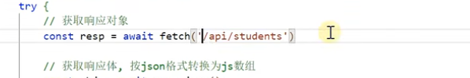

api-导入导出：

从其它js文件中导入 常量、变量、函数；

整体导入也可以有module.default；

导入的两种方式：

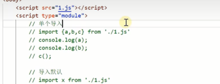

老的标签src方式不支持import语法； 

import语法需要遵循同源策略；src可以不同源；

#### ts//类型；标注位置；几大类型；泛型；

ts--入门：js是动态类型语言，类型不确定，后期使用麻烦，故对js做了扩展，产生了ts，ts文件编译后生成js文件；

ts类型--复杂类型：type  interface在编译后会擦除；

ts类型--类型--字面量与nullish类型：string类型不包含null值

ts--意义：例子用的es6的语法，编译的时候要指定es6

ts-class语法：语法上接近java的class，编译后的js文件，其实用的还是原型；

如何理解javaScript中的原型（js中函数也是对象）：原型继承（构造方法没有）——基于对象的继承， ==Object.create(father)==  可以创建基于father对象的子对象；子对象没有的方法和属性会去父对象找（子对象会复制一份父对象的方法和属性）；__ __proto__ __ 属性代表父对象；   基于函数的原型继承(构造方法可以有入参)——函数有一个prototype属性（`__proto__`代表函数的父对象），保存的是函数创建出来的子对象的父对象（原型），可进行设置，所以定义的函数就已经是子对象的构造函数了，需要==配合new关键字==使用；

==函数语法中的this代指的是函数创建出来的子对象???!!!==  

上面的说明有一个地方让我觉得有点怪，就是定义子对象的时候，不需要知道父对象有哪些属性，仔细想想，是动态的，也就接受了；

class 如果实现接口：要同时实现接口的属性和方法，缺一不可；一个雷可以继承一个类，实现多个接口；子类没有无参构造，是没有默认构造的，会调父类的构造； 	

方法重写：会调用子类的的方法（哪怕父类定义了函数）；

#### vue3

基础--环境准备

code .//即可用vscode打开当前目录；

建议安装vue插件（带骷髅头）; Chinese扩展包；浏览器vue插件；

localhost设置为0 0 0 0可以监听所有的地址；

基础--入门案例： 对于响应式变量；script中修改值要通过.value获取值再修改；再template中，还是一样{{}}即可取到值；

基础--main.ts：index.html  引入 main.ts，mian.ts创建App的时候用到了App.vue；  //将App.vue组件的template内容挂载到index.html的标签为app的属性上[mount]；

基础--属性绑定与事件绑定：ref与reactive + {{}}又称为文本插值，只能绑定  标签的 文本数据；属性绑定（单向，js的变量变化影响页面）----:+ref/reactive  ； 属性绑定（双向，需要页面输入的情况，一般用于表单项）---- v-model + ref/reactive //public下的静态资源 路径，可以省略/public，因为是默认的静态资源路径；

基础--xhr--基本使用：全称为XMLHttpRequest；结合onload方法，可以实现异步调用；

vscode快捷键推荐：shift + esc 打开终端？//npm run dev

基础-axios-获取数据：跨域请求也可以在后端配置，允许跨域（这种方式处理跨域对比前端代理，效率要高很多）；

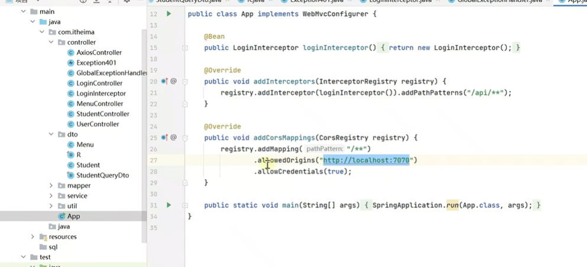

await(配合promise对象使用)用在函数里面，必须给函数加async;  

onMounted 函数，页面组件加载完毕后执行； 

axios的返回对象有一层封装，resp.data取到的才是后端返回的数据；

//`js请求不带ip默认同源的ip:port`

基础-axios-发送数据：

//后端，@RequestBody 默认对象是JSON，axios.post方法第二个参数默认也是JSON；

基础-axios-拦截器：

可以添加对请求的统一处理； 处理异常时，针对不同的异常，做不同的操作；

 

只能提示环境变量，在src/env.d.ts中的添加 环境变量的key和类型；

vscode快捷键推荐：shift + esc 打开终端？//npm run dev[开发]/build[生产的打包]

