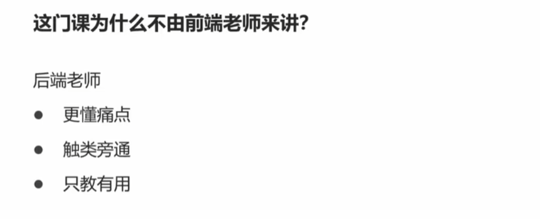

nodejs安装，idea中配置ndoejs

https://blog.csdn.net/m0_56602092/article/details/123109925

idea中启动vue项目

https://blog.csdn.net/m0_62808124/article/details/125776300

Java程序员用学前端么？java开发所需的前端技术全教程（HTML/CSS/js/vue2/vue3/react）

超文本：即包含超链接，可以关联多个网页；

标记：<></..>，不同的标签包含不同的内容

css: 描述网页的表现与展示效果，需要在html页面中引入；

#### html入门

//vscode中安装插件可以用idea的快捷键； html: !+tab； img+tab;    标签属性查找 推荐网站：mdn web docs; 

html元素：标签、内容、属性[
]、嵌套、空元素；

html页面：DOCTYPE--标准模式（渲染、展示）；  lang:语言；   页面组成；

常见元素：<h1>--文本 
--段落  <ul>---无序列表 ：<li>  <ol>--有序列表：<li>     <ul>-<li>-<ul>-</ul>-</li>-</ul>  <a>-锚，Anchor，超链接；本地页面调整-互联网页面跳转-页面内锚点<a href="#p1">；   //
 

多媒体：Image:   ，src支持-----文件地址,data URL, object URL;   <video>; <audio>

表单的基本用法： <from action>  <input   type=“text”  name--指定提交的变量名  > <input   type="submit"    value---按钮名字 >  <input   type=“password”  name--指定提交的变量名  >  <input   type=“hidden”  name--指定提交的变量名  value="1">:隐藏框不会显示，但是提交表单的时候也会提交到后端   <input   type=“date”  name--指定提交的变量名  >:对应的java接收建议Java.time.LocalDate，同时指定日期格式@DateTimeFormat(pattern = "yyyy-MM-dd")；   男 <input   type=“radio”  name--指定提交的变量名   value  checked>---单选；   <input   type=“checkbox”  name--指定提交的变量名   value >---多选，后端用List<String>接收； <input type = "file" name--指定提交的变量名>---文件上传，form的method属性必须为post，enctype = "multipart/form-data"，后端用multpartFile接收；

图片读入并用base64编码：

#### HTTP

get请求和post请求的区别在于 请求数据的存放位置不同；

host：指明要访问的虚拟主机名（不用于主机IP---链接哪台主机，连接上之后访问哪个虚拟主机）；tomcat默认的虚机主机名为localhost；

telnet可以发送原始http请求；  

Content-Type:

- post请求[application/x-www-form-urlencoded默认数据格式，汉字-&等特殊字符要先编码，再发送；JS可以编码----encodedURIComponent("张")]多个参数之间用&分隔；

//url编码的本质就是先转换为utf-8编码(一个汉字3个字节)，转为16进制再在每个数字前面+%;

- application/json格式，后端接收参数前要+@RequestBody;  方法上的@ResponseBody是把javaBean转换为JSON对象的格式；   返回的JSON串格式（可能是chunked分块响应），长度-JSON串-0表示响应结束; JSON串中的汉字不需要编码 (用js计算长度可以用单引号，但是一个汉字3个字节)；
- jdk16以上可以用record类写javaBean;

- multipart/form-data: 需要自定义分隔符boundarty; 用js计算长度，有换行，不能用单引号、双引号，要用反引号，且要多加每一行的\r ；

求字符串长度可以浏览器F12，控制台用javaScript计算；

#### session原理

session技术是为了实现不同http请求之间的数据共享，将共享数据保存到session，生成一个sessionid并将session保存到服务端，后续请求带一个sessionid即可。常用于身份校验。

请求的sessionid常保存在cookie字段；conteoller请求参数多一个httpsession即可，请求不带sessionid会自动生成一个session对象

第一次登陆，用户名作为登陆成功的标志存入session，第二次登陆拦截器里校验session中是否有用户名；

jwt适用于分布式身份校验和session的区别在于用token替代sessionid，区别在哪里？优缺点是什么？[session缺点：session存储在服务端，用户多影响性能；请求伪造攻击；若保存在内存中，分布式环境只在一台机器上有效；] [jwt不需要再服务单保存信息；跨语言；缺点：登录状态续签--每次请求刷新token或者快过期的时候刷新；用户不能主动注销[客户端删除的话要在所有客户端一个个删除]，可以再注销时将token加入黑名单；]

请求的token常保存在authorization中；controller要加@requestheader；

#### Token的原理

token或者称cookie，由三部分组成；但是要注意，payload部分不能存放敏感信息，是可以解密的[base64]；

签名：保证token不被篡改；签名依据  签名算法+数据 +密钥 生成签名，保证签名算法和数据未被篡改[如有人把普通用户伪造为管理员，将无法通过校验]；

CSS

选择器：定位到页面元素； type(元素选择器)--依据标签的名字匹配 p{key:value}；class匹配  .c1{} //class取值为c1的标签； id选择器----依据元素的id属性记性匹配 #p3  //id为p3的标签；    优先级（范围小的优先）：id>class>元素

属性和值：指定样式； 参考之前的文档---references---CSS----Reference---Properties； display:node 隐藏；block 显示； 常用于弹出框；

先用选择器定位到元素，然后用属性和值指定样式；

可以用<style>标签在html内部定义样式，即内部样式；

div:容器标签，可以写其它的html标签；一个div标签对应页面的一个区域；

UI就是设计页面布局吧？？

template：代码并不会直接在html页面上展示；结合JS代码使用，把代码动态加入到其它容器中；用于快速生成多个功能类似的组建；

#### Javascript

//修改页面内容，可以让页面展示服务端获取的最新内容；  但是页面刷新会重置到初始状态；

document对象：整个html文档；

一般写在<script>内；一般放在<body>的最后；也可以写在js文件，然后在html中引入； <script src = "路径">

声明变量：能用Let就别用var;

基本类型：undefined--null-------函数和表达式执行时没有返回结果；对象元素不存在；变量无初始值；

​		模板字符串必须用反引号` ;   小trick，用-完成字符串转数字，“10”-0；

数据类型-Function--定义与参数：第一个参数用默认值，第二个参数实参：pagination(undefined, 20);

数据类型-Function--匿名函数，箭头函数；

//下面的作用域和闭包针对var定义变量的情况；

数据类型-Function---JS中函数是对象，可以赋值，可以使用console.dir查看对象属性；高阶函数：以函数为参数或返回值；作为参数的函数被称为回调函数；

数据类型-函数对象的属性scope为作用域，属性不包含函数内的那一层[当然函数内的变量肯定可以访问]；

Function---闭包；函数对象作用域在 函数定义 时候就确定了，闭包即函数能够访问自己作用域中的变量，即使是作为返回值返回；

//类似java中landau表达式和它 的参数捕获；

常用：console.log(XXX);

数据类型-var与let区别：普通[非函数]的{}是否能界定作用域的范围，let能[建议用let，更接近java]，var不能；

数据类型-array: map  filter，返回结果变了，但是原数组的内容不变；//难怪伪代码是新建一个新的数组，不是直接改旧的数组；

数据类型-object:  属性、方法用逗号,分隔；java script没有私有概念，只有有个约定，==_name 不会调get、set方法，直接访问==为什么要这样？？？；JS的get set调用有点不同，编写get set方法，外部调用直接 this.方法名  然后做获取、赋值操作

数据类型-object-this：

//java中的this，本质上是一个隐式参数，代表的是调用方法的对象

​	JS this三种情况：落单、对象内、call动态改变；    例外：箭头函数内出现的this，以外层this理解；（例子见课件的匿名函数-落单函数、箭头函数）

数据类型-object-原型继承：

//java中的继承，在类之间；java中地址占4个字节？

js中的继承，在对象之间，会形成原型链；

数据类型-object-基于函数的原型继承：函数中出现this，代表的是要创建的对象；函数的prototype 属性就是父对象；子对象的 `__proto__` 就是函数的 `prototype` 属性；

数据类型-object-json与js对象：js对象，属性名带不带双引号均可，json对象必须要带；

运算符和表达式-展开运算符：展开运算符复制属于浅拷贝，即只拷贝一层，如果对象内的属性是对象，拷贝的时候也直接拷贝地址；   ...展开运算符和解构赋值运算符区别：展开运算符不能多变量赋值；在函数传参的时候，展开是调用时对实际参数做处理，解构是在函数定义是对形参做处理； 解构还可以在for of循环中使用；

控制语句-for in : for in中，n是一个变量，不能用.语法，.语法的含义是找son中名字为n的属性；

api-环境准备：nvm github上可以下载exe;  npm 包管理器；版本切换本质就是 让nodejs快捷方式指向不同版本的nodejs；

api-搭建前端服务器：express，前端服务器，类似后端的tomcat； --save-dev，只在开发阶段生效； 前端代码推荐在vscode中编写；   要使用import语法需要在 package中添加 "type": "module"；  vscode----ctrl+shift+` 打开终端；修改前端页面，不需要重启服务；

api-查找页面元素：document.querySelector()---依据选择器查找页面元素；

api-利用模板：document.importNode()  复制元素，通常第二个参数传true，表示如果元素内有子元素，也复制子元素；

api-同步 异步接收结果：java中异步接收结果，注意之后的打印在  123之前，而且123的打印是由 线程池的另一个线程打印的！！！！//异步接收结果的代码，不影响后续代码的执行；  而同步接收结果，要等待；

api-fetch-同步接收结果：promise 类似java中的compeletableFuture；

.json()获取的结果是promise对象，需要再次用await获取内容；

promise对象才有then方法；

异步的异常捕捉：

同步的异常捕捉，try catch即可；

api-fetch-跨域-请求头响应 解决：

跨域，未通过浏览器同源检查，即网页来源和网页内的fetch 、xhr请求是否同源；

controller上添加@CrossOrign注解即可；

//注意：java后端返回对象的data属性才是json对象；

api-fetch-跨域-代理解决：

如何区分7070的前端请求和8080的后端请求，通常可以在后端请求上加 /api/前缀；

//所有带/api前缀的都走代理，代理的地址为 'http://localhost:8080'

app.use('/api', createProxyMiddleware({ target: 'http://localhost:8080', changeOrigin: true }));

//访问同源的资源可以省略ip:port

api-导入导出：

从其它js文件中导入 常量、变量、函数；

整体导入也可以有module.default；

导入的两种方式：

老的标签src方式不支持import语法； 

import语法需要遵循同源策略；src可以不同源；

#### vue

基础--入门案例：

code .//即可用vscode打开当前目录；

建议安装vue插件（带骷髅头）; Chinese扩展包；浏览器vue插件；

localhost设置为0 0 0 0可以监听所有的地址；

