=//想学代理的玩法==

//内嵌的tomcat，神策上的代码是否 配置个WebConfig registrationBean能运行web？

//Bean工厂相关的后处理器，4个；Bean生命周期相关的后处理器，讲了2个？

课程地址：

https://www.bilibili.com/video/BV1P44y1N7QG/?vd_source=8bd5ab544d4cb8d9821752b68ce53b11

#### 问题小结：

- jdk代理的原理？如何自己实现代理？Cglib?? 代理的模拟实现自己手写下？？
- 想体验下微软的面试？看下人家和我之间的差距？

看源码技巧

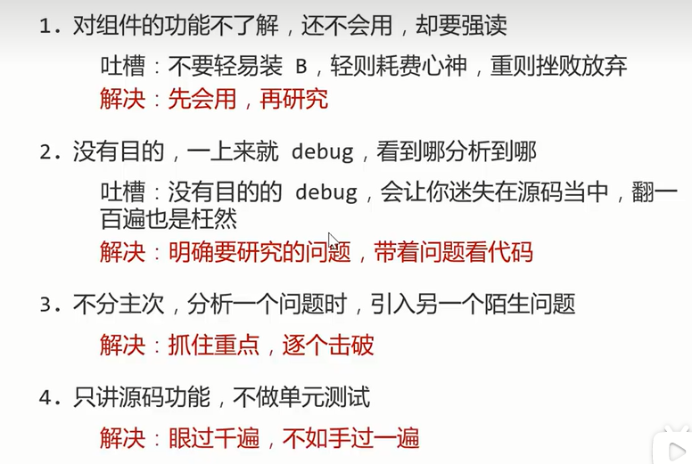

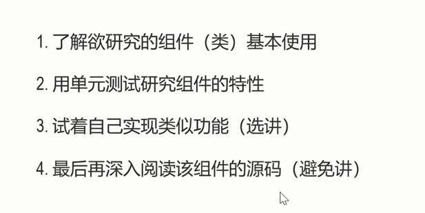

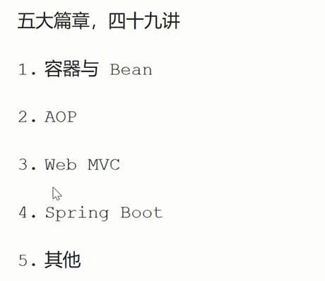

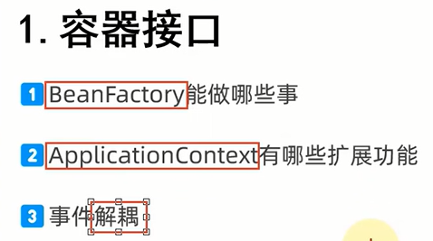

### BeanFactory和ApplicationContext

#### 1.什么是BeanFactory//看类图ctrl alt u; 查看实现：ctrl alt 单击；

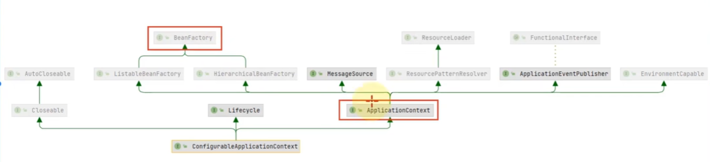

启动类的run方法返回值就是spring容器，

ApplicationContext继承了BeanFactory; BeanFactory[里面有SingletonObjects]才是Spring的核心，ApplicationContext的部分功能是组合了BeanFactory的内容实现的[beanFactory是applicationContext的成员变量，可以断点看属性验证]；

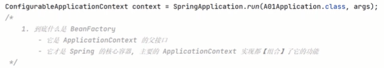

#### 2.BeanFactory的功能(要看有哪些方法和实现哪些接口、还有成员变量可以有很多方法)//ctrl+F12看方法？ uml :选中+F4

默认实现类  DefaultListableBeanFactory，可以管理所有Bean; 实现类中的DefaultSignletomBeanRegistry管理单例对象，可以反射查看所有单例；//下面的singletonObjects.get()里面的入参是什么情况？?也是个对象 说明beanFactory也是个单例对象，且保存在singletonObject中；看看 反射查看私有属性的示例代码？？

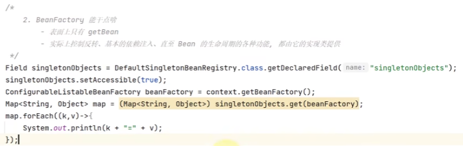

//只想看某个bean 话还可以过滤；

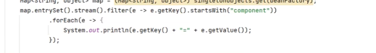

#### 3.ApplicationContext相对BeanFactory多了四种能力：//log输出日志会给出类名？@Autowired注入环境变量；

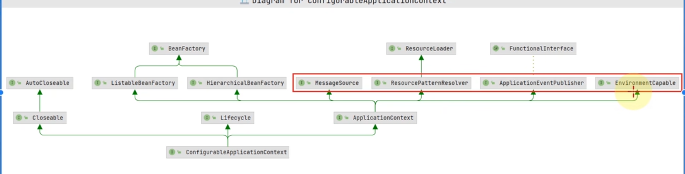

处理国际化资源的能力：MessageSource: context.getMessage() ； 依据key找到不同版本翻译结果，一般在messages打头的文件(不同语言的资源信息)；浏览器的请求头提供请求的语言类型；

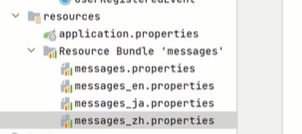

​	通配符  获取资源（磁盘路径对应的资源）的能力：getResources()   //在jar包里面也查找：calsspath*:....

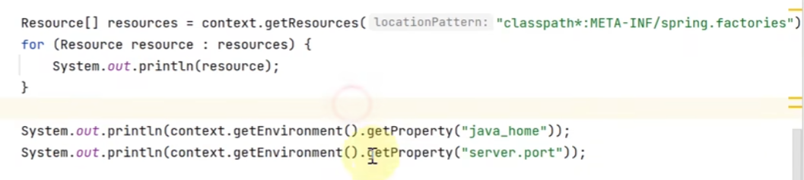

getEvironment: 获取环境信息（系统环境变量等）

发布事件对象 (本质上是一种解耦方式，如用户注册后 发短信、发邮件等；可以对标下AOP看哪个更优雅？)：pushlishEvent ，入参 事件源要继承ApplicationEcent； 接收时间  参数和入参一直，@EventListener

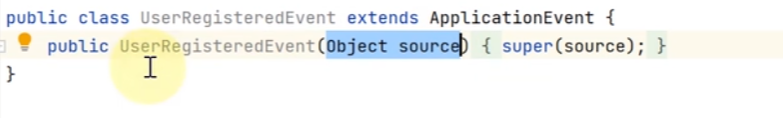

//单例+发送事件；

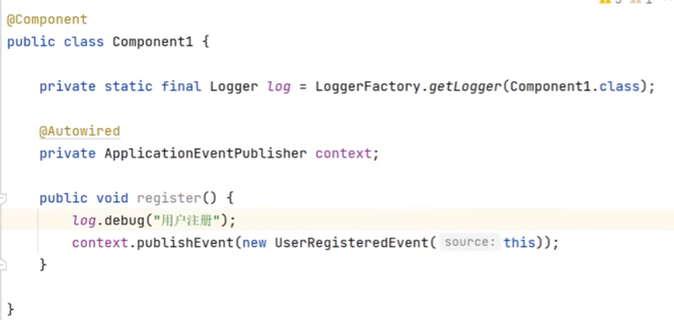

### 容器实现

#### BeanFactory实现 //默认实现DefaultListableBeanFactroy 是一个核心的spring容器？  bean的定义，BeanFactory会依据定义创建对象

//容器默认为空，往容器添加也给bean定义(先设置BeanDefinitin--类名、生命周期；然后注册bean--设置bean名字)；

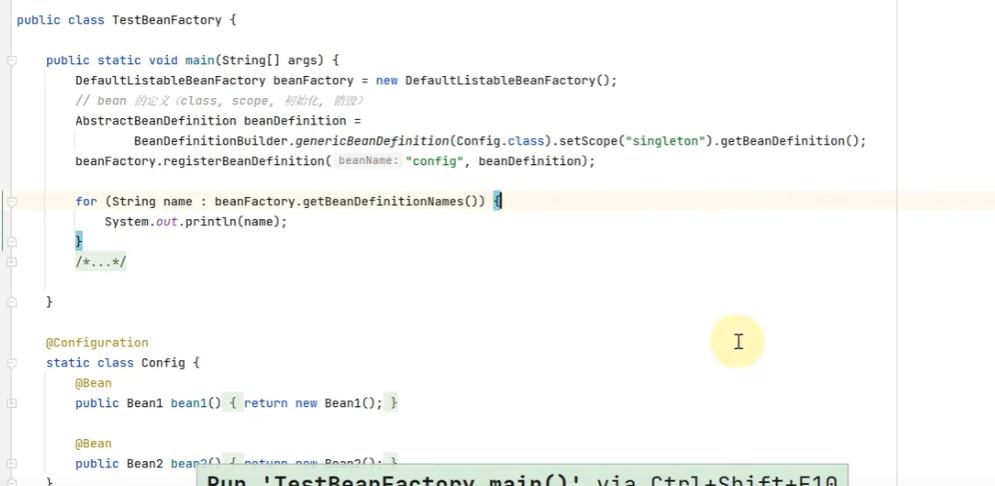

原始的beanFactory并不会去解析注解，添加了后处理器[register扩展功能]并执行[postProcess/addBean....，或者称为建立联系]之后，会去解析注解，

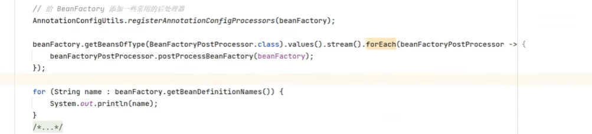

BeanFactory后处理的主要功能，补充了一些bean定义，如@Bean @Configuration注解；

Bean后处理器，针对ean生命周期的各个阶段提供扩展，解析例如@Autowired注解；@Resource注解//javaee的注解

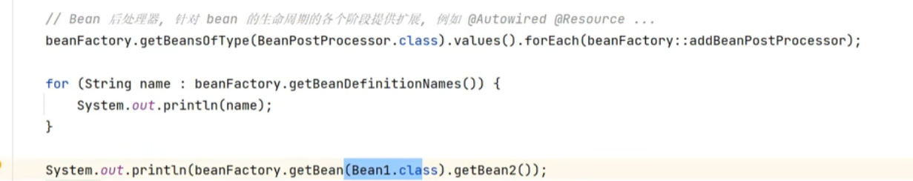

bean创建对象的时机：初始化的时候只会保存bean的定义、描述信息到beanFactory，当第一次用的时候，才会真正创建实例； 单例对象如果希望初始化时创建所有的单例对象，可以使用preInstantiateSingletons()：

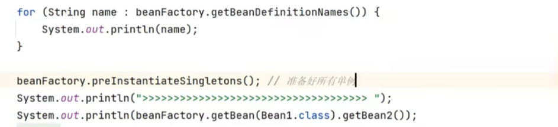

applicationContext会把上面这些常用的初始化操作都直接封装好；

beanFactory的排序：

@autowired，bean容器中找实现类；有多个的时候[可以用qualifier指定？]会匹配成员变量名字和类名，匹配上优先；@Resource可以用name属性指定； 

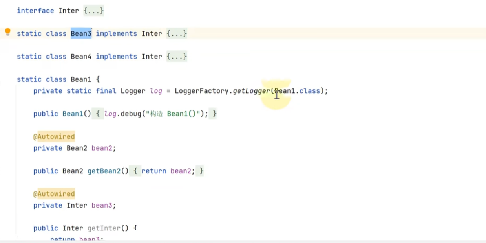

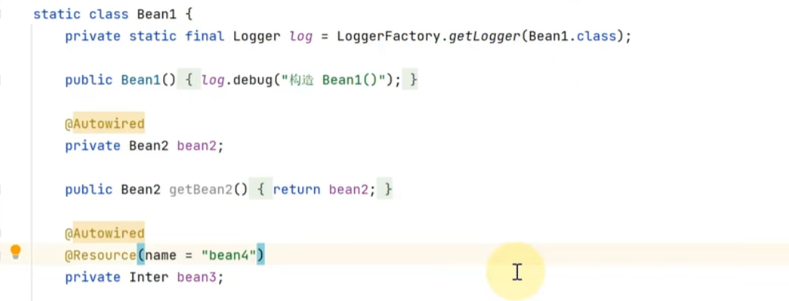

优先级[优先级高的生效]@Autowired > @Resource，可以用比较器控制先后顺序，排序依据实现order接口的getOrder方法的返回值，数字小的排前面//同时使用两个注解时;

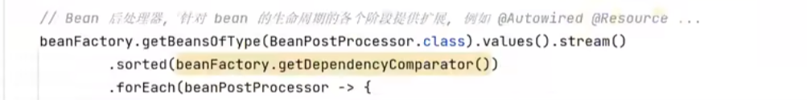

为什么sorted之后顺序会变？？和register一样的比较器啊？除非register只是进行了比较器的初始化，并没有把它用于排序，即执行；

#### ApplicationContext的常见实现和用法

- ClassPathXmlApplicationContext  基于xml路径读取配置；通常使用    <context:annotation-config>   标签就会自动加入一些有用的后处理器；
  -  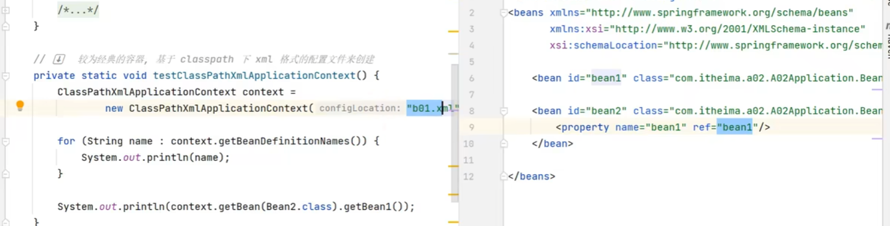
- FileSystemXmlApplicationContext : 基于文件路径读取配置；//绝对路径、相对路径均可
  - 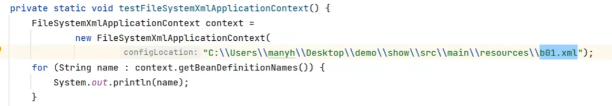
- ApplicationContext是如何把beanDefination信息加载到beanFactory中的：用的XmlBeanDefinitonReader的 loadBeanDefinitions方法，入参也可以是ClassPathResource()对象；
  - 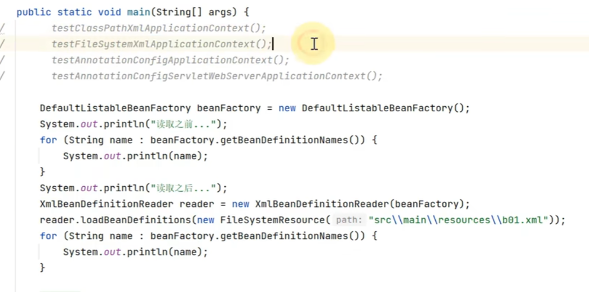
- AnnotationConfigApplicationContext : 基于配置类的applicationContext    
  - 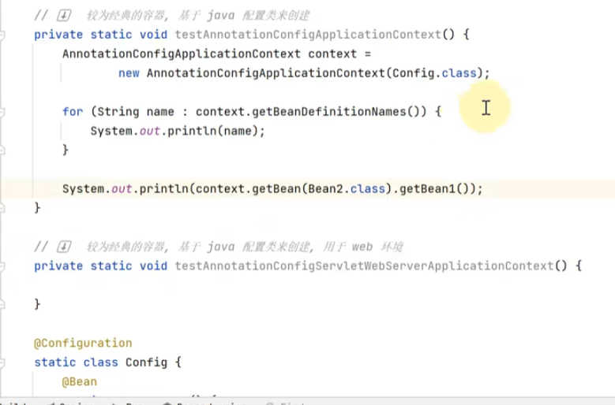

#### 内嵌容器、注册DispatcherServletAnnotationConfigServletWebServerApplicationContext：既支持配置类，又支持内嵌servlet的Web容器---tomcat

- - spring的web服务器的核心是DispatcherServlet； DispatcherServlet要运行在tomcat服务器中；
  - 路径一般配置/，所有请求都经过dispatcherServlet，再到controller
  - 
  - 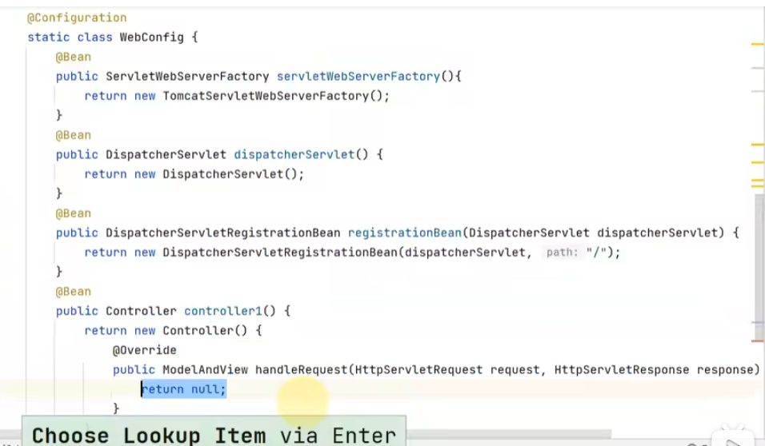
  - 前3步必须的[构建内置tomcat，构建dispatcherServlet，建立dipatcherServlet和tomcat容器之间的关联]，controller1可选，bean名字/开头并实现Controller就可以作为控制器；
  - 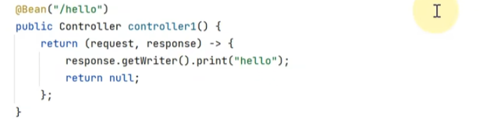

#### 

### Spring Bean的生命周期

#### Spring Bean生命周期的各个阶段

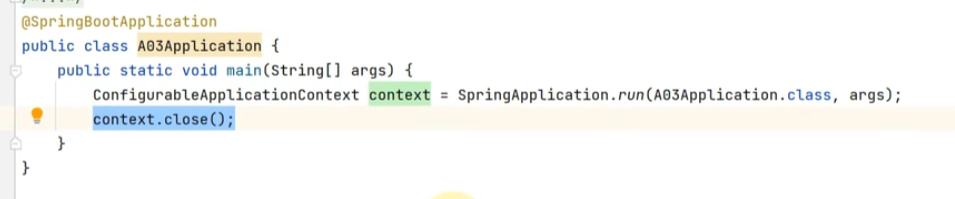

 //@Autowired的参数  也会自动注入[值、变量]；

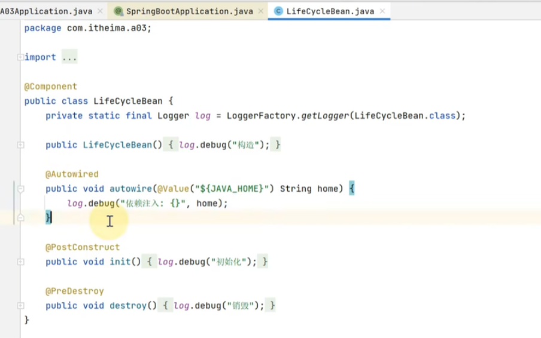

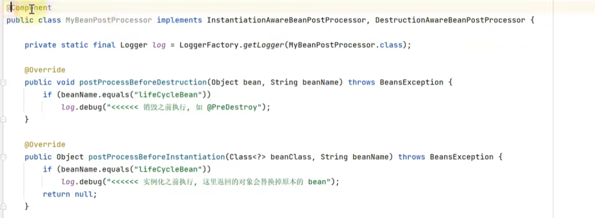

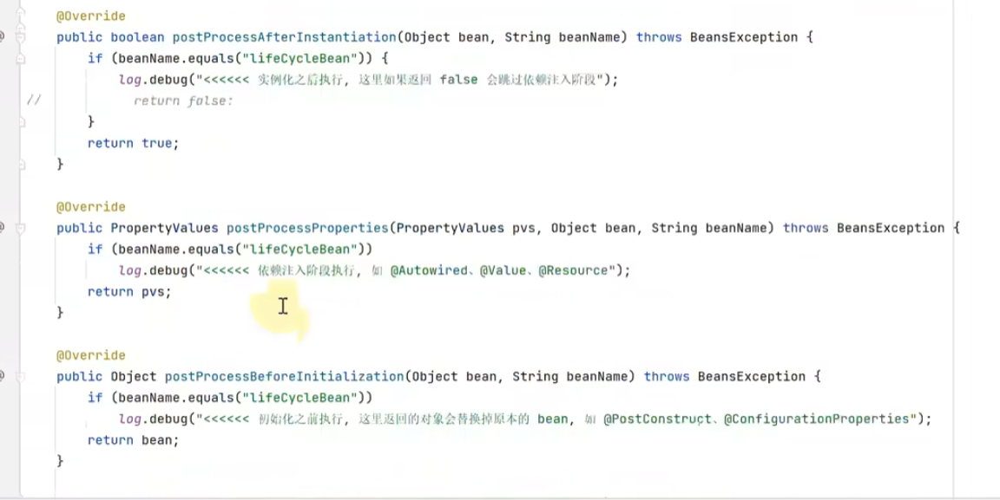

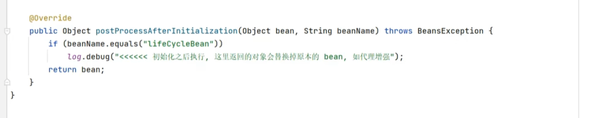

#### 模板设计模式：固定不变的内容+接口调用称为了模板[变化的内容单独封装为接口]；模板方法不需修改，改业务代码即可；

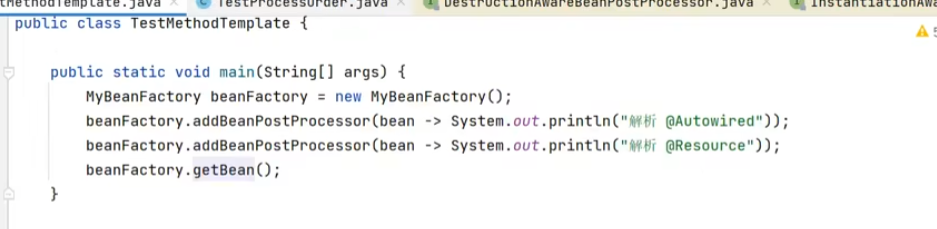

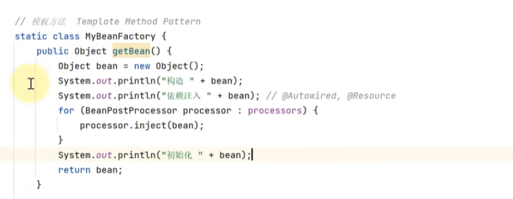

### 第四章

#### 常见的Bean后处理器

- GenericApplicationContext相比AnnotationConfigApplicationContext  ，很干净，没添加bean后处理器等；refresh()方法会执行工厂后处理器 初始化单例等；

- 常见后处理器相关注解：@Autowired @Value；@Resource @PostConstruct @PreDestroy;@ConfigurationProperties注解

  - registerBean方法默认名称：包名、类名；设置AutowiredCandiateResoulver才能获取@Value注解内部的值注入；

- tips

  - ==@Autowired结合方法进行注入，可以打印信息查看是否注入成功；== 
  - Spring注解积累，@ConfigrationProperties  SpringBoot的bean的属性和配置文件的键值对 做绑定；

  - 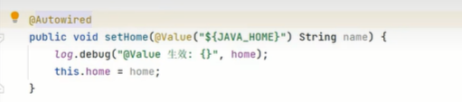
  - //将后处理器加入到容器中
  - 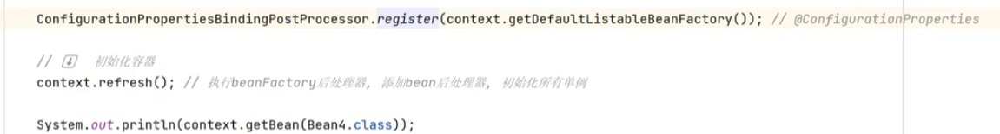

- 示例代码
  - 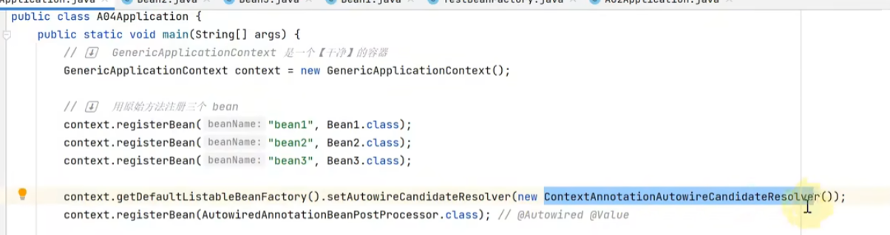
  - 
  - 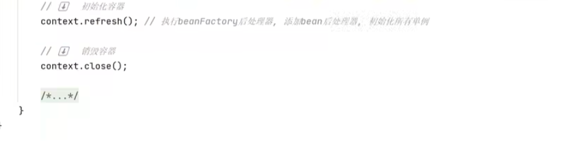
  - 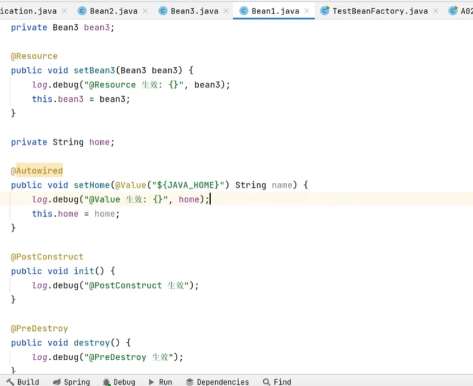
  - @ConfigurationProperties注解：前缀+属性名去配置文件中找环境变量
  - 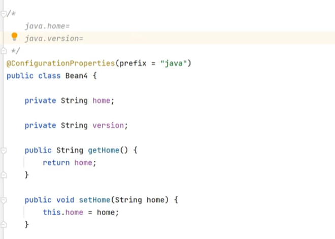

#### @Autowired bean后处理器执行分析

- 准备工作
  - registerSingleton方法使用相对简单[不需要常见BeanDefinition]；但是要提供成品bean，即不再走bean工厂创建流程；
  - bean后处理器的依赖注入等阶段需要用到beanFactory，所以需要设置；
- 真正执行@Autowired @Value解析的是postProcessProperties
  - //直接调用Autowired相关方法的方式，理解Autowired的原理；  第一个参数传null，没有自己手工指定bean中的属性的值==
  - 找到添加了@autowired注解的方法和属性；inject方法反射赋值；
    - inject内部实现：
      -  属性和方法胡被封装为DependencyDescriptor对象  入参：成员变量名，是否必须；////方法的注入，类似，但是多一个参数 表明要注入的是方法的哪一个参数，然后一个一个注入；
      - beanFactory.doResolveDependency   入参：DependencyDescripor，依据成员变量信息找到类型，进一步找到bean；
- 示例代码：
  - 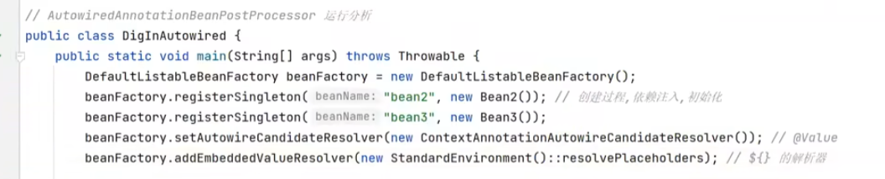
  - 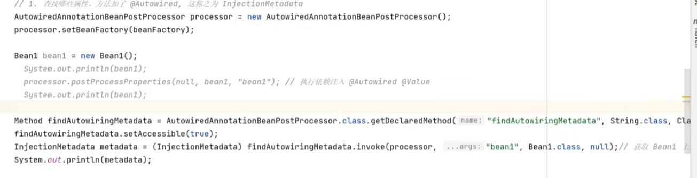
  - 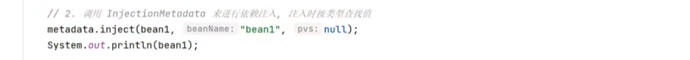
  - 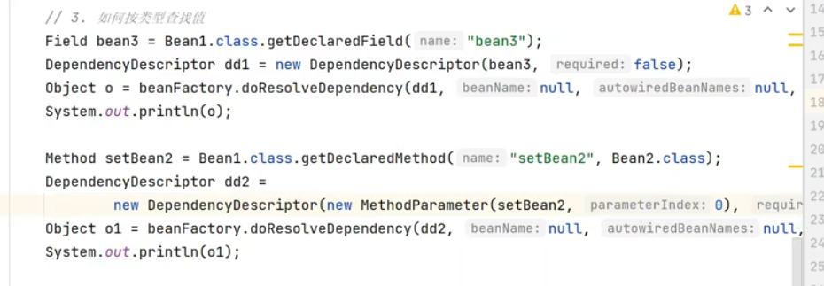
  - 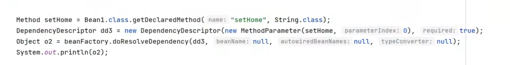

### 第五讲 BeanFactory后处理器

**BeanFactory后处理器**

- ConfigurationClassPostProcessor.class: 解析@Bean、@Component 、@Import 、@ImportResource
-  MapperScannerConfigurer[springboot自动配置]：扫描mybatis的mapper接口；
  - 一般spring boot自动配置，SSM架构用的@MapperScanner底层也是MapperScannerConfigurer.class ；
  - 入参：要指定扫描的包  //bd为beanDefinition；
- 代码示例：
  - 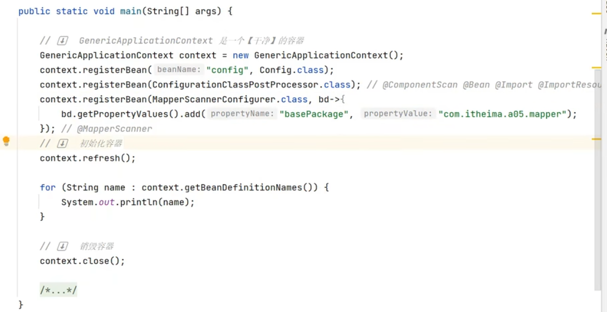

**模拟@ComponentScan注解的解析：** //==getResources是要获取二进制文件，难怪spring bean对象得是动态代理？？==；   ==需要的配置类信息，每个配置类有哪些方法和功能，得好好总结下；==

- 获取ComponentScan注解中声明的包名，获取包下所有的类；
  - AnnotationUtils.findAnnotation用于判断某个类上是不是有加注解并获取注解对象  参数----Config.class, 注解对象类型；  //如何做到判断类上是否有注解？
  - 获取basePackages 包名，报名格式转换，   getResources获取所有类资源 ；

- 判断每一个类是否加了@Component注解 ;  如果加了则生成对应的BeanDefinition，生成bean工厂并注册

  - CachingMetadataReaderFactory：获取类的元数据信息、注解信息等；用到的方法：getMeradataReader  getAnnotationMetadata().hasAnnotation()  getAnnotationMetadata().hasMetaAnnotation 

    

//getResources是在class目录下扫描到的，扫的是字节码？

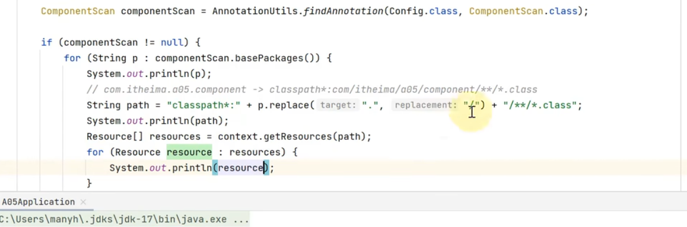

CachingMetadataReaderFactory+Resources获取类的元数据信息；

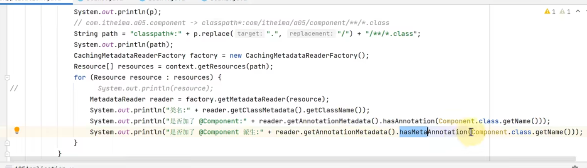

//BeanNameGenerator接口可以依据注解获取bean的名字； registerBeanDefinition将bean注册到工厂中；

//完整代码略； PathMatchingResourcePatternResolver() 这里和applicationContext类似 ， instanceOf用法？？？

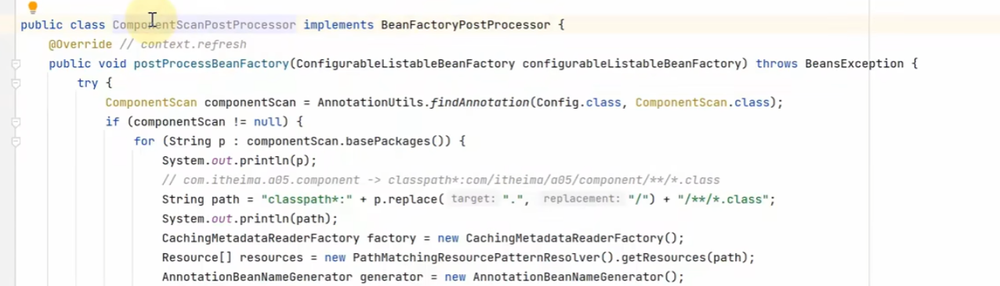

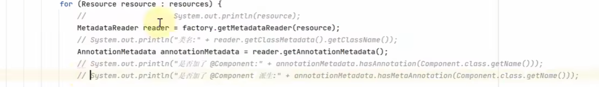

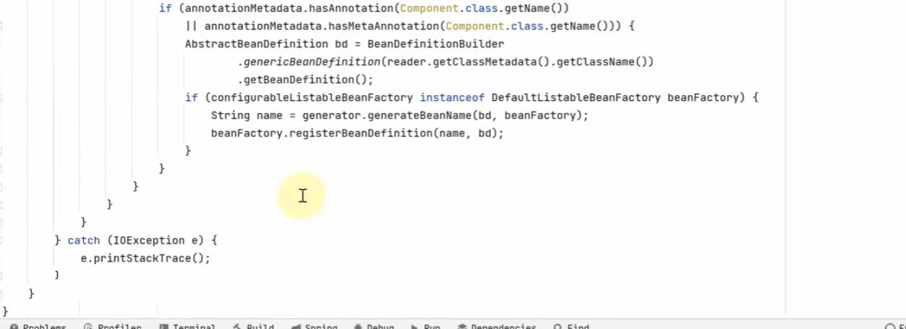

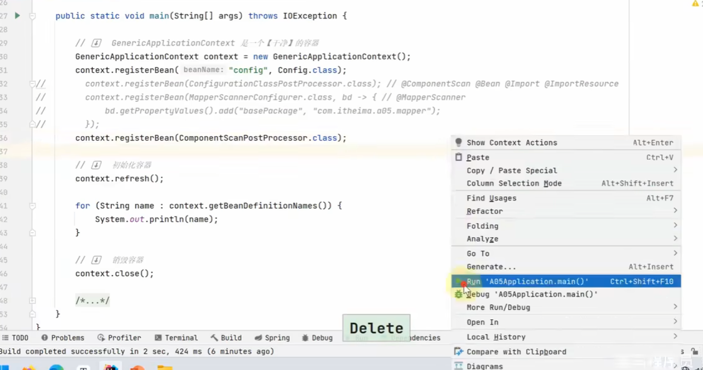

**模拟@Bean注解的解析**

- CacheingMeradataReaderFactory.getMetadataReader 加载类信息； 
- 获取注解相关的元素，进一步获取被@Bean注解标注的方法
- 遍历  方法： BeanDefinitionBuilder 生成 对应BeanDefiniton 入参----方法名、类名[用到反射 调用工厂方法]
- 将BeanDefiniton加入到Bean工厂 入参----bean的名字、beanDefiniton对象（一般就用方法名作为bean的名字）；
- 补充
  - //Bean定义方法有入参的话，需要指定自动装配模式 builder.setAutowiredMode
  - Bean中有属性的话， getAnnotationAttributes获取注解的属性；如果属性有值，则进行对应的操作(如有initMehtod则调用setInitMethodName)

配置类充当工厂的角色，@Bean标注的方法充当工厂方法；后面创建beanDefiniton用工厂的方式  CacheingMeradataReaderFactory.getMetadataReader；

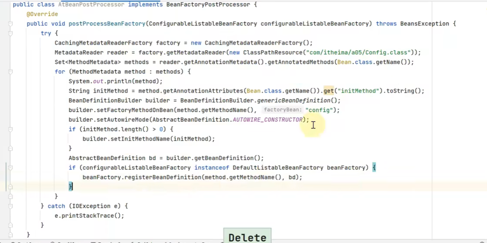

**模拟@MapperScanner注解的解析**

- 前置说明：
  - 接口转换为对象：用Mapper对象工厂类--接口  创建Mappe对象，并指定sqlSessionFactory即可；
  - 之前的后处理器实现的接口不好，用了一个强转，建议使用：BeanDefinitionRegistryPostProcessor，直接有registBeanDefiniton方法；
  - 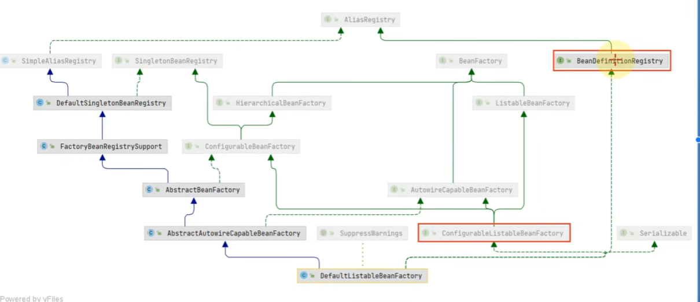

- 实现流程：
  - 加载class文件
  - for  resource : 获取元数据信息reader，获取类的元数据信息，判断是否为接口， BeanDefinitionBuilder.genericBeanDefinition()获取BeanDefinition，并设置构造方法参数值[addConstructorArgValue]，设置装配模式，注册对应的bean；//为了自动生成名字（接口名而不是MapperFactoryBean），多定义了一个接口的beanDefinition
  - 
  - 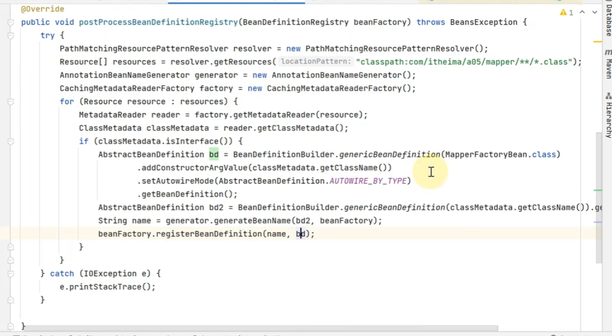

### 第六讲

#### Aware接口、InitializingBean接口//注入时会回调，可以获取自己需要的信息

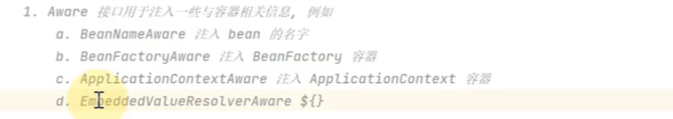

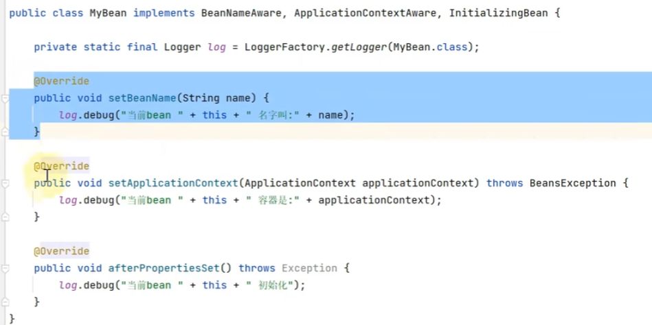

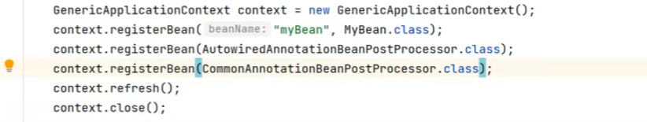

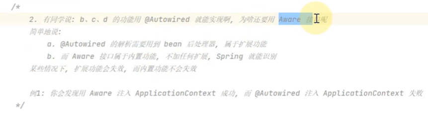

**失效的情形**

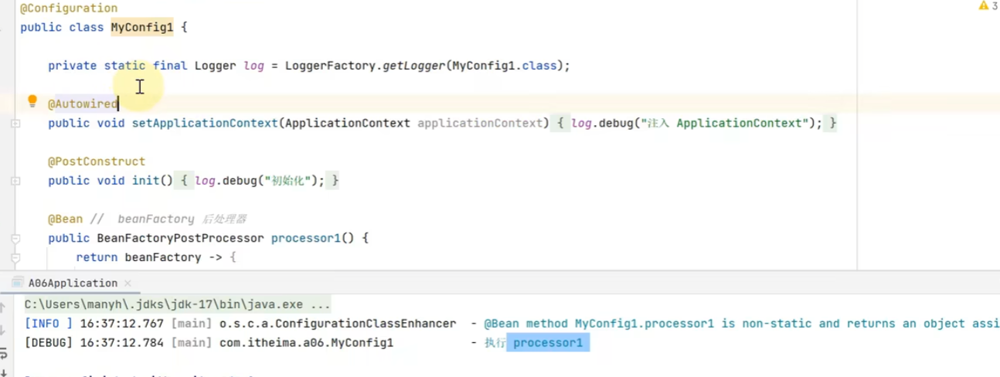

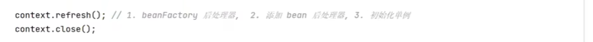

//相当于3.1  3.2这些扩展功能是注册在BeanPostProcessor；

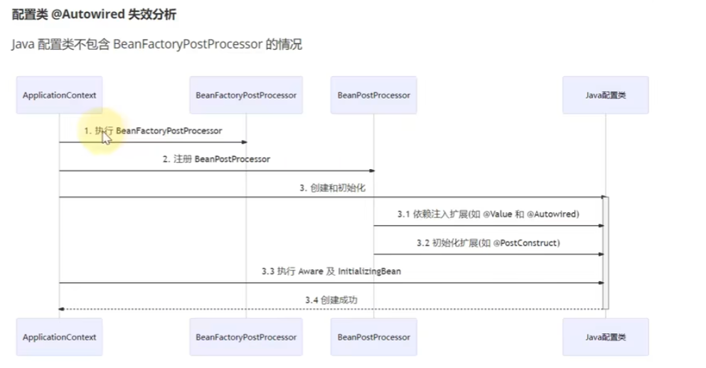

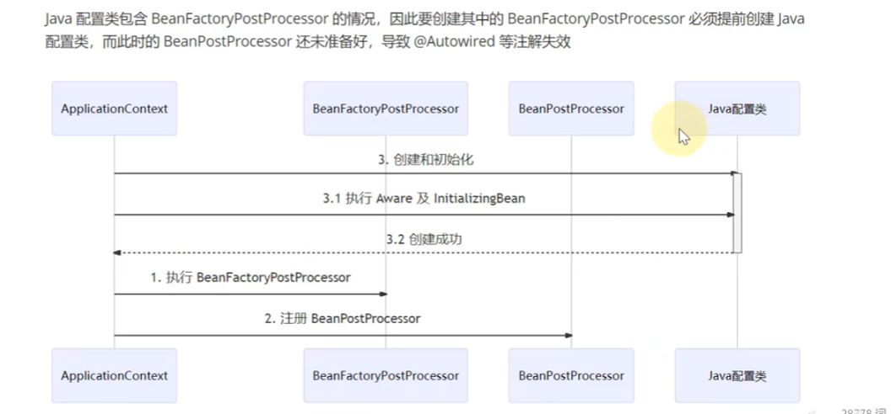

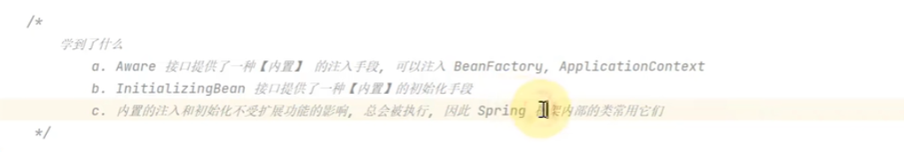

### 第七讲  初始化和销毁

#### 初始化的三种方法

- @PostConstruct     后处理器，扩展功能，第一位执行；//aware在1 2之间执行；
- 实现initializingBean接口     第二位执行；
- @Bean(initMethod = "init3")    第三位执行

#### 销毁的三种方法

- @PreDestroy
- DisposableBean
-  @Bean(destroyMethod = "destroy3")

### 第八讲  Scope  

singleton(容器关闭时销毁),  prototype（自行调用销毁）,  request（存在request域中，生命周期同request，重发请求会销毁）,  session(会话域，长时间不发请求会销毁),  application（应用程序域  入servlet context，似乎spring不会自动销毁 即使你关闭应用）

 单例使用其它域，必须用@Lazy [本质上是创建代理对象，最后反射调用Object的toString] ，jdk9以后可能出现：

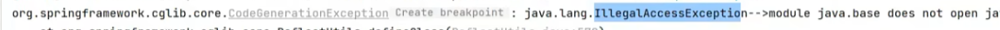

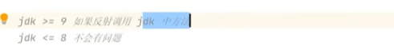

解决方案：改JDK版本；自己重写 javaBean的toString 方法；运行时添加指定的配置；

测试案例参考配制：

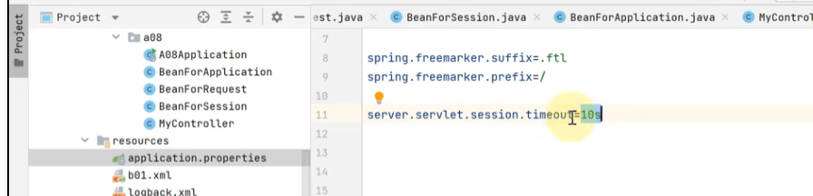

一个单例的bean注入其他scope的bean会有问题，需要加一个Lazy注解。

#### 单例注入多例，scope会失效（解决方案本质上都是获取多例的时候多一层） E（单例）有属性发（多例）；

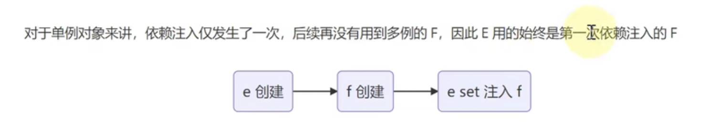

- 添加@Lazy解决  

  - 代理类是原F1的子类，代理对象使用f的方法时 可以控制注入新的f对象；

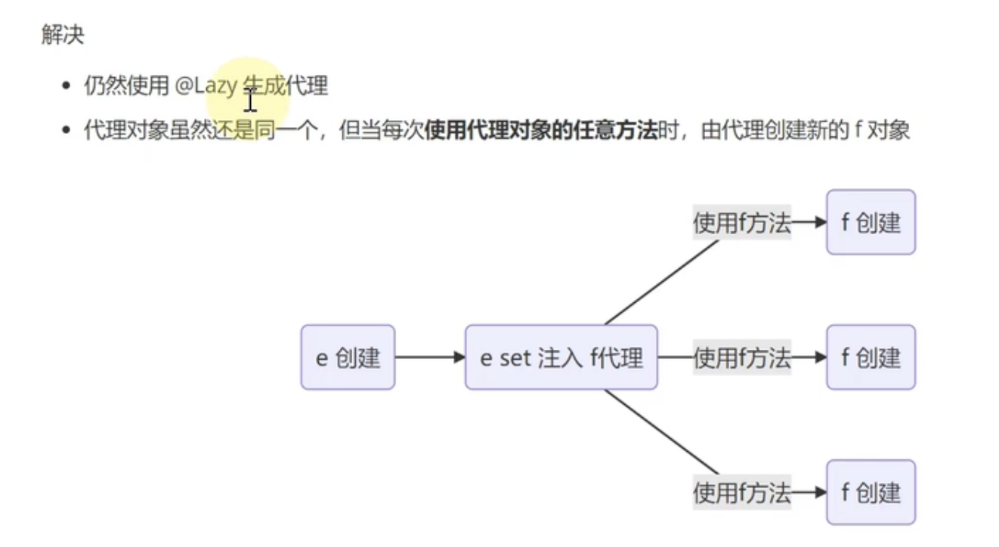

- 要注入的多例对象上添加配置，也是生成代理

- 多一层对象工厂

- 注入一个ApplicationContext，调用getBean方法；

#### aop之ajc增强

切面的实现方式不止代理，MyAspect监听MyService，拿到的MyService对象名字还是MyService; 编译的时候改写了原有的类  增加了前置增强；

编译结果的位置，==拖拉文件到idea可以反编译！！==

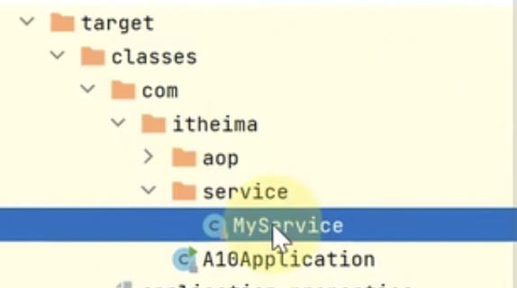

本质上，切面是由ajc编译器管理的，所以MyAspect不需要添加@Component注解；

pom.xml中添加插件：

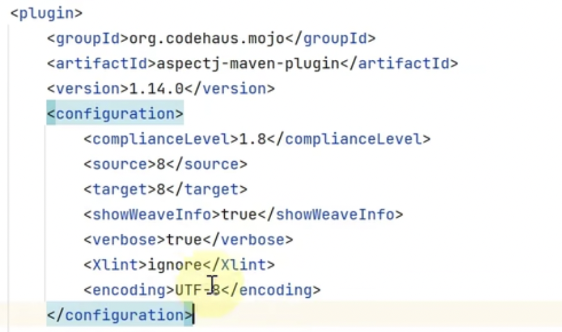

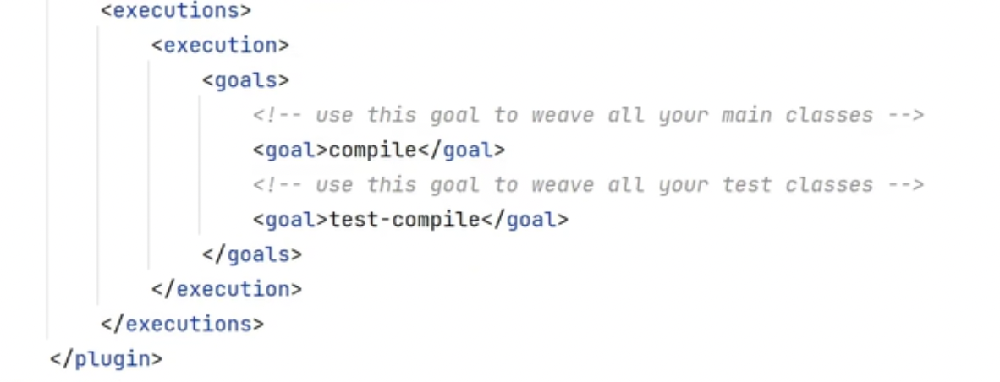

有时候，idea默认是javac编译器，不使用aspect插件，可以使用maven的compiler强制使用；

相比spring的代理方式实现 aop，使用ajc编译器（修改class文件）可以增强static方法；

#### Aop实现之agent类加载

类加载阶段实现修改字节码 实现增强

可以突破代理实现aop的限制：一个方法调用另一个方法，被调用的方法无法增强；

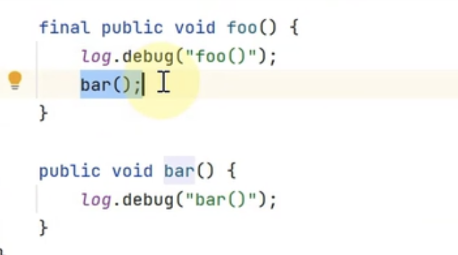

阿里巴巴的arthas工具：可以实现运行时的反编译（类加载才实现的增强，直接看target中编译结果还是没有增强）

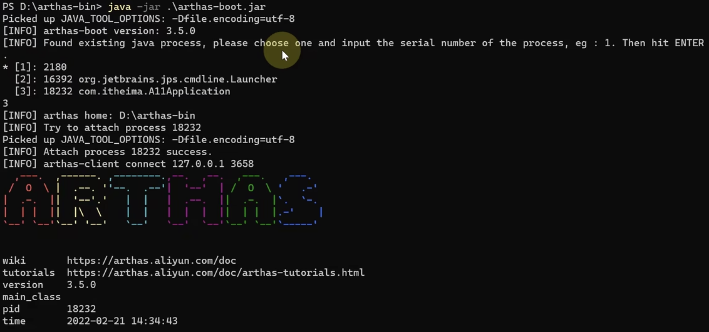

#### AOP实现之proxy//==简写为lamda快捷键？？==

代理类没有源码，运行时直接生成字节码；

##### jdk只能针对接口代理

- 参数一：classLoader；
- 参数二：要实现的接口可以一次实现多个接口；
- 参数三：invocationHandler，规定被代理方法具体的行为；

- invocationHandler的三个参数：
  - 代理对象
  - 真正执行的方法
  - 方法的参数

- 示例：
  - 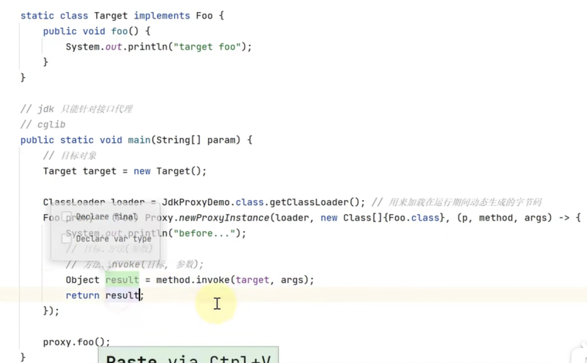
- 特点：被代理类和代理类是兄弟关系，不能互相强转，且被代理类可以是final;

##### cglib实现代理

- 参数一：被代理类
- 参数二：Callback的子接口，MethodInterceptor
- MethodInterceptor的四个参数：代理对象，当前代理对象中执行的方法，方法的参数，MethodProxy
- 示例
  - 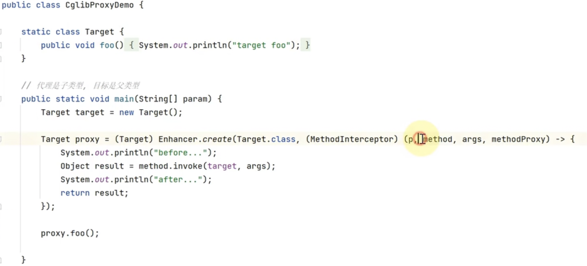
  - 使用methodProxy可以避免反射调用，invoke传被代理对象[spring使用这种]，厚着invokeSuper传代理对象
  - 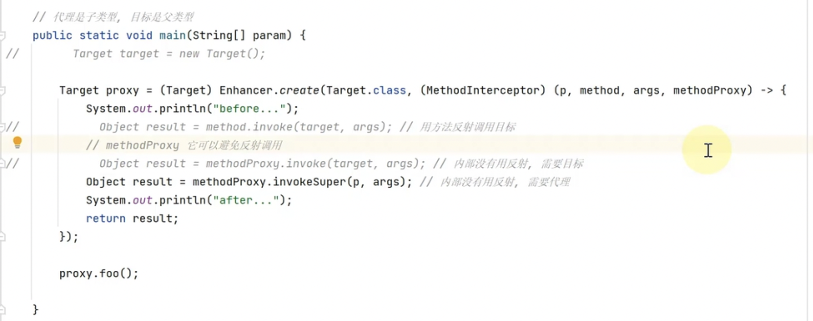

- 特点：被代理类和代理类是父子关系，可以相互强转，且被代理类不能是final；父类方法加了final也不能被增强，代理类会重写被代理方法；

#### jdk代理原理

//代理的场景：日志；权限；事务的增强？

- 模拟实现代理，代理对象 增加一个私有成员Invocationhandler，代理方法的具体执行逻辑，放在Invocationhandler的invoke方法中； 在声明代理对象的时候再指定具体的invoke方法的执行内容；

- 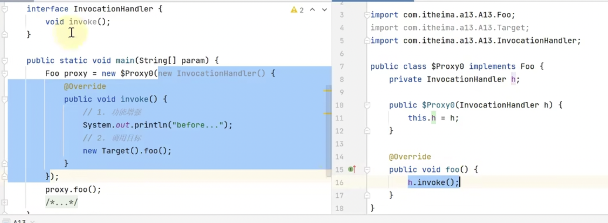
- 对象有多个方法时，上述代码的invoke方法都调用的是被代理的foo方法，需要改进 所有的方法都调invoke， invoke具体反射调用哪个被代理方法 参数化；
- 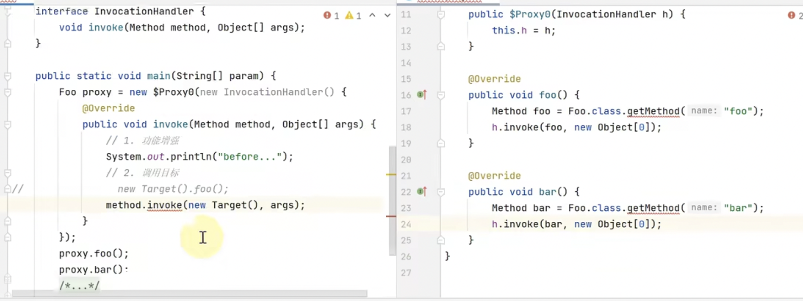
- 还需要增加返回值处理（invoke是Object），增加代理对象参数，异常处理（检查异常、throwable异常不能直接抛，需要转换下再抛）；
- 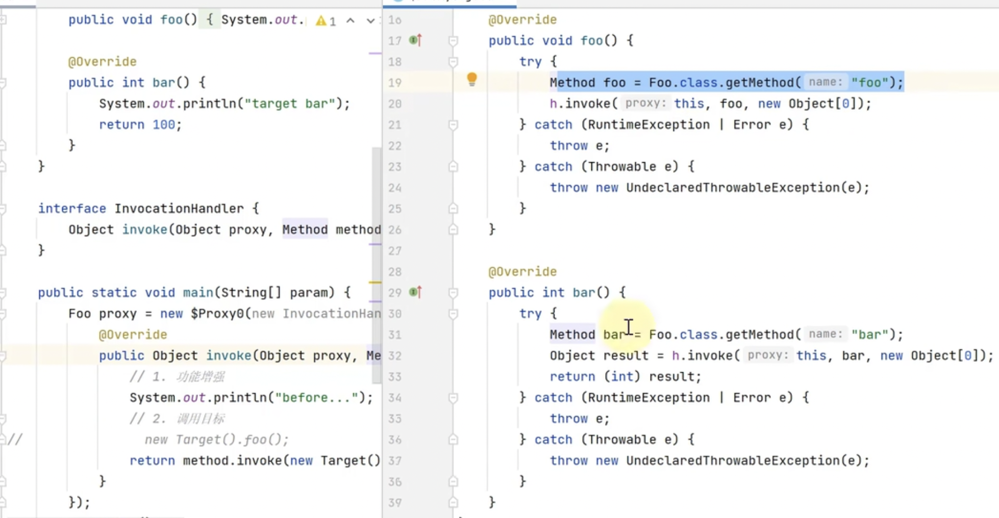
- 方法对象的获取不需要每次调用都获取一次
- 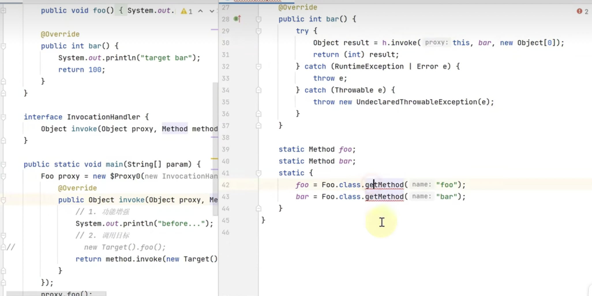
- jdk的代理会继承Proxy类，内含一个InvocationHandler接口，所以可以直接用
- 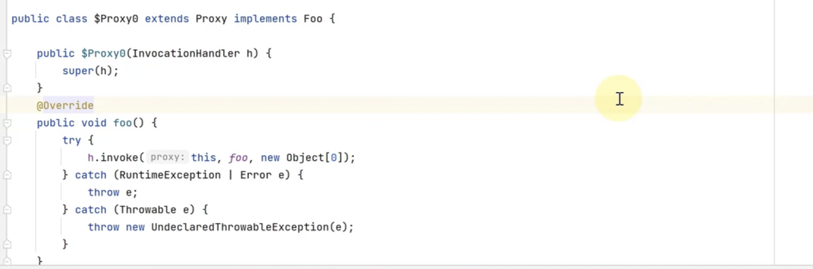
- arthas工具[powershell]需要知道类名才能反编译；程序要保持运行状态，可以System.in.read()；//直接看jdk代理源码基本看不懂，因为用的asm动态生成代理类的字节码；

- 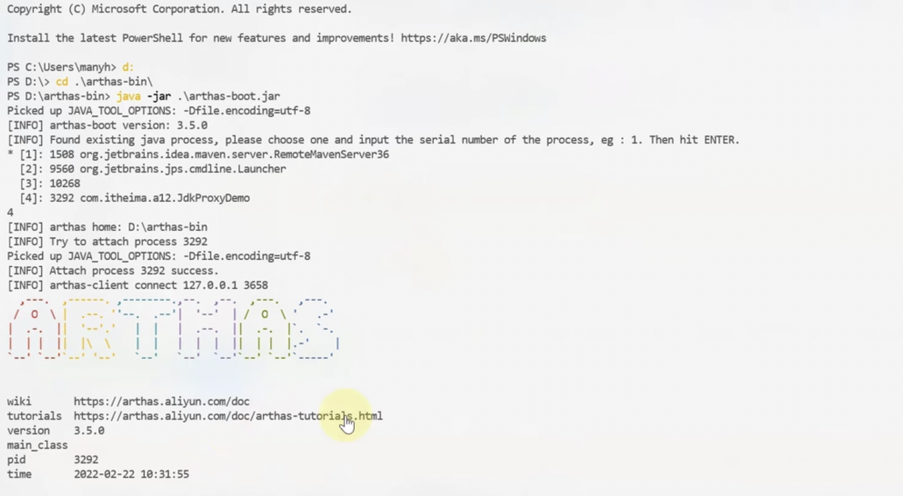
- 
- 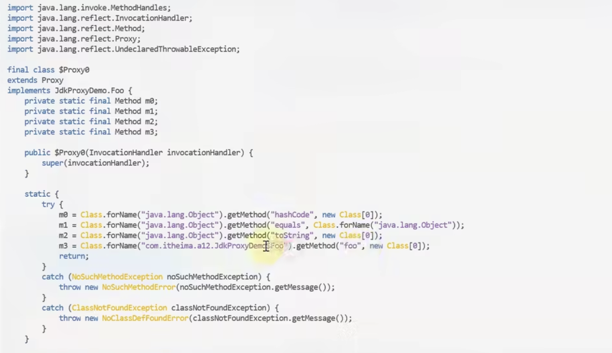
- 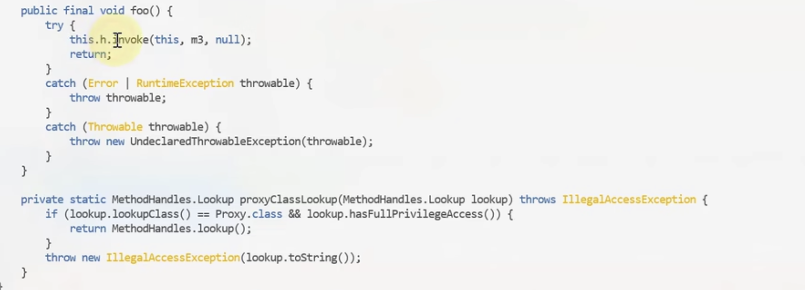

#### jdk代理字节码生成

- jdk代理没有源码，直接生成字节码，用的asm[spring jdk使用很多]
- 安装idea插件 java源码转换为asm代码，然后可以转换为字节码；但不能很好地在高版本的jdk里面工作；
  - 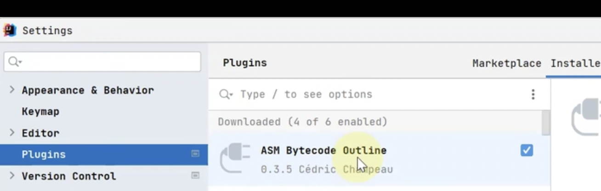
- 编写一个代理类的代码
  - 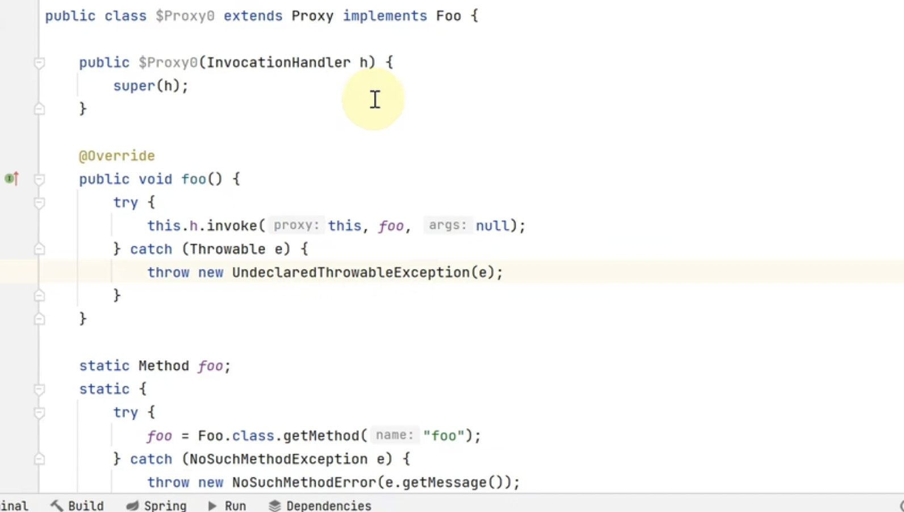
  - 编译， 右键-- show Bytecode outline，会转换为ASMified  即asm代码；需要导下包，spring的包即可；

