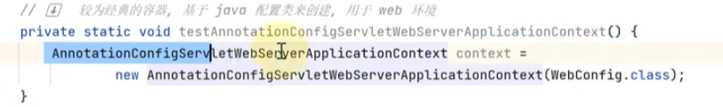

//内嵌的tomcat，神策上的代码是否 配置个WebConfig registrationBean能运行web？

//Bean工厂相关的后处理器，4个；Bean生命周期相关的后处理器，讲了2个？

课程地址：

https://www.bilibili.com/video/BV1P44y1N7QG/?vd_source=8bd5ab544d4cb8d9821752b68ce53b11

看源码技巧

### BeanFactory和ApplicationContext

#### 1.什么是BeanFactory//看类图ctrl alt u; 查看实现：ctrl alt 单击；

启动类的run方法返回值就是spring容器，

ApplicationContext继承了BeanFactory; BeanFactory[里面有SingletonObjects]才是Spring的核心，ApplicationContext的部分功能是组合了BeanFactory的内容实现的[beanFactory是applicationContext的成员变量，可以断点看属性验证]；

#### 2.BeanFactory的功能(要看有哪些方法和实现哪些接口、还有成员变量可以有很多方法)//ctrl+F12看方法？ uml :选中+F4

默认实现类  DefaultListableBeanFactory，可以管理所有Bean; 实现类中的DefaultSignletomBeanRegistry管理单例对象，可以反射查看所有单例；//下面的singletonObjects.get()里面的入参是什么情况？?也是个对象 说明beanFactory也是个单例对象，且保存在singletonObject中；看看 反射查看私有属性的示例代码？？

//只想看某个bean 话还可以过滤；

#### 3.ApplicationContext相对BeanFactory多了四种能力：//log输出日志会给出类名？@Autowired注入环境变量；

处理国际化资源的能力：MessageSource: context.getMessage() ； 依据key找到不同版本翻译结果，一般在messages打头的文件(不同语言的资源信息)；浏览器的请求头提供请求的语言类型；

​	通配符  获取资源（磁盘路径对应的资源）的能力：getResources()   //在jar包里面也查找：calsspath*:....

getEvironment: 获取环境信息（系统环境变量等）

发布事件对象 (本质上是一种解耦方式，如用户注册后 发短信、发邮件等；可以对标下AOP看哪个更优雅？)：pushlishEvent ，入参 事件源要继承ApplicationEcent； 接收时间  参数和入参一直，@EventListener

//单例+发送事件；

### 容器实现

#### BeanFactory实现 //默认实现DefaultListableBeanFactroy 是一个核心的spring容器？  bean的定义，BeanFactory会依据定义创建对象

//容器默认为空，往容器添加也给bean定义(先设置BeanDefinitin--类名、生命周期；然后注册bean--设置bean名字)；

原始的beanFactory并不会去解析注解，添加了后处理器[register扩展功能]并执行[postProcess/addBean....，或者称为建立联系]之后，会去解析注解，

BeanFactory后处理的主要功能，补充了一些bean定义，如@Bean @Configuration注解；

Bean后处理器，针对ean生命周期的各个阶段提供扩展，解析例如@Autowired注解；@Resource注解//javaee的注解

bean创建对象的时机：初始化的时候只会保存bean的定义、描述信息到beanFactory，当第一次用的时候，才会真正创建实例； 单例对象如果希望初始化时创建所有的单例对象，可以使用preInstantiateSingletons()：

applicationContext会把上面这些常用的初始化操作都直接封装好；

beanFactory的排序：

@autowired，bean容器中找实现类；有多个的时候[可以用qualifier指定？]会匹配成员变量名字和类名，匹配上优先；@Resource可以用name属性指定； 

优先级[优先级高的生效]@Autowired > @Resource，可以用比较器控制先后顺序，排序依据实现order接口的getOrder方法的返回值，数字小的排前面//同时使用两个注解时;

为什么sorted之后顺序会变？？和register一样的比较器啊？除非register只是进行了比较器的初始化，并没有把它用于排序，即执行；

#### ApplicationContext的常见实现和用法

- ClassPathXmlApplicationContext  基于xml路径读取配置；通常使用    <context:annotation-config>   标签就会自动加入一些有用的后处理器；
  -  
- FileSystemXmlApplicationContext : 基于文件路径读取配置；//绝对路径、相对路径均可
  - 
- ApplicationContext是如何把beanDefination信息加载到beanFactory中的：用的XmlBeanDefinitonReader的 loadBeanDefinitions方法，入参也可以是ClassPathResource()对象；
  - 
- AnnotationConfigApplicationContext : 基于配置类的applicationContext
  - 

#### 内嵌容器、注册DispatcherServletAnnotationConfigServletWebServerApplicationContext：既支持配置类，又支持内嵌servlet的Web容器---tomcat

- - spring的web服务器的核心是DispatcherServlet； DispatcherServlet要运行在tomcat服务器中；
  - 路径一般配置/，所有请求都经过dispatcherServlet，再到controller
  - 
  - 
  - 前3步必须的[构建内置tomcat，构建dispatcherServlet，建立dipatcherServlet和tomcat容器之间的关联]，controller1可选，bean名字/开头并实现Controller就可以作为控制器；
  - 

#### 

### Spring Bean的生命周期

#### Spring Bean生命周期的各个阶段

 //@Autowired的参数  也会自动注入[值、变量]；

Spring注解积累，@ConfigrationProperties  SpringBoot的bean的属性和配置文件的键值对 做绑定；

