//内嵌的tomcat，神策上的代码是否 配置个WebConfig registrationBean能运行web？

//Bean工厂相关的后处理器，4个；Bean生命周期相关的后处理器，讲了2个？

课程地址：

https://www.bilibili.com/video/BV1P44y1N7QG/?vd_source=8bd5ab544d4cb8d9821752b68ce53b11

#### 问题小结：

- jdk代理的原理？如何自己实现代理？Cglib?? 代理的模拟实现自己手写下？？
- 想体验下微软的面试？看下人家和我之间的差距？
- 我一直在想，为什么cglib jdk代理要直接生成字节码？因为直接生成字节码才能避免反射调用吗？或者直接生成java类定义也是可以的；  ==所以代理的精华在于自动生成class定义/对应class的字节码？估计是先生成class再编译比较麻烦，因为要检测到哪里有自动生成定义的代码，所以干脆直接生成字节码==

看源码技巧

### BeanFactory和ApplicationContext

#### 1.什么是BeanFactory//看类图ctrl alt u; 查看实现：ctrl alt 单击；

启动类的run方法返回值就是spring容器，

ApplicationContext继承了BeanFactory; BeanFactory[里面有SingletonObjects]才是Spring的核心，ApplicationContext的部分功能是组合了BeanFactory的内容实现的[beanFactory是applicationContext的成员变量，可以断点看属性验证]；

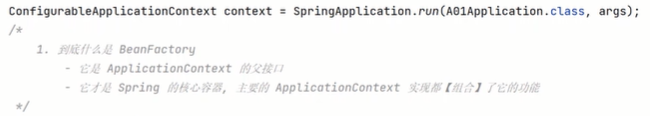

#### 2.BeanFactory的功能(要看有哪些方法和实现哪些接口、还有成员变量可以有很多方法)//ctrl+F12看方法？ uml :选中+F4

默认实现类  DefaultListableBeanFactory，可以管理所有Bean; 实现类中的DefaultSignletomBeanRegistry管理单例对象，可以反射查看所有单例；//下面的singletonObjects.get()里面的入参是什么情况？?也是个对象 说明beanFactory也是个单例对象，且保存在singletonObject中；看看 反射查看私有属性的示例代码？？

//只想看某个bean 话还可以过滤；

#### 3.ApplicationContext相对BeanFactory多了四种能力：//log输出日志会给出类名？@Autowired注入环境变量；

处理国际化资源的能力：MessageSource: context.getMessage() ； 依据key找到不同版本翻译结果，一般在messages打头的文件(不同语言的资源信息)；浏览器的请求头提供请求的语言类型；

​	通配符  获取资源（磁盘路径对应的资源）的能力：getResources()   //在jar包里面也查找：calsspath*:....

getEvironment: 获取环境信息（系统环境变量等）

发布事件对象 (本质上是一种解耦方式，如用户注册后 发短信、发邮件等；可以对标下AOP看哪个更优雅？)：pushlishEvent ，入参 事件源要继承ApplicationEcent； 接收时间  参数和入参一直，@EventListener

//单例+发送事件；

### 容器实现

#### BeanFactory实现 //默认实现DefaultListableBeanFactroy 是一个核心的spring容器？  bean的定义，BeanFactory会依据定义创建对象

//容器默认为空，往容器添加也给bean定义(先设置BeanDefinitin--类名、生命周期；然后注册bean--设置bean名字)；

原始的beanFactory并不会去解析注解，添加了后处理器[register扩展功能]并执行[postProcess/addBean....，或者称为建立联系]之后，会去解析注解，

BeanFactory后处理的主要功能，补充了一些bean定义，如@Bean @Configuration注解；

Bean后处理器，针对ean生命周期的各个阶段提供扩展，解析例如@Autowired注解；@Resource注解//javaee的注解

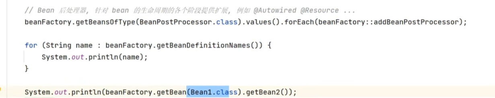

bean创建对象的时机：初始化的时候只会保存bean的定义、描述信息到beanFactory，当第一次用的时候，才会真正创建实例； 单例对象如果希望初始化时创建所有的单例对象，可以使用preInstantiateSingletons()：

applicationContext会把上面这些常用的初始化操作都直接封装好；

beanFactory的排序：

@autowired，bean容器中找实现类；有多个的时候[可以用qualifier指定？]会匹配成员变量名字和类名，匹配上优先；@Resource可以用name属性指定； 

优先级[优先级高的生效]@Autowired > @Resource，可以用比较器控制先后顺序，排序依据实现order接口的getOrder方法的返回值，数字小的排前面//同时使用两个注解时;

为什么sorted之后顺序会变？？和register一样的比较器啊？除非register只是进行了比较器的初始化，并没有把它用于排序，即执行；

#### ApplicationContext的常见实现和用法

- ClassPathXmlApplicationContext  基于xml路径读取配置；通常使用    <context:annotation-config>   标签就会自动加入一些有用的后处理器；
  -  
- FileSystemXmlApplicationContext : 基于文件路径读取配置；//绝对路径、相对路径均可
  - 
- ApplicationContext是如何把beanDefination信息加载到beanFactory中的：用的XmlBeanDefinitonReader的 loadBeanDefinitions方法，入参也可以是ClassPathResource()对象；
  - 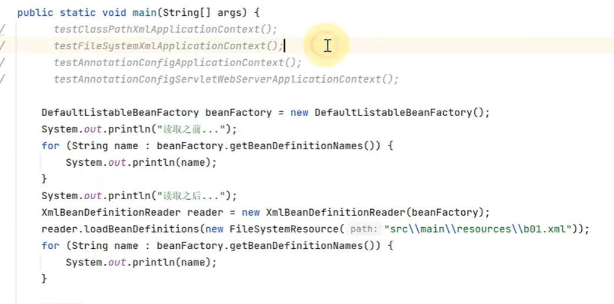
- AnnotationConfigApplicationContext : 基于配置类的applicationContext
  - 

#### 内嵌容器、注册DispatcherServletAnnotationConfigServletWebServerApplicationContext：既支持配置类，又支持内嵌servlet的Web容器---tomcat

- - spring的web服务器的核心是DispatcherServlet； DispatcherServlet要运行在tomcat服务器中；
  - 路径一般配置/，所有请求都经过dispatcherServlet，再到controller
  - 
  - 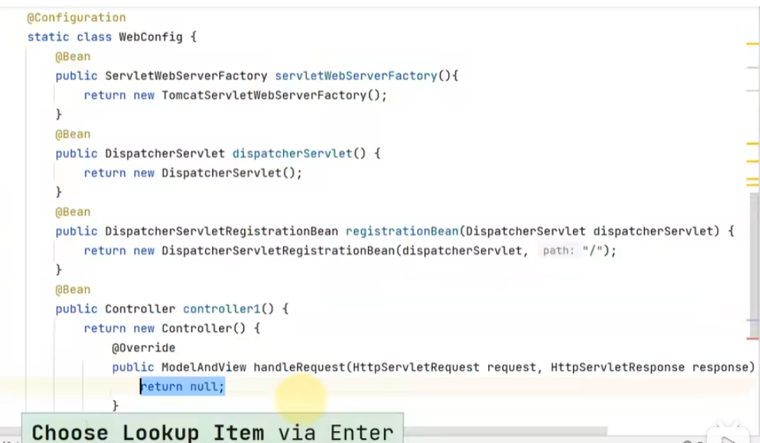
  - 前3步必须的[构建内置tomcat，构建dispatcherServlet，建立dipatcherServlet和tomcat容器之间的关联]，controller1可选，bean名字/开头并实现Controller就可以作为控制器；
  - 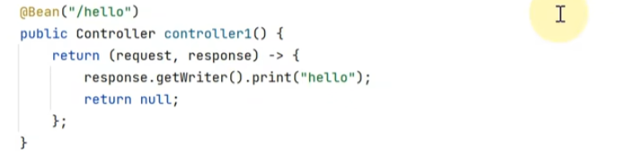

#### 

### Spring Bean的生命周期

#### Spring Bean生命周期的各个阶段

 //@Autowired的参数  也会自动注入[值、变量]；

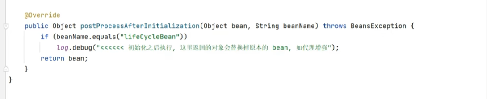

#### 模板设计模式：固定不变的内容+接口调用称为了模板[变化的内容单独封装为接口]；模板方法不需修改，改业务代码即可；

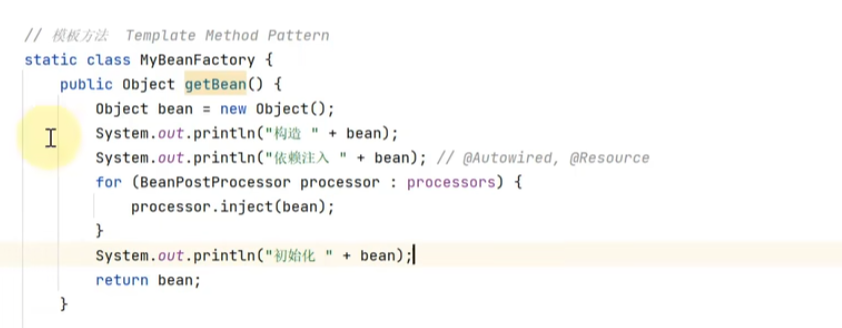

### 第四章

#### 常见的Bean后处理器//变量注入放在方法里面可以打印； Resolver是为了解析@Value值注入；//掌握下每个后处理器 能解析哪几个注解

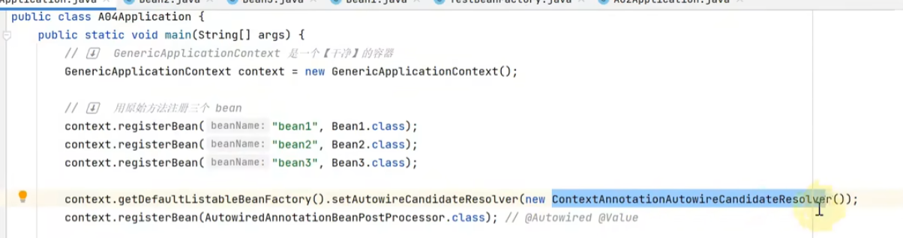

Spring注解积累，@ConfigrationProperties  SpringBoot的bean的属性和配置文件的键值对 做绑定；

一个单例的bean注入其他scope的bean会有问题，需要加一个Lazy注解。

#### 单例注入多例，scope会失效（解决方案本质上都是获取多例的时候多一层） E（单例）有属性发（多例）；

- 添加@Lazy解决  

  - 代理类是原F1的子类，代理对象使用f的方法时 可以控制注入新的f对象；

- 要注入的多例对象上添加配置，也是生成代理

- 多一层对象工厂

- 注入一个ApplicationContext，调用getBean方法；

#### aop之ajc增强

切面的实现方式不止代理，MyAspect监听MyService，拿到的MyService对象名字还是MyService; 编译的时候改写了原有的类  增加了前置增强；

编译结果的位置，==拖拉文件到idea可以反编译！！==

本质上，切面是由ajc编译器管理的，所以MyAspect不需要添加@Component注解；

pom.xml中添加插件：

有时候，idea默认是javac编译器，不使用aspect插件，可以使用maven的compiler强制使用；

相比spring的代理方式实现 aop，使用ajc编译器（修改class文件）可以增强static方法；

#### Aop实现之agent类加载

类加载阶段实现修改字节码 实现增强

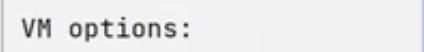

可以突破代理实现aop的限制：一个方法调用另一个方法，被调用的方法无法增强；

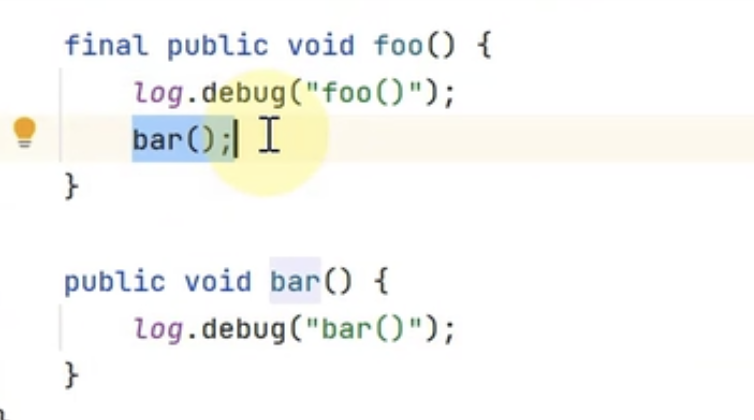

阿里巴巴的arthas工具：可以实现运行时的反编译（类加载才实现的增强，直接看target中编译结果还是没有增强）

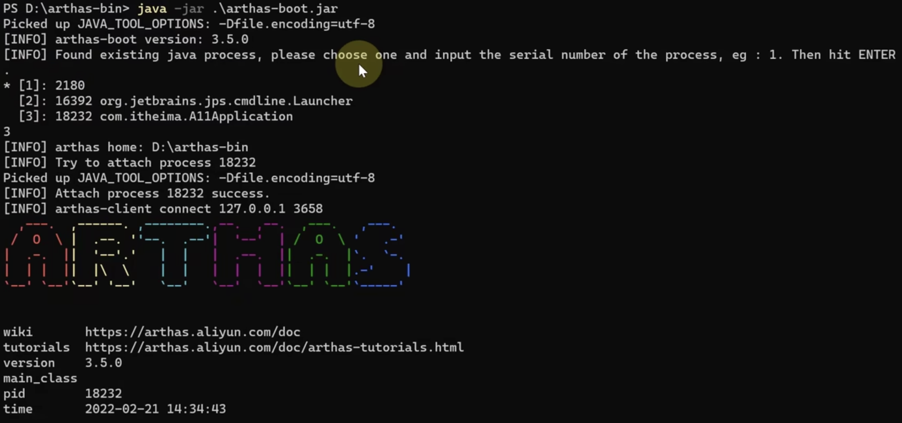

#### AOP实现之proxy//==简写为lamda快捷键？？==

代理类没有源码，运行时直接生成字节码；

##### jdk只能针对接口代理

- 参数一：classLoader；
- 参数二：要实现的接口可以一次实现多个接口；
- 参数三：invocationHandler，规定被代理方法具体的行为；

- invocationHandler的三个参数：
  - 代理对象
  - 真正执行的方法
  - 方法的参数

- 示例：
  - 
- 特点：被代理类和代理类是兄弟关系，不能互相强转，且被代理类可以是final;

##### cglib实现代理

- 参数一：被代理类
- 参数二：Callback的子接口，MethodInterceptor
- MethodInterceptor的四个参数：代理对象，当前代理对象中执行的方法，方法的参数，MethodProxy
- 示例
  - 
  - 使用methodProxy可以避免反射调用，invoke传被代理对象[spring使用这种]，厚着invokeSuper传代理对象
  - 

- 特点：被代理类和代理类是父子关系，可以相互强转，且被代理类不能是final；父类方法加了final也不能被增强，代理类会重写被代理方法；

#### jdk代理原理

//代理的场景：日志；权限；事务的增强？

- 模拟实现代理，代理对象 增加一个私有成员Invocationhandler，代理方法的具体执行逻辑，放在Invocationhandler的invoke方法中； 在声明代理对象的时候再指定具体的invoke方法的执行内容；

- 
- 对象有多个方法时，上述代码的invoke方法都调用的是被代理的foo方法，需要改进 所有的方法都调invoke， invoke具体反射调用哪个被代理方法 参数化；
- 
- 还需要增加返回值处理（invoke是Object），增加代理对象参数，异常处理（检查异常、throwable异常不能直接抛，需要转换下再抛）；
- 
- 方法对象的获取不需要每次调用都获取一次
- 
-  jdk的代理会继承Proxy类，内含一个InvocationHandler接口，所以可以直接用
- 
- arthas工具[powershell]需要知道类名才能反编译；程序要保持运行状态，可以System.in.read()；//直接看jdk代理源码基本看不懂，因为用的asm动态生成代理类的字节码；

- 
- 
- 
- 

#### jdk代理字节码生成

- jdk代理没有源码，运行期间动态生成字节码，用的asm[spring jdk使用很多]
- 安装idea插件 java源码转换为asm代码，然后可以转换为字节码；但不能很好地在高版本的jdk里面工作；
  - 
- 编写一个代理类的代码
  - 
  - 编译， 右键-- show Bytecode outline，会转换为ASMified  即asm代码；拷贝代码、粘贴；需要导下包，导入spring的包即可；
  - ClassWriter类调用生成字节码；cw.visit 就是生成一个代理对象（@Lazy就是做这个事情）；定义类的成员变量、方法;  cw.toByteArray（）得到的数组就是Class字节码； 例如：把byte数组写进ckass文件；
  - 
  - 直接在内存中使用字节码，defineClass依据字节数组生成类对象；  入参：类名、字节数组、字节数组起始为位置、长度；依据类对象可以创建对象；   
  - 
  - 
  - 具体字节码的生成要看asm的api，还要熟悉jvm的指令，成本有点高；

#### jdk反射优化//反射调用一般效率较低

- method.invoke本质上是通过methodAccessor实现类实现；
- 前16次用本地的java native api MethodAccessor，性能低；第17次  换了实现类反射，提高了性能；
- 
- 

- Arthas查看得知，第17次直接直接正常调用，为了优化反射调用  直接生成了 代理类，就可以直接调用
  - 

​			

#### cglib代理

- 继承父类

- ==MehodInterceptor.intercept 入参: 代理类对象   当前正在执行的方法   方法实参数组 **mehtodProxy[后面有说明]**==
- jdk和cglib的区别：jdk第17次有优化，针对一个方法产生一个代理类， 反射调用-->直接调用；cglib第一次调用就会产生代理，无需反射调用，一个代理类对应两个FastClass[对应代理对象 和目标对象 ，可能有些场景目标对象比代理对象多了一些功能吧，所以有两种用法？]，每个FastClass类里面可以匹配多个方法，相比jdk生成代理类数量少一些；

- ==MehtodProxy.create的五个参数：目标类型  代理类型 “参数、返回类型”  带增强功能的方法名 带原始功能的方法名;==//()V表示入参为空，返回值为void; ()表示入参为int 返回值 void
- 

- methdoProxy避免反射调用的原理，使用了FastClass; FastClass也是直接生成字节码，没有Java的源码；==核心的两个方法 getIndex[方法签名转换为整数编号] invoke[依据整数编号调用对用的方法]==； Proxy方法中初始化代码，调用create方法的时候会生成targetClass代理对象；
- methodProxy.invoke(target, args)模拟实现；结合目标对象使用的class
  - 
  - 
  - 
  - 
  - 
- methodProxy.invoke()    结合代理对象使用
  - 注意：调的是代理类的原始功能方法  因为使用methodProxy代理之前已经进行过增强了；
  - 
  - 
  - 

#### spring选择代理

**切面：通知+切点**； advisor包含一个通知和切点；

- 

模拟实现切面

- org.springframework.aop.Pointcut

- 

- org.aopalliance.intercept.MethodInterceptor

- 

- 

- ProxyFactory会依据具体情况选择 cglib或者jdk增强

  - 
  - 

  

#### 16讲 切点匹配

- execution(返回值  包名-类名-方法名 )

- @annotation(注解的 包名-类名)

- 
- @Transactional  可加方法、类[所有方法]、接口[实现该接口的类的所有的接口中的方法]；

- MergeAnnotaions可以获取方法  类上的注解信息；默认只差一层，即仅本类，不会搜父类 接口，设置为SearchStrategy.TYPE_HIERARCHY
  - 

- 

#### 17讲 从@Apect到Advisor

- 
- 
- 转换为lamda快捷键？？？
- 
- GenericApplicationContext是一个干净的容器；注册配置类  ConfigurationClassPostProcessor后处理器解析配置类内部的@Bean注解

- 

#### 第17讲 findEligibleAdvisors

bean处理器，一  找到所有的切面，包括高级切面Aspect和低级切面Advisor；二  依据切面创建代理对象；

AnnotationAwareAspectJAutoProxyCreator.class

findEligibleAdvisors ：找到所有有资格的低级切面 List， 高级切面会被转换成低级切面；入参：目标类[查看切点是否和目标类匹配]，bean在容器的名字

wrapIfNecessary:是否有必要创建代理

- 
- 
-   

#### 第17讲 代理创建时机

//通常是 创建之后  或者 初始化之后 二选一；//==我看后续的视频似乎是还有 依赖注入和初始化之间创建代理????应该理解为之前，如bean2依赖bean1，注入bean1之前会创建代理对象==

- 
- 
- 
- 
- 
- 循环依赖的情况，bean1的代理对象在bean1的构造--bean1的初始化之间被创建，因为依赖注入需要  代理对象被提前创建；
- 

#### 第17讲 切面的生效顺序

- 可以自己设置顺序，高级切面和低级切面的顺序设置方法如下
  - 
- spring切面顺序控制的缺点
  - 低级切面， @Order 和@Bean共同使用时无效
  - 高级切面，加在方法上无效，故单个类内的不同方法的顺序无法控制

#### 第17讲 高级切面转换为低级切面

- 遍历方法，查看方法的注解，创建切点  不同注解对应的通知类  切面；

- 
- 

### 第18讲 静态通知调用

#### 不同通知同意转换为环绕通知，适配器模式体现

- 
- 最后的效果是想达到下述的 套娃的效果，由外到内进，由内到外出；
- 
- getInterceptorsAndDynamicInterceptionAdvice会把不同通知转换成环绕通知
- 
-  适配器模式：把一套接口转换成另一套接口，以便适合某种场景的调用
- 
- 创建并执行调用链；proceed（）调用所有的环绕通知和目标；还需要准备好methodInvocation，可以最外层环绕通知实现放入当前线程（addAvice(ExposeInvocationInterceptor.INSTANCE)）；
- 
- 
- 
- 

#### 无参数绑定通知链执行过程，责任链模式体现 

#### 模拟实现MethodInvocation

- 本质就是一个递归调用；
- 责任链模式：链对应调用链，元素对应 通知类；
- 
- 
- 

### 第十九讲 动态通知调用

#### 参数绑定通知链执行过程

- proxyCreator()用于将高级切面转为低级切面，同时创建代理对象；
  -  
- 测试类代码，interceptorList则是所有通知转换后的环绕通知；最外层的ExposeInvocationInterceptor为其它通知准备好methodInvocatin对象；带参数的切面，最后得到的是InterceptorAndDynamicMethodMatcher对象（内部含切点属性、通知属性）
  - 
  - 
- 
- 

- 注意，上面的invocation使用了一个语法：new 一个匿名子类，为的是调用受保护的构造；

### 第二十讲：RequestMappingHandlerMapping与RequestMappingHandlerAdapter

#### diapatcherServlet初始化

- AnnotationConfig指支持java配置类方式构建容器；ServletWebServer支持内嵌 web容器（如内嵌tomcat）；
- @ComponentScan默认范围：自己类所在的包及子包；
- 工厂方法的参数支持按类型匹配，接近依赖注入；
- 不和其它servlet路径匹配，默认和/匹配
  - 

- dispatcherServlet是spring容器创建；但是初始化 ：tomcat容器默认在首次使用dispatcherServlet的时候初始化（走的是servlet的初始化流程）； 如果希望在启动tomcat的时候初始化dipatcherServlet，可以设置loadOnStartup，大于0便会在启动是初始化，具体数值表示多个servlet时的优先级；
  - 
  - 配置属性可以在配置文件中设置 @PropertySource；ServerPropertires会打包读取配置类中server打头的key
  - 
  - 
  - 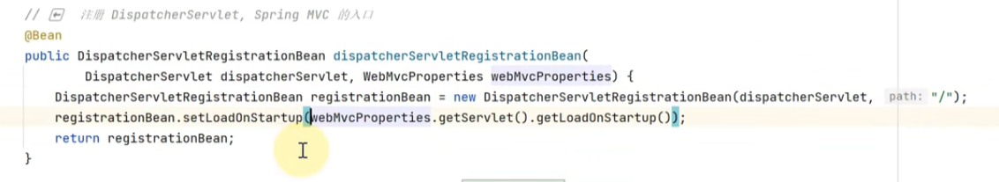
  - 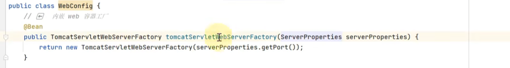

#### diapatcherServlet初始化内容

- onRefresh-->initStrategies，会初始化下面的九个组件；
  - 
  - initMultipartResolver：文件上传成解析器
  - initLocaleResolver：本地化解析器，属于哪一种国家、地区、语言；//有多种实现：accept cookie
  - initThemeResolver：不重要
  - initHandlerMappings  路径映射器，请求下方到controller；
  - initHandlerAdapters   handler：具体处理请求的代码，有多种形式；适配 不同形式的适配器方法，并调用它；
  - initHandlerExceptionResolvers   解析异常
  - 后面三个不重要

- initHandlerMappings代码阅读
  - 
  - 找到所有的HandlerMapping（detectAllHandlerMapping如果为真如果当前容器没有还会去父容器中找），如果容器中有，优先使用容器中的HandlerMapping；如果容器没有，使用默认的HandlerMapping，在DispatcherServlet.properties中配置；

#### RequestMappingHandlerMapping //流程：请求到handlerMapping映射到控制器，并和拦截器包装成调用链 chain；然后handlerAdapter解析参数；然后执行方法；最后 返回值 处理器对返回值进行解析；

- 解析RequestMapping及派生注解，建立 请求路径----控制器之间的映射关系；
- `初始化的时候`，先到当前容器下找到所有控制器，查看控制器有哪些方法并记录 路径---控制器方法  信息；

- 默认的RequestMappingHandlerMapping 创建的RequestMappingHandlerMapping对象会作为dispatcher的属性，但是不会放入Spring容器中； 可以在WebConfig中，添加定义：
  - 

- 模拟  路径匹配handlerMethod的过程；HandlerExcecutionChain不仅包含了handlerMethods[即控制器的方法信息]，还包含了拦截器对象；
  - 

#### RequestMappingHandlerAdapter

- 调用控制器方法
- 
-  invokeHandlerMethod是protected方法，为了调用可以自己创建一个子类，放大修饰符；测试案例：

- 

- 如何解析控制器方法的参数、返回值等？？
- 

- 自定义参数解析器
  - 
  - 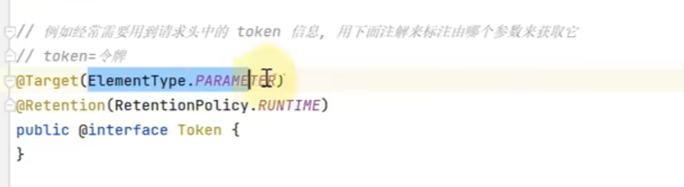
  - 加在参数位置上，运行期一直都有效；目标：标注了@Token，就会获取请求投的参数，赋值给token参数；
  - 
  - 校验参数是否包含@Token注解，不包含（return false）则不继续解析；
  - 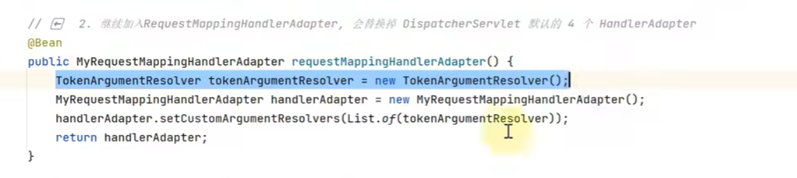
  - 将自定义的参数解析器，加入到Adapter类中；
  - 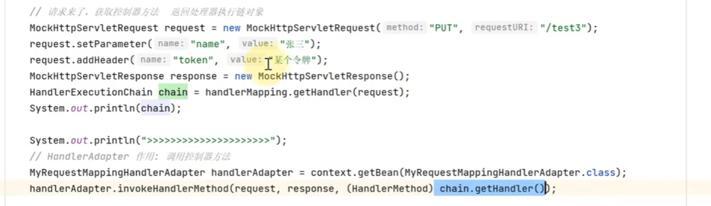
  - 测试；

- 自定义返回值处理器 //依据返回值类型、方法是否加某个注解进行特殊处理

  - 
  - 
  - 第三步是为了省略去spring MVC后续的视图解析等流程；
  - 
  - 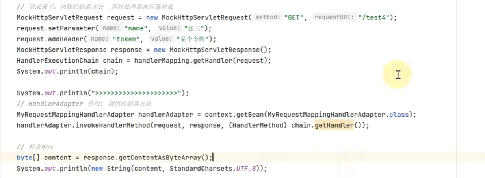
  - 测试

### 第二十一讲  参数解析器

#### 常见的参数解析器

- 

- 没加解析参数默认@RequestParam或者@ModelAttribute
- 
- 控制器方法封装为HadnlerMethod，然后才能完成 访问路径映射；对象绑定与类型转换，入请求的String转换互为contrller的int入参；
- getMethodParameters可以获取所有的形参，但是参数名还是Null，initParameterNameDiscovery才能解析参数名，
- getParameterAnnotations获取参数上的所有注解名，但是真正解析注解，获取实参需要RequestParamMethodArgumentResolver.resolveArgument；
- 
- 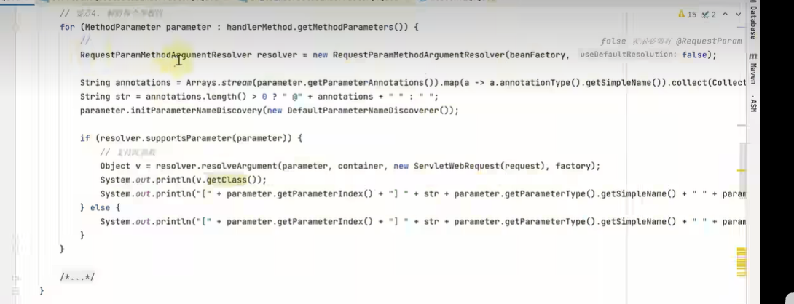

#### 逐个解析器调试@RequestParam

- 模拟请求类定义
- getMethodParameters可以获取所有的形参，但是参数名还是Null，initParameterNameDiscovery才能解析参数名，
- getParameterAnnotations获取参数上的所有注解名，但是真正解析注解，获取实参需要RequestParamMethodArgumentResolver.resolveArgument；
- new RequestParamMethodArguementResolver: beanFactory[用于支持${}解析等]  是否能省略@RequestParam注解 
- resolver.resolveArgument入参：参数；modelAndView容器 暂存中间model结果，spring封装后的请求request，bindFactory[用于类型转换]
- 解析${}需要beanFactory 读取环境变量、控制文件；

- 
- 
- 
- 
- 
- 当前问题：没有@RequestParam的其它参数 如带@PathVariable也会被尝试解析；

#### 组合模式

- 需要依次调用每个Resolver.supportsParameter方法，直到找到一个 支持此参数的解析器；//==组合器的设计模式==
- 
- 解析@PathVariable注解之前，需要handlerMapping将{id}和实参对应起来
- 
- 
- @RequestHeader @CookieValue @Value HttpServletRequest ，依次对应如下：
- 
- ${}是环境参数，#{}是spring的EL表达式；

10-12

- @ModelAttribute， 
  - 参数和javaBean的属性做一个绑定，对应的ServletModelAttributeMethodProcessor可以指定@ModelAttribute是否可以省略，spring中会添加两个；参数解析器的结果作为模型数据存入ModelAndViewContainer[默认modelAttribute中名字为类型名字  ]；  
  - 注意：不需要@ModelAttribute注解的的processor一定要放在最后，不然会尝试省略@ModelAttribute方式解析@RequestBody对应的参数，认为它省略了@ModelAttribute； 多个省略要先对象，后普通类型；
- 
- @ModelAttribute，@RequestBody依次对应
- 
- 消息转换器，把JSON数据解析为javaBean；
- dataBinder[类型转换和数据绑定]换一个：
- 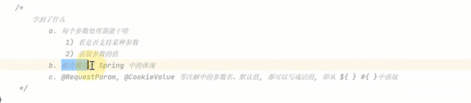

//${}对应配置文件；#{}对应EL表达式；

### 第二十二讲  参数解析器

#### 获取参数名(之前用了DefaultParameterNameDiscoverer)

- 编译    反编译 可以发现编译默认是不保留参数名；可以添加-parameters 

0352