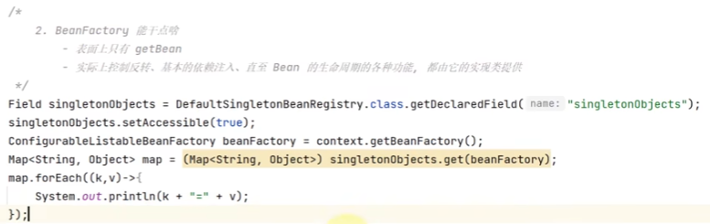
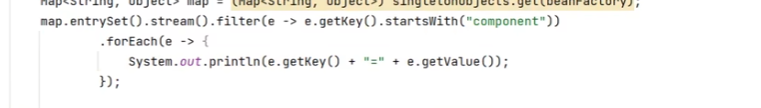
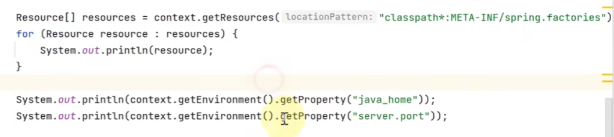
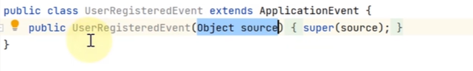
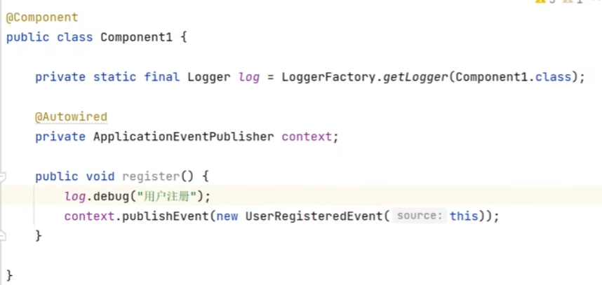
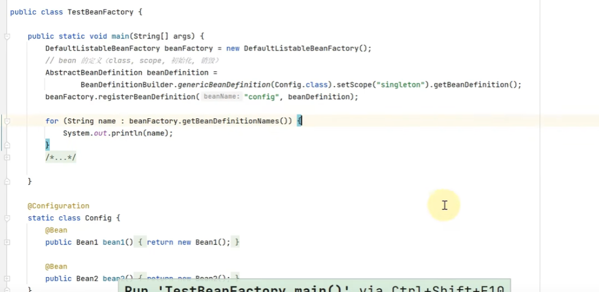
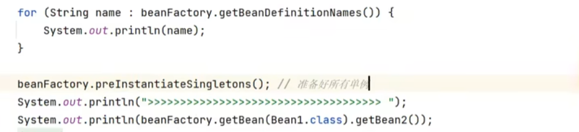
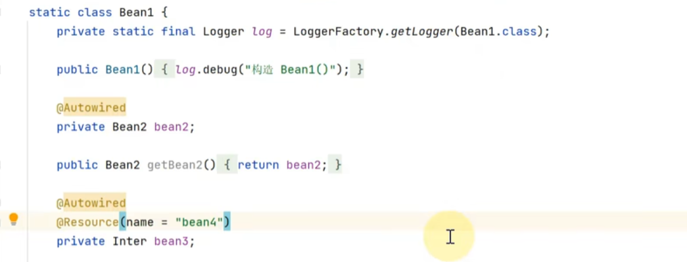
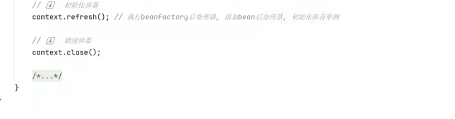

//内嵌的tomcat，神策上的代码是否 配置个WebConfig registrationBean能运行web？

//Bean工厂相关的后处理器，4个；Bean生命周期相关的后处理器，讲了2个？

课程地址：

https://www.bilibili.com/video/BV1P44y1N7QG/?vd_source=8bd5ab544d4cb8d9821752b68ce53b11

#### 问题小结：

- jdk代理的原理？如何自己实现代理？Cglib?? 代理的模拟实现自己手写下？？
- 想体验下微软的面试？看下人家和我之间的差距？

看源码技巧

### BeanFactory和ApplicationContext

#### 1.什么是BeanFactory//看类图ctrl alt u; 查看实现：ctrl alt 单击；

启动类的run方法返回值就是spring容器，

ApplicationContext继承了BeanFactory; BeanFactory[里面有SingletonObjects]才是Spring的核心，ApplicationContext的部分功能是组合了BeanFactory的内容实现的[beanFactory是applicationContext的成员变量，可以断点看属性验证]；

#### 2.BeanFactory的功能(要看有哪些方法和实现哪些接口、还有成员变量可以有很多方法)//ctrl+F12看方法？ uml :选中+F4

默认实现类  DefaultListableBeanFactory，可以管理所有Bean; 实现类中的DefaultSignletomBeanRegistry管理单例对象，可以反射查看所有单例；//下面的singletonObjects.get()里面的入参是什么情况？?也是个对象 说明beanFactory也是个单例对象，且保存在singletonObject中；看看 反射查看私有属性的示例代码？？

//只想看某个bean 话还可以过滤；

#### 3.ApplicationContext相对BeanFactory多了四种能力：//log输出日志会给出类名？@Autowired注入环境变量；

处理国际化资源的能力：MessageSource: context.getMessage() ； 依据key找到不同版本翻译结果，一般在messages打头的文件(不同语言的资源信息)；浏览器的请求头提供请求的语言类型；

​	通配符  获取资源（磁盘路径对应的资源）的能力：getResources()   //在jar包里面也查找：calsspath*:....

getEvironment: 获取环境信息（系统环境变量等）

发布事件对象 (本质上是一种解耦方式，如用户注册后 发短信、发邮件等；可以对标下AOP看哪个更优雅？)：pushlishEvent ，入参 事件源要继承ApplicationEcent； 接收时间  参数和入参一直，@EventListener

//单例+发送事件；

### 容器实现

#### BeanFactory实现 //默认实现DefaultListableBeanFactroy 是一个核心的spring容器？  bean的定义，BeanFactory会依据定义创建对象

//容器默认为空，往容器添加也给bean定义(先设置BeanDefinitin--类名、生命周期；然后注册bean--设置bean名字)；

原始的beanFactory并不会去解析注解，添加了后处理器[register扩展功能]并执行[postProcess/addBean....，或者称为建立联系]之后，会去解析注解，

BeanFactory后处理的主要功能，补充了一些bean定义，如@Bean @Configuration注解；

Bean后处理器，针对ean生命周期的各个阶段提供扩展，解析例如@Autowired注解；@Resource注解//javaee的注解

bean创建对象的时机：初始化的时候只会保存bean的定义、描述信息到beanFactory，当第一次用的时候，才会真正创建实例； 单例对象如果希望初始化时创建所有的单例对象，可以使用preInstantiateSingletons()：

applicationContext会把上面这些常用的初始化操作都直接封装好；

beanFactory的排序：

@autowired，bean容器中找实现类；有多个的时候[可以用qualifier指定？]会匹配成员变量名字和类名，匹配上优先；@Resource可以用name属性指定； 

优先级[优先级高的生效]@Autowired > @Resource，可以用比较器控制先后顺序，排序依据实现order接口的getOrder方法的返回值，数字小的排前面//同时使用两个注解时;

为什么sorted之后顺序会变？？和register一样的比较器啊？除非register只是进行了比较器的初始化，并没有把它用于排序，即执行；

#### ApplicationContext的常见实现和用法

- ClassPathXmlApplicationContext  基于xml路径读取配置；通常使用    <context:annotation-config>   标签就会自动加入一些有用的后处理器；
  -  
- FileSystemXmlApplicationContext : 基于文件路径读取配置；//绝对路径、相对路径均可
  - 
- ApplicationContext是如何把beanDefination信息加载到beanFactory中的：用的XmlBeanDefinitonReader的 loadBeanDefinitions方法，入参也可以是ClassPathResource()对象；
  - 
- AnnotationConfigApplicationContext : 基于配置类的applicationContext
  - 

#### 内嵌容器、注册DispatcherServletAnnotationConfigServletWebServerApplicationContext：既支持配置类，又支持内嵌servlet的Web容器---tomcat

- - spring的web服务器的核心是DispatcherServlet； DispatcherServlet要运行在tomcat服务器中；
  - 路径一般配置/，所有请求都经过dispatcherServlet，再到controller
  - 
  - 
  - 前3步必须的[构建内置tomcat，构建dispatcherServlet，建立dipatcherServlet和tomcat容器之间的关联]，controller1可选，bean名字/开头并实现Controller就可以作为控制器；
  - 

#### 

### Spring Bean的生命周期

#### Spring Bean生命周期的各个阶段

 //@Autowired的参数  也会自动注入[值、变量]；

#### 模板设计模式：固定不变的内容+接口调用称为了模板[变化的内容单独封装为接口]；模板方法不需修改，改业务代码即可；

### 第四章

#### 常见的Bean后处理器//变量注入放在方法里面可以打印； Resolver是为了解析@Value值注入；//掌握下每个后处理器 能解析哪几个注解

Spring注解积累，@ConfigrationProperties  SpringBoot的bean的属性和配置文件的键值对 做绑定；

P30

一个单例的bean注入其他scope的bean会有问题，需要加一个Lazy注解。

#### 单例注入多例，scope会失效（本质上都是获取多例的时候多一层）；

- 添加@Lazy解决  

代理类是原F1的子类；

- 添加配置，也是生成代理

- 多一层对象工厂

- 注入一个ApplicationContext，调用getBean方法；

#### aop之ajc增强

切面的实现方式不止代理，MyAspect监听MyService，拿到的MyService对象名字还是MyService; 编译的时候改写了原有的类  增加了前置增强；

编译结果的位置，==拖拉文件到idea可以反编译！！==

本质上，切面是由ajc编译器管理的，所以MyAspect不需要添加@Component注解；

pom.xml中添加插件：

有时候，idea默认是javac编译器，不使用aspect插件，可以使用maven的compiler强制使用；

相比spring的代理方式实现 aop，使用ajc编译器（修改class文件）可以增强static方法；

#### Aop实现之agent类加载

类加载阶段实现修改字节码 实现增强

可以突破代理实现aop的限制：一个方法调用另一个方法，被调用的方法无法增强；

阿里巴巴的arthas工具：可以实现运行时的反编译（类加载才实现的增强，直接看target中编译结果还是没有增强）

#### AOP实现之proxy//==简写为lamda快捷键？？==

代理类没有源码，运行时直接生成字节码；

##### jdk只能针对接口代理

- 参数一：classLoader；
- 参数二：要实现的接口可以一次实现多个接口；
- 参数三：invocationHandler，规定被代理方法具体的行为；

- invocationHandler的三个参数：
  - 代理对象
  - 真正执行的方法
  - 方法的参数

- 示例：
  - 
- 特点：被代理类和代理类是兄弟关系，不能互相强转，且被代理类可以是final;

##### cglib实现代理

- 参数一：被代理类
- 参数二：Callback的子接口，MethodInterceptor
- MethodInterceptor的四个参数：代理对象，当前代理对象中执行的方法，方法的参数，MethodProxy
- 示例
  - 
  - 使用methodProxy可以避免反射调用，invoke传被代理对象[spring使用这种]，厚着invokeSuper传代理对象
  - 

- 特点：被代理类和代理类是父子关系，可以相互强转，且被代理类不能是final；父类方法加了final也不能被增强，代理类会重写被代理方法；

#### jdk代理原理

//代理的场景：日志；权限；事务的增强？

- 模拟实现代理，代理对象 增加一个私有成员Invocationhandler，代理方法的具体执行逻辑，放在Invocationhandler的invoke方法中； 在声明代理对象的时候再指定具体的invoke方法的执行内容；

- 
- 对象有多个方法时，上述代码的invoke方法都调用的是被代理的foo方法，需要改进 所有的方法都调invoke， invoke具体反射调用哪个被代理方法 参数化；
- 
- 还需要增加返回值处理（invoke是Object），增加代理对象参数，异常处理（检查异常、throwable异常不能直接抛，需要转换下再抛）；
- 
- 方法对象的获取不需要每次调用都获取一次
- 
-  jdk的代理会继承Proxy类，内含一个InvocationHandler接口，所以可以直接用
- 
- arthas工具[powershell]需要知道类名才能反编译；程序要保持运行状态，可以System.in.read()；//直接看jdk代理源码基本看不懂，因为用的asm动态生成代理类的字节码；

- 
- 
- 
- 

#### jdk代理字节码生成

- jdk代理没有源码，直接生成字节码，用的asm[spring jdk使用很多]
- 安装idea插件 java源码转换为asm代码，然后可以转换为字节码；但不能很好地在高版本的jdk里面工作；
  - 
- 编写一个代理类的代码
  - 
  - 编译， 右键-- show Bytecode outline，会转换为ASMified  即asm代码；需要导下包，spring的包即可；
