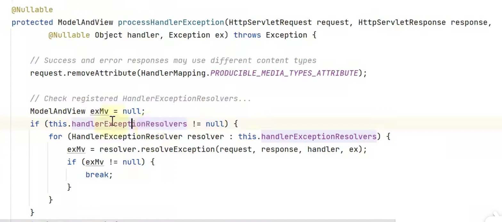
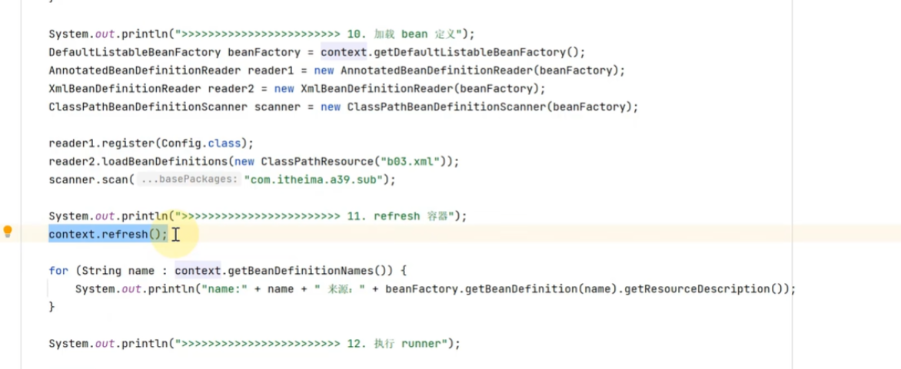
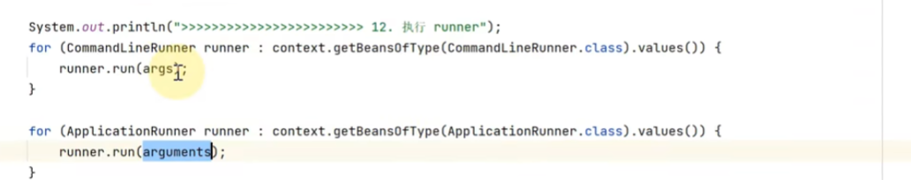
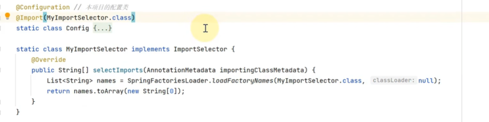
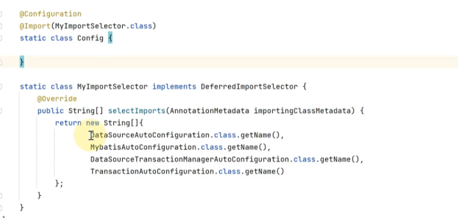

==找个时间把课程的主线梳理下，然后梳理一般面试用 或者说 知识点框架 的极简思维导图，如RequestMappingHandlerAdapter包含了参数解析器，引出了二十一讲有哪些参数解析器及底层原理；==

==解锁了注解的新一种用法，使用回调方法+ MethodParameter.getParameterAnntation(Interface.class)对带有特定注解的参数或方法做处理；==

### 第十九讲 动态通知调用

- 动态通知：通知方法有入参，需要参数绑定，执行时需要切点；//通知的实参由目标方法的入参提供

- 测试类代码，和静态通知调用不同的是，getInterceptorsAndDynamicIntercAdvice的返回结果，动态通知对应的转换结果为【静态通知的转换结果为环绕通知】InterceptorAndDynamicMethodMatcher对象（内部含切点属性、环绕通知属性）//前面提过会额外多一个最外层的ExposeInvocationInterceptor为其它通知准备好methodInvocatin对象[调用链]
  - proxyCreator()用于将高级切面转为低级切面，同时创建代理对象；
    -  
  - 
  - 
  - 
  - 
  - 注意，上面的invocation使用了一个语法：new 一个匿名子类new A(){}，为的是调用受保护的构造；这里的target只有一个带参数的foo方法，但是同时满足了两个切点，带参与不带参；

### 第二十讲：RequestMappingHandlerMapping与RequestMappingHandlerAdapter

**diapatcherServlet简介**

- 定位：springMVC程序的入口点；
- 示例代码的spring容器选择实现[需要支持内嵌tomcat容器]：AnnotationConfigServletWebServcerApplicationContext //  AnnotationConfig表示指支持java配置类方式构建容器；ServletWebServer支持内嵌 web容器（如内嵌tomcat）；
  - 支持web容器的配置类有三项必须配置：内嵌web容器工厂、DispatcherServelet的Bean定义，注册bean[用于把DispatcherServlet注册到Tomcat，两个入参：DispatcherServlet、注册路径{/表示不和其它servlet路径匹配，默认和/匹配}]
  - 工厂方法的参数支持按类型匹配，接近依赖注入；
- tips: @ComponentScan默认范围：配置类所在的包及子包；==玩一玩自定义快捷键？?如bean定义、controller接口的定义；==  debug模式页面左下方可以看到调用栈
  - 
- diapatcherServlet初始化时机
  - dispatcherServlet是spring容器创建，但是初始化在tomcat完成；tomcat容器默认在首次使用dispatcherServlet的时候初始化；//如果希望在启动tomcat的时候初始化dipatcherServlet，可以设置loadOnStartup，大于0便会在启动是初始化，具体数值表示多个DispatcherServlet初始化时的优先级；
- 配置文件属性读取
  - 配置属性可以在配置文件【application.properties】中设置，并通过注解 @PropertySource + @Value/@EnableConfigurationProperties[结合WebMvcProperties.class/WebProperties.class）读取；例如：@EnableConfigurationProperties({ServerPropertires.class})会打包读取application.properties中server打头的key并封装为ServerProperties对象存入容器；
  - 
  - 
  - 
  - 
  - 

dispatcherServlet初始化内容

- dispatcherServlet-->onRefresh-->initStrategies，会初始化下面的九类组件；
  - initMultipartResolver：初始化  文件上传解析器
  - initLocaleResolver：初始化 本地化解析器，属于哪一种国家、地区、语言；//有多种实现：请求头中accept头获取相关信息  从cookie中获取等；
  - //initThemeResolver：不重要
  - initHandlerMappings： 初始化 路径映射器，请求下发到controller；
  - initHandlerAdapters   
    - 适配 不同形式的控制器方法，并调用它；
    - handler：具体处理请求的代码，有多种形式；
  - initHandlerExceptionResolvers   解析异常
  - //后面三个不重要
  - 
- initHandlerMappings代码阅读
  - 找到所有的HandlerMapping（detectAllHandlerMapping如果为真如果当前容器没有还会去父容器中找），如果容器中有，优先使用容器中的HandlerMapping；如果容器没有，使用默认的HandlerMapping，在DispatcherServlet.properties中配置；
  - 
  - 
  - 
  

**RequestMappingHandlerMapping //流程：请求到handlerMapping映射到控制器，并和拦截器包装成调用链 chain；然后handlerAdapter解析参数；然后执行方法；最后 返回值 处理器对返回值进行解析；**

- 实现了HandlerMapping接口//解析@RequestMapping及派生注解，建立 请求路径----控制器方法之间的映射关系；
- `初始化的时候`，先到当前容器下找到所有控制器类，查看控制器有@RequestMapping及其派生注解【包括GetMapping等】的方法并记录  路径--->控制器方法  信息【getHandlerMethods方法可以查看】并保存到RequestMappingHandlerMapping；
- 默认的RequestMappingHandlerMapping 创建的RequestMappingHandlerMapping对象会作为dispatcher的属性，但是不会放入Spring容器中； 可以在WebConfig中，添加RequestMappingHandlerMapping定义：
  - 
  - 模拟 依据路径获取控制器方法，可以用getHandler方法，入参为httpServletRequest请求对象；//返回的HandlerExcecutionChain不仅包含了handlerMethods[即控制器的方法信息]，还包含了拦截器对象；
  - 

RequestMappingHandlerAdapter

- 实现了HandlerAdapter接口，即处理器适配器，作用是调用控制器方法

- 代码示例：调用RequestMappingHandlerAdapter重要方法

  - invokeHandlerMethod【调用handlerMethod】是protected方法，为了调用可以自己创建一个子类，放大修饰符；测试案例：
  - 入参：请求对象、响应对象、handlerMethod对象

- 如何解析控制器方法的参数、返回值等？？

  - getArguementResolvers获取参数解析器；getReturnValueHandlers获取返回值解析器；

- 代码示例

  - 
  - 
  - 

  - 

- 自定义参数解析器
  - 自定义注解；
  - 自定义resolver并实现HandlerMethodArgumentResolver接口，重写两个方法；
  - 将自定义的参数解析器，加入到RequestMappingHandlerAdapter的实现类中；
  - //后续使用的时候只需要在方法参数前添加注解即可；
  - 代码示例：
    - 
    - @Target指定加在参数位置上，@Retention运行期一直都有效；目标：标注了@Token，就会获取请求投的参数，赋值给token参数；
    - 
    - 校验参数是否包含@Token注解，不包含（return false）则不继续解析；
    - 解锁了注解的新一种用法，使用回调方法+ MethodParameter.getParameterAnntation(Interface.class)对带有特定注解的参数或方法做处理；
    - 
    - 
    - 

- 自定义返回值处理器 //依据返回值类型、方法是否加某个注解进行特殊处理

  - 自定义注解；
  - 自定义resolver并实现HandlerMethodReturnValueHandler接口，重写两个方法；
  - 将自定义的参数解析器，加入到RequestMappingHandlerAdapter的实现类中；
  - //后续使用的时候只需要在方法上添加注解即可；
  - 示例代码
    - 
    - 第三步是为了省略去spring MVC后续的视图解析等流程
    - 
    - 
    - 

### 第二十一讲  参数解析器

**常见的参数解析器**

- handlerAdapter自带的参数解析器：

- 测试代码准备：测试器类中方法带有不同的注解：
  
- @RequestParam+String   name1=张三；
  - 没加解析参数:特殊类型；默认@RequestParam【基础类型】; @ModelAttribute【自定义类型】
  - @RequestParam+类型转换；
  - @RequestParam+从环境变量获取默认值
  - @RequestParam   上传文件
  - @PathVariable   // test/{id}
  - @RequestHeader  //解析请求头数据
  - @CookieValue
  - @Value   获取Spring中数据
  - ///特殊类型  //包括request response session等；
  - @ModelAttribute  自定义类型；
    - @Request  请求体获取数据
  
- 示例代码
  
- 
  
  - 
  
- 示例代码：测试代码框架+打印所有的方法入参【包括注解、类型、参数名等信息】
  - 前面提到过HandlerMapping会将控制器方法封装为HadnlerMethod，然后才能完成 访问路径映射；对象绑定与类型转换，入请求的String转换互为contrller的int入参；
  - initParameterNameDiscovery是为了解析方法入参的参数名；
  - getParameterAnnotations获取参数上的所有注解名；
  - 
  - 

**逐个解析器调试@RequestParam 相关---RequestParamMethodArgumentResolver**

- 参数解析器核心两个方法
  - supportsParameter判断时否支持某种参数；
  - resolver.resolveArgument  真正解析参数得到实参；
- 组合模式
  - 需要依次调用每个Resolver.supportsParameter方法，直到找到一个 支持此参数的解析器；//==组合器的设计模式==
  - 
- 情况1：RequestParamMethodArguementResolver即可；情况2    RequestParamMethodArguementResolver的第二个参数要为true；情况3：因为有类型转换需要指定类型转换器：  ；情况4：因为要解析${}，RequestParamMethodArguementResolver的第一个参数要指定beanFactory用于读取环境变量、控制文件；情况5：RequestParamMethodArguementResolver 即可；
  - new RequestParamMethodArguementResolver（）入参: beanFactory[用于支持${}解析等]  是否能省略@RequestParam注解 
  - resolver.resolveArgument入参：参数；modelAndView容器 暂存中间model结果；spring封装后的请求对象ServletWebRequest， bindFactory[用于类型转换]
  - /////当前问题：没有@RequestParam的其它参数 如带@PathVariable也会被认为省略了@RequestParam[尝试用RequestParamMethodArguementResolver解析]，会报错；//后面会学到用组合模式+ 可省略/不可省略两个解析器可以解决；
- 情况6-9：@RequestHeader @CookieValue @Value  特殊类型HttpServletRequest ，依次为：RequestHeaderMethodArgumentResolver、ServletCookieValueMethodArgumentResolver、ExpressionValueMethodArgumentResolver、ServletRequestMethodArgumentResolver
  - ${}是环境变量、配置参数，#{}是spring的EL表达式；
- 情况10-12
  - 情况10和11@ModelAttribute，情况12@RequestBody依次对应：ServletModelAttributeMethodProcessor、RequestResponseBodyMethodProcessor
  - 情况10和11本质上都是@ModelAttribute；
    - 参数和javaBean的属性做一个绑定，参数解析器的结果作为模型数据存入ModelAndViewContainer[==默认modelAttribute中名字为类型名字==  ]；
    - 注意：对应的ServletModelAttributeMethodProcessor可以指定@ModelAttribute是否可以省略，spring中会添加两个[不可省略+可以省略]；  ==可以省略@ModelAttribute @RequestParam注解的的processor一定要放在最后，不然会尝试省略@ModelAttribute方式解析@RequestBody对应的参数，认为它省略了@ModelAttribute； 多个省略要先省略省略@ModelAttribute，后省略@RequestParam，不会把String当做省略@ModelAttribute处理时为什么？？==
- 示例代码：
  - 模拟请求
    - 
    - 
  - 主程序
    - 
    - 
    - 

  - 解析@PathVariable注解之前，需要将请求路径的{id}和实参对应起来，结果放入request作用域[key是固定的]；//[spring中由handlerMapping完成]
    - 

  - 情况6-9：@RequestHeader @CookieValue @Value  特殊类型HttpServletRequest ，依次对应如下：
    - 示例中@Value中的值用了${},其实@RequestParam @CookieValue中指定参数名 默认值，也可以这么用
    - ${}是环境变量、配置参数，#{}是spring的EL表达式；
    - 
    - 除HttpServletRequest 外，ServletRequestMethodArgumentResolver支持的其它特殊类型
    - 

  - 情况10和11@ModelAttribute，情况12@RequestBody依次对应
    - @ModelAttribute需要换一个dataBinder[类型转换和数据绑定]
      - 
    - @RequestBody的解析器入参需要一个消息转换器，把JSON数据解析为javaBean；
    - 

### 第二十二讲  获取参数名(之前用了DefaultParameterNameDiscoverer)

- 编译    反编译 可以发现编译默认是不保留参数名；解决方案：

  - 可以添加-parameters[反编译会有MethodParameter，参数可以反射获取] ；
  - 或者-g[反编译会有LocalVariableTable，参数名 反射无法获取，但是可以ASM获取;  只能获取类的参数名，==对接口不生效==]  //反编译  ： javap -c -v .\Bean1.class 
  - spring中参数名获取结合了两种，默认是DefaultParameterNameDiscoverer

- idea添加src外的源文件：project structure-----Modules-----show-----dependencies，点击+号，JARs or directories，把Bean2.java所在的外层目录加进来；//src目录下idea会自动编译，添加额外参数

- 参数名获取：反射获取，LocaLVariableTableParameterNameDiscoverer（底层是asm解析LocalVariableTable）获取
  
  - 
  
  - 

### 第二十三讲  对象绑定与类型转换

**绑定接口、实现及使用示例**

- 底层第一套转换接口与实现[源自spring]，FormattingConversionService是一个实现类；
  - 
- 底层第二套转换接口，可以与第一套接口适配（或者说转换）  //jdk自带
  - 
- 高层接口实现
  - 
  - 转换器查找顺序：优先级最高的是PropertyEditorRegistry 中自定义的转换器；
    - 
  - 常见的几个转换器
    - 
    - ////spring反射插件bean，不知道有哪些属性，需要批量属性赋值；Property走反射的set get；Field 走反射的成员变量赋值；
    - ServletRequestDataBinder绑定配置文件属性和Bean属性，directFieldAccess为真则走Field；
  - 四个实现的基本用法
    - 
    - bean属性赋值，类型不匹配会自动转换；
    - 
    - 
    - 
    - web环境下推荐的binder和propertyValues
    - 
- 绑定工厂
  - 场景：日期格式 不支持的情况； 设置 属性.属性
    - 不合格式的日期等需要自定义转换器：ConversionService配合Formatter ；自定义PropertyEditor
  - 代码示例：使用dataBinder工厂，ServletRequestDataBinderFactory
    - new ServletRequestDataBinderFactory入参：要新增的自定义的方法List[可以为null]、初始化器[可以为null]
    - createBinder入参：封装的request请求、目标对象、对象名[随便起]
  - @initBinder扩展类型转换器：[对factory设置回调的方法知乎] factory.createBinder方法调用时，会回调@InitBinder方法，可以在回调中把自定义的formatter方法添加倒WebDataBinder中；底层用的是PropertyEditorRegistry   PropertyEditor
    - 无自定义转换
      - 
    - @InitBinder注解扩展类型转换器，
      - 
    - 
    - 用ConversionService.addformatter 添加自定义转换方法，需要封装为ConfigurableWebBindingInitializer；
      - 
    - 两种都有，@InitBinder优先级更高
      - 
  - 默认的ConversionService[其实内置了对特殊日期格式的解析，会针对注解自己添加转换器]配合@DateTimeFormat指定日期格式；  DefaultFormattingConversionService或ApplicationConversionService[springBoot中]；
      - 
- spring获取泛型参数
  - jdk获取：getGenericSuperclass获取有泛型信息的父类；有泛型信息 类型是ParameterizedType；getActualTypeArguments获取泛型参数(可以有多个)；
  - spring获取：resolveTypeArguments入参：子类类型、父类类型（也可以有多个，单个去掉s）
  - 获取父类泛型参数的两种方法
    - 

### 第24讲 ControllerAdvice

- @InitBinder【添加自定义类型不定期】  @ExceptionHandler  @ModelAttribute
- @InitBinder  用于扩展类型转换器
  - @Controller【只对单个controller生效】、@ControllerAdvice中【全局，对所有控制器生效】
  -  getDataBinderFactory被调用的时候会解析contorller1的 @InitBinder
  - 
  - 

### 第25讲 控制器方法执行流程

- 
- 图2 和 图3是连在一起的；先是图2这边的 准备工作：准备 数据绑定工厂、模型工厂，中间的临时数据保存倒ModelAndViewContainer；然后是图3：ServletInvocableHandlerMethod 完成调用：参数解析、反射调用方法、返回值解析、最后从ModelAndViewContainer中获取最终结果
  - 
  - 
  - 参数名解析器、参数解析器、设置数据绑定工厂、加了@RespaonseStataus(HttpStatus.OK)，可以暂时不考虑返回值处理器；     handlerMethod.incokeAndHandle入参：http请求对象、MVCContainer
  - 
  - 

### 第26讲 ControllerAdvice之@ModelAttribute

- 加在参数名上  流程：参数解析器[ServletModelAttributeMethodProcessor]调用对象构造方法，用数据绑定工厂 绑定空对象和参数，结果放入MVCContainer；
- 加在方法名上  流程：解析者变为RequestMappingHandlerAdapter，ModelFactory[模型工厂]调用标注了@ModelAttribute方法，并把返回值放入MVCContainer；
  - afterProperties会找到controller中所有带@ModelAtribute注解的方法，并记录；  
  - ==我没想到的是用的handlerMethod对象，绑定的是foo方法，却不影响modelFactory的初始化和反射调用，看来getModelFactory.invoke的反射 真的是只执行了 带@ModelAtribute注解的方法 自动调用，所以只用到了类信息把；modelFactory的initModel( )方法可以为MVCContainer补充模型数据；==
  - 
  - 

- 加在controller中方法上 流程：单个控制器中方法调用时都会补充mvc数据；  而ControllerAdvice中方法上则对应所有的的controller中方法；

### 第27讲 返回值处理器

- 准备返回值处理器；渲染：这里结合freeMarker：renderView()方法是自己写好的渲染方法；
  - 
  - 
- 7种返回值类型：ModelAndView、String[代表视图的名字]、@ModelAttribute+@RequestMapping[默认试图会取路径]+自定义类型、自定义类型[省略@ModelAttribute]     不走视图渲染的三个方法:【RequestHandler为true】： HttpEntity<T>   HttpHeaders   @ResponseBody
- ModelAndView  //modelAndView也没有定义试图名称啊？？？？ModelAndView种指定试图名了
  - 
- String和ModelAndView类似  方法名改为method2即可；
- ModelAttribute+@RequestMapping[默认试图会取路径]+自定义类型
  - @RequestMapping[默认试图会取路径]原理：路径解析结果存到request作用域[resolveAndCacheLookupPath]，后续会生成默认的视图名；
  - 没加@RequestMapping注解的话需要自己设置路径到request作用域
  - 
- HttpEntity<T>  可控制 状态码  响应头  响应体；响应体有值
  - 
- HttpHeaders：和HttpEntity<T>类似，不同 的是响应头有值
  - 
- @ResponseBody  和HttpEntity<T>类似，有值的也是响应体，会自动生成部分响应头[有默认值]
  - 

- 被解析返回结果的方法：
  - 
  - 
  - 

小tips:

- //ctrl+alt+b查看实现类； ctrl + alt +v 提取出变量； ctrl+alt+m 抽取成方法； ctrl + alt +上/下箭头  stack trace

- MockHttpServletRequest可以模拟http请求

- MVCContainer中默认的 对象名字：类型名首字母小写；

  

### 第28讲 MessageConverter

- 信息转换器：入参处理器解析requsetBody转换为JSON串、返回值处理器等；

- 消息  javaBean转换示例：

  - 

  - 

  - 

- 多个转换器的执行顺序，若指定请求的response的ContentType/request的Accept头，则以ContentType/Accept头为准；默认List顺序；
  - 
  - 

### 第29讲 ControllerAdice之ResponseBodyAdvice

- 对请求体、响应体的增强，例：Result类直接返回，不是则可以自动包装为Result；
- BeforeBodyWrite入参：响应结果、返回值的相关信息如方法名  注解等、contentType、converter等；
- AnnotationUtils.findAnnotation注解会递归查找某个注解，即包含一个该注解的子注解也算
- 
- 
- 

### 第30讲 异常处理

- 之前不是好奇，@Exception注解后，未处理的异常是如何返回给前端的？这一节其实就是讲解这个过程
- dispatcherServlet的doDispatch方法：handlerAdaptor、handle()，如果有异常 会先记录，后续调用processDispatchResult；
- 
- ExceptionHandlerExceptionResolver:处理带有@Exception；resolver.afterPropertiesSet()会自动设置一些默认的参数解析器、返回值处理器；
- 示例：
  - 
  - 
  - 
  - 嵌套异常信息也能取出；
  - 
  - 
  - 例：获取入参
    - 
    - 

### 第31讲：ControllerAdvice之@ExceptionHandler

-  全局异常处理，@ControllerAdvice注解类+@ExceptionHandler注解方法，异常会由方法处理
- 会先找抛异常方法上是否有@Exception注解，如果没有的话，会找@ControllerAdvice注解类+@ExceptionHandler注解方法，异常会由方法处理
- 底层实现原理：
  - 初始化的afterPropies方法中会调用initExceptionHandlerAdiceCache()，该方法会 查找context中所有的ControllerAdviceBean，并便利找到其中包含exceptionhandler注解的方法，加入cahce，方便后续从cahce中取异常处理方法并调用；

- 
- @Bean注解的方法都会自动回调initializeBean
- 

### 第32讲 tomcat的异常处理

- 控制器的异常可以被ControllerAdvice处理，但是如filter中的异常不会被处理，需要更上层的异常处理者；其实tomcat是自带默认的异常处理器的，会自动返回异常的起因等等；
- tomcat自定义异常处理地址
  - 定义：errorPageRegistrart添加tomcat出错了默认的错误页面地址，可以是静态页面或者自定义的controller的地址[底层是请求转发，浏览器现实的地址不变]；errorPageRegistrarBeanPostProcessor [在创建TomcatServletWebServerFactory的时候会自动回调]用于 回调errorPageRegistrar
  - 其实 方法的入参/最后返回的ErrorPageRegistrar 就是TomcatServletWebServerFactory[是ErrorPageRegistrar的子类]
  - 
  - tomcat捕获到spring框架外的异常会保存到Request域中；
  - 
  - 

- BasicErrorController
  - 支持不同的响应格式[json格式  html格式]
    - 
  - 返回格式为json[如postMan请求] 入参： ErrotAttributes[要显示的异常内容]   ErrorProperties[要读取的配置文件的键值信息]
    - 
  - 返回格式为html[如浏览器请求 postman设置Accept为text/html]  需要自定义名为error的视图，这里用bean+视图解析器的方式提供
    - 
    - 

### 第33讲  BeanNameUrlHandlerMapping与SimpleControllerHandlerAdapter

- 这么多映射器和适配器，各自有优缺点和适用场景吗？还是做好历史兼容？

- 之前用的RequestMappingHandlerMapping
  - 
- 路径映射[需求解析@RequestMapping及其派生注解]    调用控制器方法[解析参数  调用 处理返回值]
- BeanNameUrlHandlerMapping   不是去找@RequstMapping注解的方法，而是去找  名字是/ 开头的bean
- SimpleControllerHandlerAdapter   [要求控制器的类必须实现Controller接口]
- 
- 
- 
- 自定义MyHandlerMapping
  -  自己获取容器的bean最简单的方法就是注入ApplicationContext；  需要先找到 容器中所有实现了controller接口的bean，结果保存到collect中；
  - 
  - 

- 自定义MyHandlerAdapter
  - getLastModified已经过时；handle返回null表示不视图渲染流程；
  - 

- RouterFunctionMapping与HandlerFunctionAdapter
  - RouterFunctionMapping初始化时会找到容器中所有的RouterFunction，并添加到？？请求来了，会和所有的RouterFunction的条件进行匹配，匹配上就找到对应的处理函数；最后由adapter反射 调用函数
  - 收集所有的RouterFunction，包括RequestPreficate[请求路径、请求方式等]  HandlerFunction [处理程序]，最后又HandlerFunctionAdapter调用handler
  - 例：get请求、请求路径为/r1 ，由后面的处理器(函数式接口)响应；
  - 和@RequestMapping对比，核心是 映射路径的方式不同，依据 RequestPRedicate方式，参数解析等功能相对少，但是简洁
    - 

- SimpleUrlHandlerMapping与HttpRequestHandlerAdapter
  - SimpleUrlHandlerMapping映射；ResourceHttpRequestHandler作为处理器处理静态资源；HttpRequestHandlerAdapter调用处理器；
  - SimpleUrlHandlerMapping 没有自动收集返回结果为ResourceHttpRequestHandler的类，需要自己初始化，把所有的类汇总；
  - tomcat三件套初始化略；
  - 
  - 
  - ResourceHttpRequestHandler优化//afterPropertiesSet 默认只有一个路径资源的解析器；这里设置为  缓存资源、压缩资源、路径资源；
    - 
    - 要使用EncodedResourceResolver压缩功能还需要初始化进行html文件压缩
      - 
  - 欢迎页[静态]   //将访问/路径的请求映射到欢迎页 //springBoot才有
    - 入参：null, context, 欢迎页静态资源[用于判断是否存在]，指定处理器的 路径处理范围？？这里的/**对应前一讲静态资源的路径
    - 
    - 
  - 小结：
    - 

### 36MVC处理流程

- 像一个总结，把前面各个小结的 单个组件 的内容，在这里全部都串联起来了，这里是大纲，前面是细枝末节;   结合每个细节，去前面的章节查看对应的内容//初始化时机：第一次请求来；配置load_on_startUp； 

- 
- 
- 

### 37构建Boot项目骨架

- curl  https://start.spring.io/pom.xml  -d dependencies=mysql, mybatis,web -o pom.xml
- idea64 .\pom.xml
- //help:  curl https://start.spring.io

### 38Boot War项目

- jsp是能打包为war，这里视图用jsp； 

- idea--> new project-->spring initializr-->打包方式改为war, next-->勾选spring Web , finish
- src/main下新建webapp[文件夹名字固定]，创建jsp文件； 
- com.itheima的包下新建controller文件夹，新建controller文件； //字符串返回值会被解析成视图名

- 
- 设置视图名字的前缀、后缀
  - 

- //handlerMethod包含了控制器方法对象和控制器对象； preHandler判断请求是否被响应；
- 外置tomcat
  - 运行   配置-->  + -->tomcat server --> local  -->选择tomcat路径--> fix --> ==test5 : war exploded？？？== ,  context建议/ -->apply -->直接运行；
  - 需要创建ServletInitializer类，作为外置tomcat接入springBoot的入口
  - 
- 内嵌tomcat
  - 没有自带jsp解析器，需要加入jsp解析器
  - 
  - 

### 39 Boot启动流程-构造方法

- SpringApplicaion.run --> new SpringApplication(primarySources).run(args);
- 主要内容分为两块，构造方法 做了什么？【准备该做】run方法 做了什么？【真正创建spring容器】
- 构造方法（准备工作，run方法创建spring容器）
  - 
  - 
  - 进一步显示bean的来源
    - 
- 示例：设置BeanDefinition源
  - BeanDefinition源：配置类、xml文件等等；这里主要是指引导类； 
  - 
- 示例：推断应用类型   //ClassUtils.isPresent 判断类路径下是否存在某个类
  - springBoot支持三种应用类型：非web程序、基于servlet的web程序、reactive的web程序； 基于jar包中关键类判断属于哪一种，创建不同类型的ApplicationContext； 
  - 
  - 
- ApplicationContext初始化
  - 初始化器对ApplicationContext添加扩展；
  - initialize的入参就是  容器的初始化器
  - 
- 监听器与事件
  - 入参event就是生成的事件
  - 
- 推断主类即运行main方法的类；
  - 

#### 39 Boot启动流程-run

- 
- 事件发布
  - SpringApplicationRunListener的实现类只有一个，接口、实现类的对应关系保存在配置文件中（spring-boot-***.META-INF.spring .factories），SpringFactoriesLoader提供相关访问方法； loadFactoryNames入参：接口类型、classLoader
  - 在spring一些重要节点结束之后就发布事件；
  - 反射创建发布器（调的是有参构造），并模拟发送各个事件//关注发布哪些事件即可，不必过于在意每个方法入参
  - 
  - 

- 后续步骤
  - 这里bean定义读取，以获取  类定义配置  bean、xml、classPathBeanDefinitionScanner为例；
  - 第10不用到的bean的类名 xml位置  扫描路径等本质上是.setResource方法设置的；
  - 1？  8 9 10 11设置增强；回调增强；加载bean定义；准备好bean定义才好调用 refresh()方法：准备后处理器，初始化所有单例；
    - 
    - 
  - 2  12run接口风味两类（入参不同  可以用于预加载数据等）：CommandLineRunner    main传的， ApplicationRunner  封装后的；
    - 
    - 
    - 添加参数
      -  
    - 
  - 3 4 5 6环境对象有关[配置信息的抽象]    //系统环境变量   properties yaml
  - step3：设置env变量；设置命令行变量[暂时没有approperties的来源]；
  - ApplicationEnvironment默认两个来源  propertySources：系统属性[VM option]、系统环境[操作系统的环境变量]；有先后查找顺序；
  - 添加系统属性
    
    - 
  - approperties、命令行[prgram arguments]  等人工的属性，可以手工添加；通过添加propertySource的方式；
  
    - 
  - step4：为了使得getProperty能自动识别不同的分隔符    -、 _、 驼峰等，需要添加一个特殊的ConfigurationPropertySource；
  
    - 
  - step5：对env进一步增强，补充propertySource[通过后处理器的方式，property对应的源就是在这一步添加]；   spring中是通过监听器读取配置，进行增强[事件发布、监听、增强]；
  
    - 
  
    - 
  - 补充：绑定env中键值到对象；
  
    - 
  - step6：配置文件中键值绑定到springApplication
  
    - 
  - step7:打印banner，需要借助SpringApplicationBannerPrinter[会把banner转换为文本信息]，可以自己指定banner，不指定会使用默认的banner；版本信息从spring boot jar包获取，manifest.mf中有版本信息;
  - boot执行流程---小结
    - 源码阅读：新建一个事件发布器（listener）； 发布starting事件；参数封装【--的为命令行源，不带的不是】；创建environment对象，参数消息封装为propertySource源添加进来；对命名不规范的键处理；发布environmentPrepared事件，监听器会添加postProcessor，增加environment添加更多源；environment中以springmain为前缀的key和springApplication对象做绑定；打印banner消息；创建spring容器，依据三种容器类型选择实现；应用初始化器，增强applicaionContext; [发布contrextPrepared];得到所有的beanDefinition源，并加载到ApplicationContext；[发布contextLoaded事件]；调用ApplicationCOntext的refresh方法[调用bean工厂  bean  初始化每个单例 ]；发布started事件；调用所有实现APplicationRunner接口、commandLine接口的Runner的Bean;[发布running事件]
    - 

### 第三十讲：tomcat

- tomcat重要组件
  - tomcat能识别的只有三大组件，经过web.xml配置的 servlet filter  listener[3.0之后可以不用配置，编程动态添加]
  - 
- 内嵌tomcat使用示例
  - tomcat.adContext:如果要用/作为虚拟目录，第一个参数要传"";
  - servletContainerInitializer不会添加后立刻执行，会在tomcat.start()方法调用后，创建servletConext对象并回调；
  - 
  - 
  - 
- 内嵌tomcat与spring融合
  - 几个术语的含义实例：context为tomcat中的组件，含义通常为一个应用；applicationContext是spring中的概念，含义通常是spring容器，内含所有的bean等信息；servletContext则是tomcat中的组件，含义是应用中包含的servlet等信息；
  - 需要拿到springContext ，并把对对应的servlet、dispatcherServlet添加到servletContext【ctx.addServlet】/或者借用spring的ServletRegisrationBean的onStartup方法注册到servletContext
  - 上述的tomcat创建、结合spring、与启动，本质上实在AbstractApplicationContext的refresh()中实现的；
  - 
  - 
  - 

#### 第三十一讲：自动配置

- 配置类整合原理
  - 也是Bean，但一般是多个项目通用的bean;
  - 为了引入三方配置类 的类名可以写进配置文件，使用ImportSelector接口，接口的selectImports方法的返回值就是要导入的配置类的类名，
  - resources/META-INF/spring.factories   配置文件名 //细节：换行加/，内部类用$而不是.
  - 示例：整合第三方的配置类； @Import+ ImportSelctor接口；
    - 
    - 
- 自动配置原理
  - spring会自动扫描当前目录、所有jar包目录的spring.factories的配置；要看自动配置，只要选EnableAutoConfiguration.class的名字为key的值；
    - 
  - 同一个bean在三方和本项目都有，解析顺序：第三方、本项目；beanFactory默认后注册的Bean会覆盖先注册的bean[springBoot默认不可覆盖]；
  - 为保证本项目优先级，ImportSelector接口改为DeferredImportSelector，会先解析本项目的配置类；同时保证不会重复注册报错，需要在三方配置添加注解@ConditioanalOnMissingBean注解，即本项目没有时自动配置类第三方bean才生效；
  - 
  - 
  - 
  - 
- 常见的自动配置类学习---AOP
  - 
  
  - 第二步会添加常见的后处理器；
  
  - 下方红色框内的四个注解是AopAutoConfiguration带来的；
  
  - 
  
  - AopAutoConfiguration源码解析
  
    - 用了很多注解来实现if else；   @ConditionalOnproperty：条件满足才导入该类，@ConditionalOnClass等则类似；matchIfMissing 缺失了也满足；
    - 
  
    - 
    - ==ps：这里的默认配置指的是当前测试类，不是spring默认配置了；==
    - 两个@ConfiditonOnProperty的配置的他加你相反，可以理解为if else;
    - 补充：@EnableAspectJAutoProxy的本质是使用@Import注解进行配置导入，的作用是添加一个自动代理创建器；接口ImportBeanDefinitionRegistrar以编程的方式把bean的beanDefinition加入到容器；
    - 看一眼容器的代理配置
      - 
- 常见的自动配置类学习---DataSource  Mybatis  事务  MVC
  - 测试代码：
    - 
    - 
    - 
  - 自动配置——dataSource;  DataSourceAutoConfiguration
    - DataSourceBean的配置需要 数据库url 用户名 密码等；
    - DataSourceAutoConfiguration会选择哪个实现类？
      - 看代码条件可以知道，一般会是HikariDatSource
      - 是否有基于连接池的数据源：一般有HikariDatasource； mybatis jar包，下面 有jdbc jar包，下面有HikariCp；
      - 
      - 
    - DataSource获取url等配置信息
      - @EnableConfigurationProperties会注册后处理器以支持绑定，属性为 DataSourceProperties.class表示会创建该对象，会绑定键值信息——以spring.datasource打头；在创建dataSource的时候会用到；
      - 
      - ==工厂方法[一般是指带有@Bean注解吗？]可以依据类型去容器找实现类？？==
      - 
  -  自动配置——Mybatis
    - SqlSessinFactory.class   SqlSessionFactoryBean.class 这两个类在Mybatis的jar包中有；
    - @AutoConfigureAfter表明了bean注入的先后顺序， mybatis的sqlSession需要DataSource
    - MbatisAutoConfiguration会选择哪个实现类？或者提供哪些bean?
      - 有SqlSessionFactory   SqlSessionTemplate  MapperScannerRegistrarNotFoundConfiguration
      - 
      - SqlSessionTemplate[spring mybatis整合要用的]是sqlSession的一个实现类，而且实现了线程绑定，即一个线程共用一个SqlSession;
        - mapper由MapperFactoryBean生产，里面的getObject  生成mapper对象用的sqlSession就是SqlSessionTemplate；
      - 
      - 
      - AutoConfigMapperScannerRegistrar会依据mapper接口类型，将mapper接口[带有@Mapper注解的接口]封装成MapperFactoryBean.class，然后作为beanDefinition加入beanFactory;
        - 使用时要指定包名；
        - AutoConfigurationPackages可以用来记录引导类的包名[register的第二个入参]，后面用来确定扫描范围；
        - 
    - 如何获取Mybatis创建bean需要的配置信息？
      - @EnbaleConfigurationProperties(MybatisProperties.class)会创建MybatisProperties对象，并绑定键值信息——以mybatis打头；
    - 题外话：@SpringBoot注解
      - @AutoConfigurationPackage：导入自动配置；里面的@AutoConfigurationPackage注解就会记录前面提到的引导类的包名；
      - @Component：组件扫描，@Component @Service @Controller  ;
      - @SpringBootConfiguration表明这是个配置类；
  -  自动配置——DataSourceTransactionManagerAutoConfiguration[事务管理器]、TransactionAutoConfiguration[事务的三大组件：切面 切点 通知]   //了解即可
    - MbatisAutoConfiguration会选择哪个实现类？或者提供哪些bean?
      - transactionManager[事务管理器]、transactionAdvisor[切面：切点+通知]、transactionAttributeSource[切点]、transactionInterceptor[环绕通知];   剩下几个略，不大重要；
    - 
    - 
  - 自动配置——MVC  (了解就好）
    - 
    - 
    - 四个自动配置类  会选择哪个实现类？或者提供哪些bean?
      - tomcatServletWebServerFactory :  内嵌的tomcat
        - 
      - ​    dispatcherServlet:里面用了WebMvcProperties.class用来绑定springMVC打头的键值
        - 
      - diapatcherServletRegistration : 注册用的bean
      - 其它相对重要的还有：Adapter结尾的、mapping结尾的、带有exception的、basicErrorController
- spring自动配置原理解析
  - @EnableAutoCOnfiguration中使用@Import注解，导入相关配置；接下来的内容和前面学的自动配置原理一致，在selectImports方法中，从springFactory中读取指定的key对应的配置类列表，注册到spring容器，不同的是这里的key用的是EnableAutoConfiguration.class；
  - 
  - 

#### 第三十二讲：条件装配底层

- matches方法可以提供一些必要的信息，如通过context获取beanFactory信息，metadata获取类的注解信息；
- ClassUtils.isPresent 判断类路径下是否存在某个类；
- 就是@Conditonal + 一个实现了condition接口的类；
- 例子
  - 
- 改进：是否存在的具体类名抽成变量；存在和不存在可以整合；参考@ConditionOnBean自己定义一个注解整合@Condition和指定的类
  - getAnnotationAttributes获取关联类的注解的属性信息，入参：注解的类名
  - 

### 第四十三讲Factory Bean

- 工厂Bean要实现三个方法，getObjectType 返回产品类型[依据类型获取时用到]； isSingleton  单例还是多例； getObject 提供产品对象； 
  - context.getBean(name)，name传工厂类的bean名字，但是取到的确是产品对象；
  - 获取工厂对象本身，依据类型获取，或者name传 &name
  - 
- 工厂的产品只会部分受spring管理；
  - 通过facttoryBean创建 产品，因为用的new Bean1()即构造方法，所以Bean1中的注解不生效；容器的前处理器检测到不到产品，但是==后处理器可以检测到==；
  - 产品如果单例不会入beanFactory的单例池，会有另外一个集合存放产品的单例池；
  - 
  - 
  - 
- 

### 第四十四讲 @Indexed的原理

- 作用：编译阶段就实现扫描，减少扫描时间
- spring5.0之后，scan方法在找不到spring.components文件的情况下，才会真正去做包扫描
  - target--classes--META-INF，spring.components文件
  - spring.components生成的条件，添加依赖
    - 编译阶段，去找类是否有@Indexed注解[@Coponent注解中有]
    - 
- 

### 第四十五讲  spring代理的特点(结合代理的AOP模式讲解)

- 依赖追和初始化影响的时原始对象； 生成代理对象之后，切点才会生效；
  - 下面==目标对象==初始化时自动调用set init方法不会被增强，==代理对象==的手工调用会增强；
  - 
  - 
  - 
- 代理对象和目标对象并不公用属性
  - spring单例池中只存代理对象，不存目标对象；要获取目标对象，需要先转换为Adivised接口；
    - 
  - 初始化时进行了依赖呼入和init的时目标对象；  代理对象的getBean2  isInitialized等方法底层调用的还是目标对象的属性；
    - 
  - static方法  final方法  private方法 无法被增强，只有可以被重写的方法能被增强；
    - 

### 第四十六讲 @Value注入底层（结合第四讲学习）

- @Value注解的解析，表达式中 占位符的解析
  - resolver.getSuggestedValue获取@Value注解中的内容； 入参：成员变量[或成员方法]的描述、变量是否是必须的；
  - environment().resolvePlaceholders(value) 解析
  - 
- age除了 解析，还需要多一步类型转换，因为解析的结果是字符串
  - 
- 表达式中为spring EL表达式，即#打头； 要用getbeanExpressionResulver().evaluate，入参： 原始值，expressionContext，null；
  - 
  - 
- 同时包含${}    #{}
  - 函数用上面的test3即可；
  - 

### 第四十七讲：@Autowired注入底层（结合第四讲学习）

- 示例代码
  - 
  - 
- 获取依赖的四种情况， 属性、方法参数
  - 方法参数的descriptor还要指定方法的哪个参数；==dependencyDescriptor用来描述内嵌的类型，increaseNestingLevel；如场景3 4==
  - doResolveDependency [去容器中找依赖的对象实例]入参：descriptor[成员变量还是成员方法] beanName null
  - 
  - 
  - ObjectFactory和Optional的不同，objectFactory在有人调用getObject时才会去容器中找 产品对象，即有推迟初始化；故这里在工厂内部解析依赖
    - 
- @Lazy  创建一个代理对象，当真正调用目标对象方法时，才初始化目标对象，类似FactoryBean
  - 使用了@Lazy，就不推荐直接用doResolveDependency 取目标对象了，可以用getLazyResolutionProxyIfNecessary   [有@Lazy注解会创建代理]
  - 

- doResolveDependency原理解析
  - @Autowired  @Value最终都会调用doResolveDependency；
  - 解析依赖数组
    - 
    - beannamesForTypeIncludingAncestors：查找当前容器及其祖先容器中所有类型为type的对象的beanName；
  - 解析依赖的List
    - 和数组类似，但是这里获取元素类型改用 getResolvableType().getGeneric()  不指定第几个泛型参数默认第一个；
    - 
  - 解析依赖的特殊类型：如ApplicationContext的子接口，还有下图红圈的四个类型
    - 最终的成品的bean其实放在DefaultListableBeanFactory的父类DefaultSingletonBeanRegistry类的属性singletonObjects中，但特殊的类型放在resoleableDependencies   key为类型，value为特殊对象；在调用ApplicationContext的Refresh方法时添加
    - 
    - 下面红圈多了一个key是否为指定类型的子类的判断：
    - 
    - 
  - 解析依赖的特殊类型：实现了接口且接口包含泛型信息，要精准定位到泛型对对应的类，如这里想精确定位到Dao<Teacher>；
    - getMergedBeanDefinition获取bd包含泛型信息[dd4中也有泛型信息]，resolver的isAutowreCandidate方法对比泛型信息是否匹配
    - 
    - 
  - 解析依赖：依据Qualifier名字匹配，检查Qualifier名字和@Component中名字是否一致；适用一个接口有多个实现类时的精确定位，如这里要精确定位到Service2；
    - resolver的isAutowreCandidate方法解析@Qualifier注解，对比 名字和dd5中是否一致；
    - 
    - 
    - 
  - 解析依赖：包含@Primary注解，和@Qualifier类似，解决一个接口多个实现类的精确定位问题
    - 
  - 解析依赖：如果没有@qualifier  @Primary  会优先选择和变量名匹配的，优先级@qualifier>  @Primary > 成员变量名字
    - 

### 第四十八讲：事件-监听器

- 常用于 业务代码的解耦；
- 例：主线业务  与 发送短信  发送邮件 解耦；使用ApplicationListener监听；
  - 
  - 
  - 
- 使用@EventListener监听  + 异步处理
  - SimpleApplicationEvenMulticaster可以在线程池发布事件，即多线程发布
  - ApplicationEventPublisher底层用了applicationEventMulticaster  bean发布事件，默认单线程；自定义多线程发布的  bean的名字必须叫applicationEventMulticaster
  - 
  - 
  - 
- @EventListener原理
  - 本质还是借助ApplicationListener实现； context找到带有@EventListener注解的所有方法，创建ApplicationListener对象[内部反射调用业务代码相关方法]，并将生成的ApplicationListener添加到context中；    本质上：这里创建ApplicationListener时一个适配器模式的应用；
  - 
  - 
  - 优化：接受到自定义的MyEvnet事件才反射调用，不对其它的事件[如容器关闭]做出错误反应；
    - 
  - 扩展：对所有的bean作此操作；同时添加监听器的代码封装为一个方法，使用接口：SmartInitializingSingleton，会在所有单例初始化时被回调，在refresh中执行；
    - 
    - 

#### 第四十九讲：实现一个事件发布器

- 需要实现  接口：ApplicationEventMulticaster ，这里用一个抽象类作为中介，抽象类实现所有方法，但是方法体都为空；
- 我们只实现两个方法即可：收集监听器，发布事件；如何触发Listener的回调，只需要调用listener.onAPplicationEcent()方法即可
  - 
  - addApplicationListenerBean 入参可以获取到listener的beanName，大概率是因为回调的逻辑是优先回调实现类；
- 发布事件钱要判断下，当前的事件和监听器  发布接口的入参是否匹配，不匹配的话强制调用会出错
  - GenericApplicationListener：是ApplicationListener的子接口，有一个supportEvent方法；
  - 
  - 
  - 改进：多线程发布
    - 发布时以多线程发布即可
    - 
    - 

摇手机  棉球 洗衣服 快递；  ==宁波那边是否提供一份初始化要查的数据列表，方便投产验证；==

#### ==//后面补充学习下spring事务的递归回滚==； https全套； 编码方式，刚好看到一篇文章；Spring自动配置原理的梳理？比如从springFactory中读取配置开始说起；

 

//tips:.if;  ctrl+alt+v；   a instanceof AClass  aClass.if;   List.of;  ==CTRL+F  chrome不走缓存访问服务器==；F12-->禁用缓存； 接口-->右键-->find usages;  ctrl+alt+左键直接到实现类；  idea右边右键文件，copy path,  reference；

//格式优化：lamda  静态导入；

//todo:mediaType列表；  编码方式列表；

//spring返回值就两种，一种是HttpEntity这种，那MVC就为空；第二种就是MVC响应，那么返回的结果内容存在MVC中；

//蜂蜜、麦片；蒸汽熨斗

//去异味喷雾  蒸汽熨斗；  局部污渍清洁液、小刷子、不掉毛的小帕子[必要时可开水]；[lint free]

棉质--洗衣机：分  白[温水 漂白粉]  浅 深[常温]三色；

丝质：人造丝[洗衣机  衣物清洗带 温和模式 不能阳光直射]  真丝[手洗  常温 专用洗衣液，局部刷  泡15min-30  挤干]

羊毛：羊绒[手洗  常温 专用洗衣液，局部刷  泡15min-30  挤干  平铺晾晒 毛球修剪器]   其它[洗衣机  衣物清洗带 温和模式 低转速 不能阳光直射 平铺晾晒] 

收纳：

挂：外套[宽一家]

叠：弹力、贴身的；

裤子：可叠可挂；

其它：

牛仔裤：尽量不洗；蒸汽熨斗；   洗衣机 洗衣袋；

去静电：特殊喷雾；

