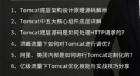
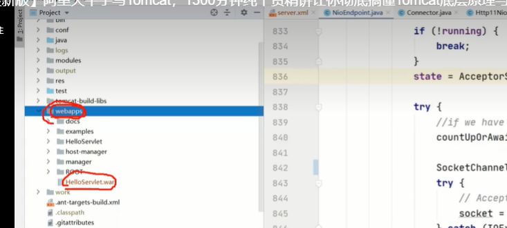
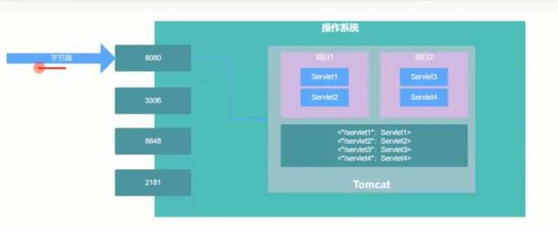

参考课程：https://www.bilibili.com/video/BV1o34y197fz/?spm_id_from=333.337.search-card.all.click&vd_source=8bd5ab544d4cb8d9821752b68ce53b11

#### tomcat简介

- 1999年正式发布，spring boot , dubbo都有用到；

- tomcat本质上是一个java进程，但是可以启动多个项目；==servlet容器==

- 高PV必定负载均衡，

- 

- tomcat部署流程

  - war包放到webaaps目录下
  - 
  - war包自动解压，每个文件夹就是一个应用；应用-->WEB-INF  web.xml -->找到的定义了哪些servlet  及对应的url，放到servlet容器中；
  - 

  11:34