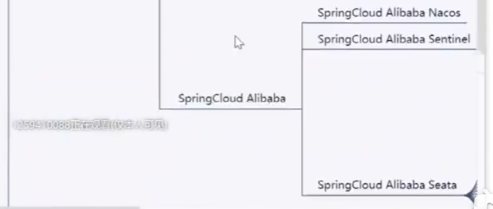

工作空闲时间安排

- 工作时间不要学自己的东西，眼里要有点活，可以熟悉系统  ==学学前端==都行；学个架构师把自己的知识串起来；踏实做事做自己！！面试100题那个标题过于明显了；
- 可以梳理下当前绩效计算的数据流，找书立一起；==学学dataworks[可以问问尤要个教程]==
- 优先问问季有没有别的活？
- ==比起钱，更想看看这个行业的顶点是什么样？？？==
- spring完结之后，梳理下自己的技术栈，找马那边规划下学习和发展（对课程的大纲比较感兴趣），后续再看//技术要学，动不动再说
  - 优先自己找资源学习；淘宝 youtube搜搜看也行；
  - 真找不到预算1W以内，留心分阶段收费；

#### 其它补充来源//周末找个时间再汇总下   工作日确实没有心思冷静下来，总览全局；

看看mac的笔记有没有遗漏的，再想想哪里有没有想学的技术总结遗漏的 家里本地估计有

行内技术架构分析
数据仓库：dpc hawq ods(准备弃用)
实时数据同步：本地库接入Tidb(通过监听数据库日志的方式) + kafka发布 + 消费kafka数据
//数据库的主从同步也是监听日志的，难怪日志这么重要；
交易反欺诈： hawq取数入redis，规则判定，记录命中结果；
神策系统： 埋点数据采集、hawq数据导入；
大监督：wsdl接口、hawq取数、调用taip接口；
技术架构一下子想写估计也写不出来，只能是想到的话再补充好了；
想学的东西
业务上：之前学校看的那本书 找不到原书的话换一本好了；金融科技的框架；大数据在银行业、互联网业的应用；
//金融科技：前沿与趋势； 手把手教你读财报2； 人为制造的脆弱性; 
技术上：hutools工具包想看下，看下有哪些实用的功能，有助于以后开发使用（没必要重复造轮子吧，练手除外；原理感兴趣的话倒是可以学习下；）
nginx之前没学完的，学学完吧；
Hutool工具包学习笔记
支持泛型的克隆接口和克隆类：clone()方法在Object对象中，返回值也是Object对象，因此克隆后我们需要自己强转下类型；
深克隆：实现Cloneable接口后克隆的对象是浅克隆，要想实现深克隆，请使用：

#### 人生目标

- 对我来说就是职业规划[既是历史经验也是生活所迫]：这辈子想做点什么打发时间？
  - 一开始是技术大牛；  现在：我想改变一个行业，金融科技   金融   社会的规划与发展，让世界多一些真善美吧；
  - 就像信息技术彻底改变了人们的日常生活，金融业也能彻底改变社会的分配模式和运转方式；

#### 0820---0920：技术总结 //==技术学习为主，适当穿插吉他学习；夏天减少社交 多一些积累吧==

#### 1. spring框架知识点总结

#### 2. 梳理下自己的技术站

- 从java面经开始，回顾自己的技术站（结合项目经验可以有新的感受）   java  并发 mysql  操作系统  网络 springboot redis 刷题  redis  kafka  flink  spring maven  mysql优化  sh脚本   js
- ==复习的时候顺便把flink等学习资料都上传下吧，把自己的思维导图也都附上==

#### 3. 之前面经带来的启发：

- java  Arrays.sort底层怎么排序？  spring事务如何实现递归回退？   spring启动流程    tcp状态迁移
- spring batch运行的原理 //vim 看日志 sftp等常用的工具也简单理解下；
- 分布式锁 aop的异步好好总结下；对  es没说明白如何保证只有一台服务器运行？
- 问如何自己实现一个组件，本质上就是问组件的核心架构和原型；
  - dubbo源码？spring源码？
- 之前mysql有个联合索引不直接生效，要先建立单个索引，然后联合索引生效 为什么？  in可以走索引，and/or不行；
- 表结构设计：获取外部数据最好源数据全接进来作为中间表，自己再做处理；
- replace into用法？
- 数据库主从同步的原理，通过日志  可以看下细节；

#### 4. 梳理下后面想要学习的技术

- 容器，如tomcat docker
- 其余的各项技术，要学会横向对比，如kafka和rabbit mq的区别及各自的应用场景等；
- 就是自己的问题搜索网站及思路的总结：
- 想梳理自己开发遇到问题的问答百科网站；
- //5分钟背八股只能是作为自己体系上的一个补充，不值得单独去学
  - https://www.bilibili.com/video/BV16B4y1U7yc/?spm_id_from=333.788&vd_source=8bd5ab544d4cb8d9821752b68ce53b11

#### 5.以及如何去关注学术前言

- ==如何关注最新的技术前沿[能想到的都去了解一下]？公众号？gitHub?网站？app？B站   slack，apache官网==
- 之前es的那个视频最后的二维码扫一下，加一下；

#### 6.兴趣爱好扩展

- 游泳  谈情  ==手部肌肉的锻炼==  素描---画人像
- 羽毛球可以继续呀
- 这个时间  富爸爸、穷爸爸提到的理财 信息的关键的点都梳理下；

#### 马士兵--职业发展规划 //==三年是最好的时间呀！！！！不要躺！！！！==

- https://www.bilibili.com/video/BV128411g7Pr/?p=4&spm_id_from=pageDriver&vd_source=8bd5ab544d4cb8d9821752b68ce53b11
  - 07: 51
- mashibing.com
- ==马士兵严选项目：you-app.mashibing.com //技术复杂，值得学习==
- you.mashibing.com     
- 课程：java高级工程师；
- MCA高级架构师：直播课(mashibing.com/schedule)；课程列表是最大值，每个人可以选择性学习；
  - ==想看看架构师课程的大纲，倒是不在乎它的课程细节==
  - 定制化过程：摸底；评估诉求；定制学习路线；入职后系统化学习；
  - 可以先看P9的课程，让自己对自己目前所在的层次，心里有个数；
  - 白皮书可以看看；
- 推荐用马士兵的项目：飞滴出行；
- 轻易不离职，至少有一段3年以上的经历；
- 运维
  - 云运维、安全运维、开发运维一体化、自动化运维
- 安全：脱壳；
- 架构师 ==//多看看别的网站的招牌要求;找老师做个基本的职业规划先也不错呀（先找到和年龄匹配的薪资  岗位，囫囵吞枣先蒙进去；第一家罩不住  先学几个月  还能蒙进下一家；）;站在老板角度帮老板考虑的人  提前做P6事情的人； 大纲可以找客服要==           云原生、高并发、湖仓一体；
  - 可能适合我的：==算法 技术设计  原理源码  高并发  +  大数据== ； MBA;    //进大厂50W； 云原生；
  - 多少个节点 跑什么协议 跑什么服务器上，中间件选型（kafka还是rabbitmq 直接搜还是elk?） 
  - 技术架构师：后端架构师 + 大数据架构师
  - 业务架构师
  - 解决方案架构师（产品架构师）
  - go主要中间件、游戏服务器开发、区块链；java做业务相对多、大数据；
  - lamda架构：编码 数据两份，实时（kafka）+离线(hive)   
    - kappa去掉离线模块：不可行；
    - 数据湖：编码 数据都一份；
- 八股文十二个模块：多线程、JVM、mysql调优、设计模式、spring一段源码、redis、kafka、zookeeper、计组、操作系统、网络  ==算法==；
  - 

- 目录梳理
  - 
    - 
    - 
  - 
    - 
    - 
    - 
  - 
    - 
  - 
  - 
  - 
  - 
- 简历赏析
  - 
    - 
    - 
    - 
    - 
    - 
    - 
    - 
    - 
    - 
    - 
    - 

#### IT职业发展选择

- 
- 